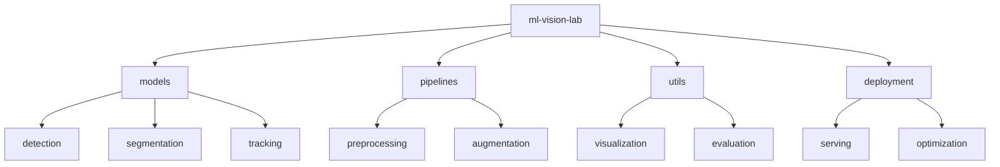

# ML Vision Lab 👁️

[](https://www.python.org/downloads/)
[](https://pytorch.org/)
[](https://opencv.org/)
[](https://developer.nvidia.com/cuda-toolkit)
[](LICENSE)

> Production-grade computer vision implementations. Advanced applications in image processing, object detection, and video analytics with GPU acceleration.

[Features](#features) • [Installation](#installation) • [Quick Start](#quick-start) • [Documentation](#documentation) • [Contributing](#contributing)

## 📑 Table of Contents
- [Features](#features)
- [Project Structure](#project-structure)
- [Prerequisites](#prerequisites)
- [Installation](#installation)
- [Quick Start](#quick-start)
- [Documentation](#documentation)
  - [Models](#models)
  - [Pipeline Optimization](#pipeline-optimization)
  - [Benchmarks](#benchmarks)
- [Contributing](#contributing)
- [Versioning](#versioning)
- [Authors](#authors)
- [Citation](#citation)
- [License](#license)
- [Acknowledgments](#acknowledgments)

## ✨ Features
- Real-time object detection and tracking
- Image segmentation pipelines
- Video analytics systems
- GPU-accelerated processing
- Production deployment examples

## 📁 Project Structure



<details>
<summary>Click to expand full directory structure</summary>

```plaintext
ml-vision-lab/
├── models/            # Model implementations
│   ├── detection/    # Object detection models
│   ├── segmentation/ # Segmentation models
│   └── tracking/     # Tracking algorithms
├── pipelines/        # Processing pipelines
│   ├── preprocessing/# Data preprocessing
│   └── augmentation/ # Data augmentation
├── utils/            # Utility functions
├── deployment/       # Deployment tools
├── tests/            # Unit tests
└── README.md         # Documentation
```
</details>

## 🔧 Prerequisites
- Python 3.8+
- CUDA 11.8+
- OpenCV 4.8+
- PyTorch 2.2+
- NVIDIA GPU (Compute Capability 6.0+)

## 📦 Installation

```bash
# Clone repository
git clone https://github.com/BjornMelin/ml-vision-lab.git
cd ml-vision-lab

# Create environment
python -m venv venv
source venv/bin/activate

# Install dependencies
pip install -r requirements.txt
```

## 🚀 Quick Start

```python
from vision_lab import detection, tracking

# Initialize detector
detector = detection.YOLODetector(
    model='yolov8',
    confidence=0.5
)

# Setup video pipeline
tracker = tracking.DeepSORT(
    max_age=30,
    n_init=3
)

# Process video stream
results = detector.process_video(
    source='video.mp4',
    tracker=tracker
)
```

## 📚 Documentation

### Models

| Model | Task | Performance | Speed (FPS) |
|-------|------|-------------|-------------|
| YOLOv8 | Detection | mAP: 52.3 | 120 |
| Mask R-CNN | Segmentation | mAP: 47.8 | 45 |
| DeepSORT | Tracking | MOTA: 76.5 | 80 |

### Pipeline Optimization
- GPU-accelerated preprocessing
- Batch processing optimization
- Memory-efficient inference
- TensorRT integration

### Benchmarks
Performance on standard datasets:

| Task | Dataset | Model | GPU | FPS | Accuracy |
|------|---------|-------|-----|-----|----------|
| Detection | COCO | YOLOv8 | A100 | 120 | mAP: 52.3 |
| Segmentation | COCO | Mask R-CNN | V100 | 45 | mAP: 47.8 |
| Tracking | MOT17 | DeepSORT | 3090 | 80 | MOTA: 76.5 |

## 🤝 Contributing
- [Contributing Guidelines](CONTRIBUTING.md)
- [Code of Conduct](CODE_OF_CONDUCT.md)
- [Development Guide](DEVELOPMENT.md)

## 📌 Versioning
We use [SemVer](http://semver.org/) for versioning. For available versions, see the [tags on this repository](https://github.com/BjornMelin/ml-vision-lab/tags).

## ✍️ Authors
**Bjorn Melin**
- GitHub: [@BjornMelin](https://github.com/BjornMelin)
- LinkedIn: [Bjorn Melin](https://linkedin.com/in/bjorn-melin)

## 📝 Citation
```bibtex
@misc{melin2024mlvisionlab,
  author = {Melin, Bjorn},
  title = {ML Vision Lab: Production Computer Vision Implementations},
  year = {2024},
  publisher = {GitHub},
  url = {https://github.com/BjornMelin/ml-vision-lab}
}
```

## 📄 License
This project is licensed under the MIT License - see the [LICENSE](LICENSE) file for details.

## 🙏 Acknowledgments
- OpenCV community
- YOLO authors and contributors
- Deep SORT implementation team

---
Made with 👁️ and ❤️ by Bjorn Melin
