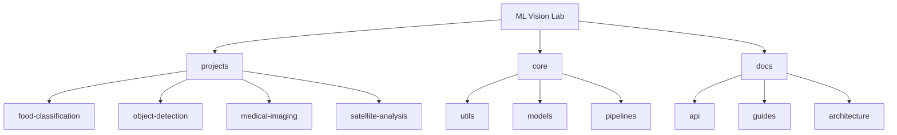
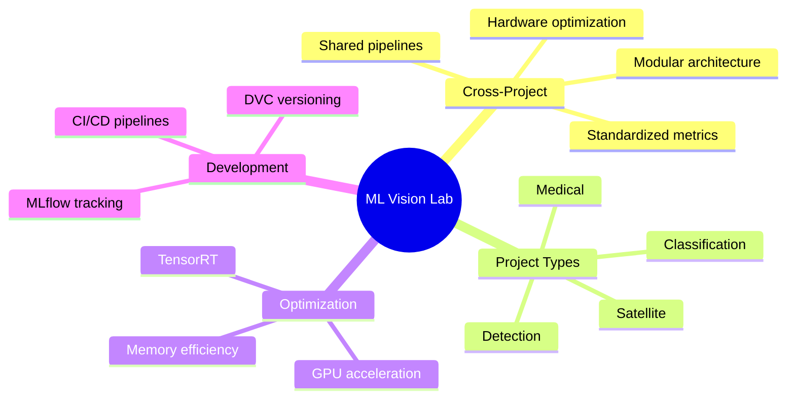
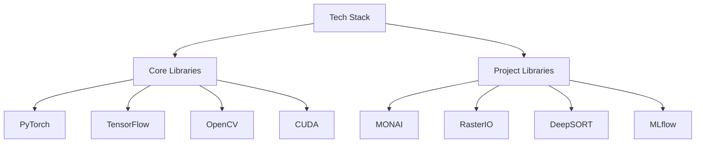
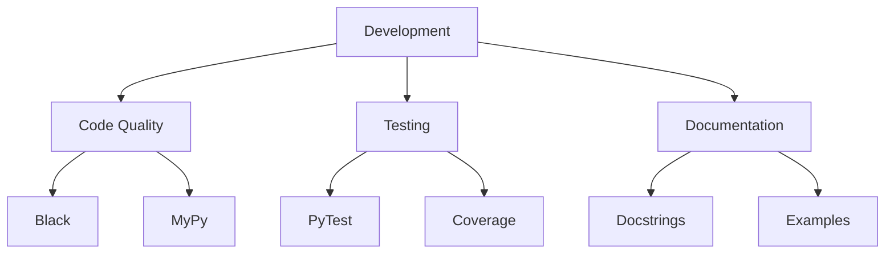
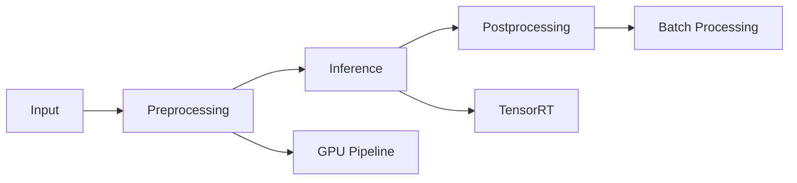

# ML Vision Lab 👁️

[](https://www.python.org/downloads/)
[](https://pytorch.org/)
[](https://tensorflow.org/)
[](https://opencv.org/)
[](https://developer.nvidia.com/cuda-toolkit)
[](https://github.com/BjornMelin/ml-vision-lab/pulse)
[](LICENSE)

> Modular computer vision implementations - A collection of production-grade vision systems spanning multiple domains.

[Featured Projects](#-project-matrix) • [Installation](#-installation) • [Quick Start](#-quick-start) • [Contributing](#-contributing)

## 📑 Table of Contents

- [Project Organization](#-project-organization)
- [Core Features](#-core-features)
- [Prerequisites](#-prerequisites)
- [Tech Stack](#-tech-stack)
- [Installation](#-installation)
- [Quick Start](#-quick-start)
- [Project Matrix](#-project-matrix)
- [Development Standards](#-development-standards)
- [Contributing](#-contributing)
- [Documentation](#-documentation)
- [Benchmarks](#-benchmarks)
- [Versioning](#-versioning)
- [Authors](#-authors)
- [Citation](#-citation)
- [License](#-license)
- [Acknowledgments](#-acknowledgments)

## 🗂️ Project Organization



```
ml-vision-lab/
├── projects/               # Individual vision projects
│   ├── food-classification/  # Food analysis system
│   ├── object-detection/      # Real-time detection
│   ├── medical-imaging/       # DICOM processing
│   └── satellite-analysis/    # Geospatial vision
├── core/                   # Shared vision components
│   ├── utils/              # Common utilities
│   ├── models/             # Base model architectures
│   └── pipelines/          # Processing workflows
└── docs/                   # Project documentation
```

## ✨ Core Features



**Cross-Project Capabilities**

- Modular project architecture
- Shared preprocessing pipelines
- Hardware-optimized inference
- Standardized evaluation metrics
- GPU-accelerated processing
- Production deployment examples
- Memory-efficient inference
- TensorRT integration

**Project Types**

- Image Classification
- Object Detection & Tracking
- Medical Imaging Analysis
- Satellite Imagery Processing
- Industrial Quality Inspection

## 🔧 Prerequisites

- Python 3.11+
- CUDA 12.2+
- OpenCV 5.0+
- PyTorch 2.3+
- TensorFlow 2.15+
- NVIDIA GPU (Compute Capability 6.0+)

## 🛠️ Tech Stack



**Core Libraries**

- PyTorch - Deep learning framework
- TensorFlow - Machine learning platform
- OpenCV - Computer vision operations
- CUDA - GPU acceleration
- TensorRT - Inference optimization
- NumPy - Numerical computing
- Pandas - Data manipulation
- Scikit-learn - Machine learning utilities
- Matplotlib - Visualization
- Plotly - Visualization
- Pillow - Image processing

**Project-Specific Libraries**

- MONAI - Medical imaging
- RasterIO - Geospatial analysis
- DeepSORT - Object tracking
- Albumentations - Image augmentation
- MLflow - Experiment tracking
- DVC - Data version control

## 📦 Installation

```bash
# Clone repository
git clone https://github.com/BjornMelin/ml-vision-lab.git
cd ml-vision-lab

# Create virtual environment
python -m venv .venv
source .venv/bin/activate  # Linux/MacOS
# or
.venv\Scripts\activate  # Windows

# Install core requirements
pip install -r requirements.txt

# Install project-specific requirements (optional)
pip install -r projects/food-classification/requirements.txt
```

## 🚀 Quick Start

**Food Classification**

```python
from projects.food_classification import predict

result = predict("pizza.jpg")
print(f"Identified: {result.label} ({result.confidence:.1%})")
```

**Object Detection**

```python
from projects.object_detection import VideoAnalyzer

analyzer = VideoAnalyzer(model="yolov9")
analyzer.process_stream("input.mp4", output="results.mp4")
```

## 📊 Project Matrix

| Project                                             | Task                 | Models              | Input Types   |
| --------------------------------------------------- | -------------------- | ------------------- | ------------- |
| [Food Classification](projects/food-classification) | Image Classification | EfficientNetV2, ViT | JPEG/PNG      |
| [Object Detection](projects/object-detection)       | Real-time Tracking   | YOLOv9, DeepSORT    | Video Streams |
| [Medical Imaging](projects/medical-imaging)         | DICOM Analysis       | UNet3+, MONAI       | CT/MRI Scans  |
| [Satellite Analysis](projects/satellite-analysis)   | Geospatial ML        | ResNet50-ADE20K     | GeoTIFF       |

## 🔧 Development Standards



**Code Quality**

```bash
# Format all projects
black projects/

# Type checking
mypy projects/

# Run tests
pytest projects/ --cov
```

**Project Structure Template**

```
projects/new-project/
├── app/          # Application interface
├── engine/       # Core logic
├── models/       # Trained weights
├── tests/        # Unit tests
├── README.md     # Project docs
└── requirements.txt # Local dependencies
```

## 🤝 Contributing

**Adding New Projects**

1. Create project folder in `projects/`
2. Follow structure template
3. Add cross-links to:
   - Core utilities (avoid duplication)
   - Related projects
4. Submit PR with:
   - [ ] Black-formatted code
   - [ ] Google-style docstrings
   - [ ] Unit tests (≥80% coverage)

See [CONTRIBUTING.md](CONTRIBUTING.md) for full guidelines.

## 📚 Documentation

### Pipeline Optimization



- GPU-accelerated preprocessing
- Batch processing optimization
- Memory-efficient inference
- TensorRT integration
- Multi-GPU support
- Mixed precision training

### Models

| Model      | Task         | Performance | Speed (FPS) |
| ---------- | ------------ | ----------- | ----------- |
| YOLOv8     | Detection    | mAP: 52.3   | 120         |
| Mask R-CNN | Segmentation | mAP: 47.8   | 45          |
| DeepSORT   | Tracking     | MOTA: 76.5  | 80          |

## 📊 Benchmarks

Performance on standard datasets:

| Task         | Dataset | Model      | GPU  | FPS | Accuracy   |
| ------------ | ------- | ---------- | ---- | --- | ---------- |
| Detection    | COCO    | YOLOv8     | A100 | 120 | mAP: 52.3  |
| Segmentation | COCO    | Mask R-CNN | V100 | 45  | mAP: 47.8  |
| Tracking     | MOT17   | DeepSORT   | 3090 | 80  | MOTA: 76.5 |

## 📌 Versioning

We use [SemVer](http://semver.org/) for versioning. For available versions, see the [tags on this repository](https://github.com/BjornMelin/ml-vision-lab/tags).

## ✍️ Authors

**Bjorn Melin**

- GitHub: [@BjornMelin](https://github.com/BjornMelin)
- LinkedIn: [Bjorn Melin](https://linkedin.com/in/bjorn-melin)

## 📝 Citation

```bibtex
@misc{melin2024mlvisionlab,
  author = {Melin, Bjorn},
  title = {ML Vision Lab: Production Computer Vision Implementations},
  year = {2024},
  publisher = {GitHub},
  url = {https://github.com/BjornMelin/ml-vision-lab}
}
```

## 📄 License

This project is licensed under the MIT License - see the [LICENSE](LICENSE) file for details.

## 🙏 Acknowledgments

- OpenCV community
- YOLO authors and contributors
- Deep SORT implementation team
- Medical imaging community (MONAI)
- Satellite imagery processing teams
- TensorFlow and PyTorch teams
- NVIDIA for CUDA and TensorRT support

---


Made with 👁️ and ❤️ by Bjorn Melin
