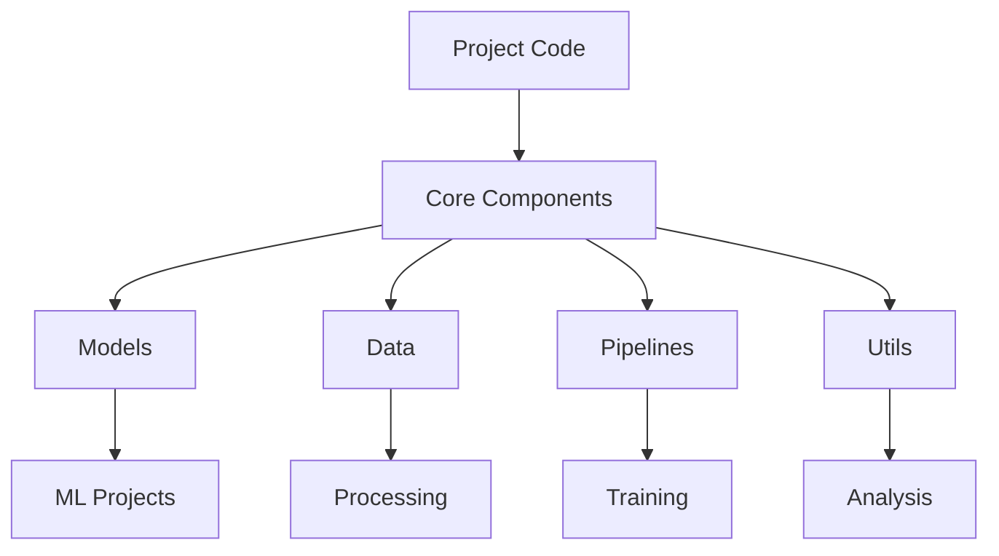
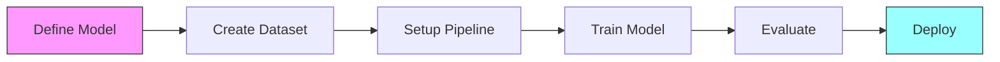

# Core Components 🛠️

> Central hub for shared ML vision components, utilities, and best practices

## 📑 Table of Contents

- [Overview](#overview)
- [Directory Structure](#directory-structure)
- [Core ML Components](#core-ml-components)
- [Guidelines](#guidelines)
- [Usage](#usage)
- [Documentation](#documentation)

## Overview

This directory contains shared components, utilities, and base implementations used across multiple ML vision projects, focusing on reproducibility, maintainability, and production-grade standards.

## Directory Structure

```
core/
├── models/               # Base model architectures and components
│   ├── architectures/   # Neural network architectures
│   ├── blocks/          # Reusable model blocks
│   ├── heads/           # Task-specific model heads
│   └── backbones/       # Feature extractors
├── data/                # Data processing components
│   ├── datasets/        # Base dataset classes
│   ├── transforms/      # Data augmentation
│   ├── loaders/         # DataLoader utilities
│   └── samplers/        # Sampling strategies
├── pipelines/           # ML processing pipelines
│   ├── training/        # Training workflows
│   ├── inference/       # Inference optimization
│   ├── evaluation/      # Metrics computation
│   └── deployment/      # Model serving
├── utils/               # Common utilities
│   ├── metrics/         # Evaluation metrics
│   ├── visualization/   # Result plotting
│   ├── logging/         # Experiment logging
│   └── optimization/    # Performance tools
└── config/              # Base configurations
    ├── models/          # Model configs
    ├── data/            # Data configs
    └── training/        # Training configs
```

## Core ML Components

### 🧠 Model Components

```python
from core.models.architectures import BaseArchitecture
from core.models.blocks import ResidualBlock, AttentionBlock
from core.models.heads import ClassificationHead, DetectionHead

class CustomModel(BaseArchitecture):
    def __init__(self, config):
        super().__init__()
        self.backbone = self.build_backbone(config)
        self.head = self.build_head(config)

    def forward(self, x):
        features = self.backbone(x)
        return self.head(features)
```

### 📊 Data Components

```python
from core.data.datasets import VisionDataset
from core.data.transforms import get_transforms
from core.data.loaders import get_dataloader

class CustomDataset(VisionDataset):
    def __init__(self, root, transform=None):
        super().__init__(root, transform)
        self.transforms = get_transforms(config)
        self.loader = get_dataloader(self, batch_size=32)
```

### 📈 Training Pipeline

```python
from core.pipelines.training import Trainer
from core.utils.metrics import MetricLogger
from core.utils.logging import MLflowLogger

class CustomTrainer(Trainer):
    def __init__(self, model, config):
        super().__init__()
        self.logger = MLflowLogger(config)
        self.metric_logger = MetricLogger()

    def train_epoch(self):
        # Custom training logic
        self.logger.log_metrics(self.metric_logger.metrics)
```

## Guidelines

### 🔧 Code Organization

1. **Modularity**

   - Clear interfaces
   - Single responsibility
   - Dependency injection
   - Configuration-driven

2. **ML Best Practices**

   - Reproducible components
   - Experiment tracking
   - Metrics logging
   - Model versioning

3. **Performance**
   - GPU optimization
   - Memory efficiency
   - Batch processing
   - Mixed precision

### 📦 Dependencies

- Keep core requirements minimal
- Version compatibility
- Optional ML extras
- Hardware requirements

### ✨ Development Standards

```python
# Type hints
from typing import Optional, Dict, Any
import torch.nn as nn

class BaseModel(nn.Module):
    def __init__(self, config: Dict[str, Any]) -> None:
        super().__init__()
        self.config = config

    def forward(self, x: torch.Tensor) -> torch.Tensor:
        raise NotImplementedError

    def save_checkpoint(self, path: str) -> None:
        # Implementation
        pass
```

## Usage

### Model Development

```python
from core.models import BaseModel
from core.data import DataLoader
from core.utils.config import load_config

class CustomModel(BaseModel):
    def __init__(self):
        config = load_config('path/to/config.yaml')
        super().__init__(config)
        self.data = DataLoader(config)
```

### Pipeline Integration

```python
from core.pipelines import DataProcessor
from core.utils.metrics import calculate_metrics
from core.utils.visualization import plot_results

# Example workflow
processor = DataProcessor()
results = processor.process(data)
metrics = calculate_metrics(results)
plot_results(metrics)
```

## Component Relationships



## 🔄 ML Development Workflow



Remember: Core components should prioritize:

- Reproducibility
- Scalability
- Maintainability
- Documentation
- Testing coverage

These components form the foundation of all ML vision projects - keep them robust and well-documented! 💪
