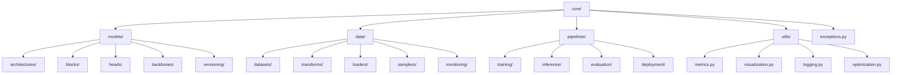

# Core Components 🛠️

> Central hub for shared ML vision components, utilities, and best practices

## 📑 Table of Contents

- [Overview](#overview)
- [Directory Structure](#directory-structure)
- [Core ML Components](#core-ml-components)
- [Usage Examples](#usage-examples)
- [Guidelines](#guidelines)
- [Integration](#integration)

## Overview

This directory contains shared components, utilities, and base implementations used across multiple ML vision projects, focusing on reproducibility, maintainability, and production-grade standards.

## Directory Structure



```
core/
├── models/               # Base model architectures and components
│   ├── architectures/   # Neural network architectures
│   ├── blocks/          # Reusable model blocks
│   ├── heads/           # Task-specific model heads
│   ├── backbones/       # Feature extractors
│   └── versioning/      # Model version control
├── data/                # Data processing components
│   ├── datasets/        # Base dataset classes
│   ├── transforms/      # Data augmentation
│   ├── loaders/         # DataLoader utilities
│   ├── samplers/        # Sampling strategies
│   └── monitoring/      # Data drift detection
├── pipelines/           # ML processing pipelines
│   ├── training/        # Training workflows
│   ├── inference/       # Inference optimization
│   ├── evaluation/      # Metrics computation
│   └── deployment/      # Model deployment
├── utils/               # Common utilities
│   ├── metrics.py       # Evaluation metrics
│   ├── visualization.py # Result plotting
│   ├── logging.py       # Experiment logging
│   └── optimization.py  # Performance tools
└── exceptions.py        # Custom exception classes
```

## Core ML Components

### 🧠 Model Components

```python
from core.models.architectures import BaseArchitecture
from core.models.blocks import ResidualBlock, AttentionBlock
from core.models.heads import ClassificationHead, DetectionHead
from core.models.versioning import ModelRegistry

class CustomModel(BaseArchitecture):
    def __init__(self, config):
        super().__init__()
        self.backbone = self.build_backbone(config)
        self.head = self.build_head(config)

    def forward(self, x):
        features = self.backbone(x)
        return self.head(features)

# Register model version
registry = ModelRegistry()
registry.register("custom_model", "1.0.0", CustomModel)
```

### 📊 Data Components

```python
from core.data.datasets import VisionDataset
from core.data.transforms import get_transforms
from core.data.loaders import get_dataloader
from core.data.monitoring import DriftDetector

class CustomDataset(VisionDataset):
    def __init__(self, root, transform=None):
        super().__init__(root, transform)
        self.transforms = get_transforms(config)
        self.loader = get_dataloader(self, batch_size=32)
        self.drift_detector = DriftDetector()

    def monitor_distribution(self, data):
        """Monitor data distribution for drift."""
        return self.drift_detector.detect(data)
```

### 📈 Training Pipeline

```python
from core.pipelines.training import Trainer
from core.utils.metrics import MetricLogger
from core.utils.logging import MLflowLogger
from core.pipelines.deployment import ModelDeployer

class CustomTrainer(Trainer):
    def __init__(self, model, config):
        super().__init__()
        self.logger = MLflowLogger(config)
        self.metric_logger = MetricLogger()
        self.deployer = ModelDeployer()

    def train_epoch(self):
        # Custom training logic
        self.logger.log_metrics(self.metric_logger.metrics)

    def deploy(self, model_path):
        """Deploy trained model."""
        self.deployer.deploy(
            self.model,
            path=model_path,
            format='onnx'
        )
```

### ⚠️ Exception Handling

```python
from core.exceptions import (
    DataLoadError,
    ModelError,
    PipelineError,
    ConfigError
)

try:
    dataset = CustomDataset(data_path)
except DataLoadError as e:
    logger.error(f"Failed to load dataset: {e}")

try:
    model = CustomModel(config)
except ModelError as e:
    logger.error(f"Failed to initialize model: {e}")
```

## Guidelines

### 🔧 Code Organization

1. **Modularity**

   - Clear interfaces
   - Single responsibility
   - Dependency injection
   - Configuration-driven

2. **ML Best Practices**

   - Reproducible components
   - Experiment tracking
   - Metrics logging
   - Model versioning
   - Data monitoring

3. **Performance**
   - GPU optimization
   - Memory efficiency
   - Batch processing
   - Mixed precision
   - Production optimization

## Integration

### 🔄 Project Integration

Each project in the `projects/` directory should:

1. **Import Core Components**

```python
# Import base classes
from core.models.architectures import BaseArchitecture
from core.data.datasets import VisionDataset
from core.pipelines.training import BaseTrainer
from core.models.versioning import ModelRegistry

# Extend for project needs
class ProjectModel(BaseArchitecture):
    def __init__(self, config):
        super().__init__()
        # Project-specific implementation
```

2. **Use Core Utilities**

```python
# Use shared utilities
from core.utils.metrics import calculate_metrics
from core.utils.visualization import plot_results
from core.utils.logging import setup_logging
from core.data.monitoring import monitor_drift

# Project-specific usage
logger = setup_logging(__name__)
metrics = calculate_metrics(predictions, targets)
plot_results(metrics, save_dir="experiments/results")
drift_detected = monitor_drift(dataset)
```

### 📦 Dependencies

Core components require:

```python
# Base requirements
python_requires='>=3.8'
install_requires=[
    'torch>=1.12.0',    # Deep learning
    'numpy>=1.21.0',    # Array operations
    'opencv-python>=4.5.0',  # Image processing
    'albumentations>=1.0.0', # Augmentations
    'onnx>=1.12.0',     # Model export
    'tensorrt>=8.0.0',  # Inference optimization
]
```

Projects should include these in their `requirements.txt` or `pyproject.toml`.
