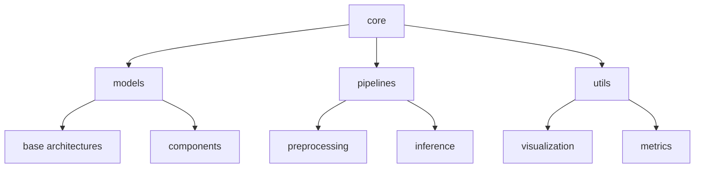
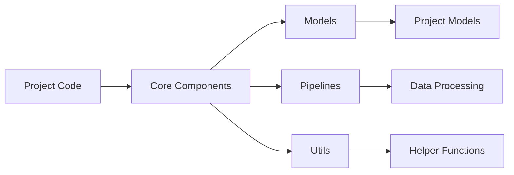
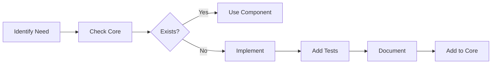

# Core Components 🛠️

> Central hub for shared vision components and utilities

## 📑 Table of Contents

- [Overview](#overview)
- [Directory Structure](#directory-structure)
- [Guidelines](#guidelines)
- [Usage](#usage)
- [Documentation](#documentation)

## Overview

This directory contains shared components, utilities, and base implementations that are used across multiple projects in the ML Vision Lab.

## Directory Structure



```
core/
├── models/     # Base model architectures and components
├── pipelines/  # Shared processing workflows
└── utils/      # Common utility functions and tools
```

## Guidelines

### 🔧 Code Organization

- Keep code modular and reusable
- Maintain clear separation of concerns
- Document all public interfaces
- Include type hints and docstrings
- Write unit tests for all components

### 📦 Dependency Management

- Minimize external dependencies
- Document version requirements
- Keep core requirements separate from project-specific ones
- Use virtual environments for development

### ✨ Best Practices

- Follow DRY (Don't Repeat Yourself) principles
- Write clear documentation
- Maintain backward compatibility
- Include usage examples
- Add proper error handling

## Usage

Import core components in project-specific code:

```python
from core.models import BaseDetector
from core.utils import visualization
from core.pipelines import DataProcessor

# Example usage
class CustomDetector(BaseDetector):
    def __init__(self):
        super().__init__()
        self.processor = DataProcessor()
```

## Documentation

Each subdirectory contains its own README.md with specific guidelines and documentation:

📚 **Documentation Links**

- [Models Documentation](models/README.md) - Base architectures and components
- [Pipelines Documentation](pipelines/README.md) - Data processing workflows
- [Utils Documentation](utils/README.md) - Common utilities and tools

## Component Relationships



## 🔄 Development Workflow



Remember: Core components are the foundation of all projects - keep them robust, well-documented, and maintainable! 💪
