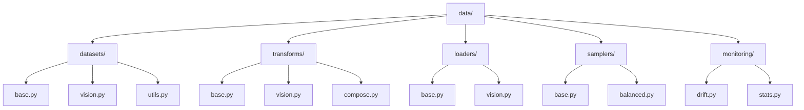
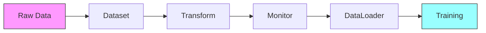

# Data Components 📊

> Base data processing components for computer vision tasks

## 📑 Table of Contents

- [Overview](#overview)
- [Directory Structure](#directory-structure)
- [Components](#components)
- [Usage Examples](#usage-examples)
- [Best Practices](#best-practices)

## Overview

This directory contains base data processing components used across ML vision projects, providing standardized interfaces for data loading, transformation, sampling, and monitoring.

## Directory Structure



```
data/
├── datasets/        # Base dataset classes
│   ├── base.py     # Abstract dataset classes
│   ├── vision.py   # Vision dataset implementations
│   └── utils.py    # Dataset utilities
├── transforms/      # Data augmentation
│   ├── base.py     # Base transformations
│   ├── vision.py   # Vision-specific transforms
│   └── compose.py  # Transform composition
├── loaders/        # DataLoader utilities
│   ├── base.py     # Base loader classes
│   └── vision.py   # Vision data loaders
├── samplers/       # Sampling strategies
│   ├── base.py     # Base sampler classes
│   └── balanced.py # Balanced sampling
└── monitoring/     # Data monitoring utilities
    ├── drift.py    # Data drift detection
    └── stats.py    # Statistics tracking
```

## Components

### Base Dataset

```python
from abc import ABC, abstractmethod
from typing import Any, Dict, List
from core.data.monitoring import DriftDetector

class BaseDataset(ABC):
    """Abstract base class for datasets."""

    def __init__(self):
        self.drift_detector = DriftDetector()

    @abstractmethod
    def __getitem__(self, index: int) -> Dict[str, Any]:
        """Get a single data item."""
        pass

    @abstractmethod
    def __len__(self) -> int:
        """Get dataset size."""
        pass

    def monitor_stats(self):
        """Monitor dataset statistics."""
        return self.drift_detector.compute_stats(self)

class VisionDataset(BaseDataset):
    """Base class for vision datasets."""

    def __init__(self, root: str, transforms: List = None):
        super().__init__()
        self.root = root
        self.transforms = transforms

    def apply_transforms(self, image: Any) -> Any:
        """Apply transformation pipeline."""
        if self.transforms:
            for t in self.transforms:
                image = t(image)
        return image
```

## Usage Examples

### Creating Custom Datasets

```python
from core.data.datasets import VisionDataset
from core.data.transforms import get_transforms
from core.data.monitoring import StatsTracker

class CustomDataset(VisionDataset):
    def __init__(self, root: str):
        super().__init__(root)
        self.transforms = get_transforms()
        self.stats_tracker = StatsTracker()
        self.data = self.load_data()

    def __getitem__(self, index: int):
        image = self.data[index]
        self.stats_tracker.update(image)
        return self.apply_transforms(image)
```

### Data Processing Pipeline



### Data Loading

```python
from core.data.loaders import get_dataloader
from core.data.samplers import BalancedSampler
from core.data.monitoring import DataMonitor

# Create dataset with monitoring
dataset = CustomDataset(root="data/raw")
monitor = DataMonitor(dataset)

# Configure loader
loader = get_dataloader(
    dataset,
    batch_size=32,
    sampler=BalancedSampler(dataset),
    num_workers=4
)

# Monitor data statistics
stats = monitor.compute_statistics()
monitor.detect_drift(stats)
```

## Best Practices

### 1. Data Processing

- Implement proper validation
- Handle edge cases
- Support multiple formats
- Enable efficient loading
- Cache processed data

### 2. Transforms

- Make transforms configurable
- Support composition
- Handle different input types
- Preserve metadata
- Validate outputs

### 3. Monitoring

- Track data statistics
- Detect distribution shifts
- Monitor data quality
- Log preprocessing steps
- Alert on anomalies

Remember: Clean data and monitoring are crucial for ML success! 💪

### Additional Resources

- [Dataset Implementation Guide](docs/datasets.md)
- [Data Transformation Best Practices](docs/transforms.md)
- [Monitoring Guidelines](docs/monitoring.md)


_Placeholder: Insert diagram showing the data processing pipeline_
