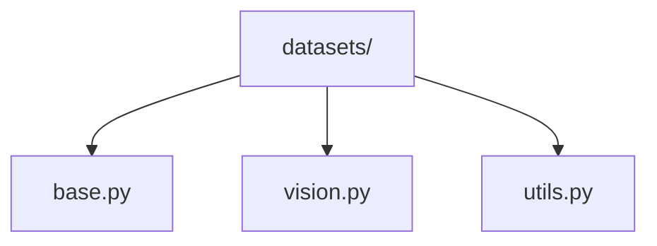

# Vision Datasets 📊

> Base dataset classes and implementations for computer vision tasks

## 📑 Table of Contents

- [Overview](#overview)
- [Directory Structure](#directory-structure)
- [Components](#components)
- [Usage Examples](#usage-examples)
- [Best Practices](#best-practices)

## Overview

The datasets/ module provides base dataset classes and implementations for handling various types of computer vision data. It includes abstract base classes and utilities for creating custom datasets.

## Directory Structure



```
datasets/
├── base.py        # Abstract dataset classes
├── vision.py      # Vision dataset implementations
└── utils.py       # Dataset utilities
```

## Components

### Base Dataset

```python
from abc import ABC, abstractmethod
from typing import Any, Dict

class BaseDataset(ABC):
    """Abstract base class for all datasets."""

    @abstractmethod
    def __getitem__(self, index: int) -> Dict[str, Any]:
        """Get a single data item."""
        pass

    @abstractmethod
    def __len__(self) -> int:
        """Return the dataset size."""
        pass
```

### Vision Dataset

```python
from core.data.datasets import BaseDataset
from core.data.transforms import get_transforms

class VisionDataset(BaseDataset):
    """Base class for vision datasets."""

    def __init__(self, root: str, transform=None):
        self.root = root
        self.transform = transform
        self.samples = self._load_samples()

    def __getitem__(self, index):
        sample = self.samples[index]
        if self.transform:
            sample = self.transform(sample)
        return sample
```

## Usage Examples

### Creating Custom Datasets

```python
from core.data.datasets import VisionDataset
from core.data.transforms import compose_transforms

class CustomDataset(VisionDataset):
    def __init__(self, root, split='train'):
        transforms = compose_transforms(split)
        super().__init__(root, transforms)

    def _load_samples(self):
        # Implement data loading logic
        return samples

    def __getitem__(self, index):
        # Customize data item retrieval
        return sample
```

### Data Flow


## Best Practices

### 1. Data Loading

- Implement efficient loading
- Cache when possible
- Support streaming
- Handle large datasets
- Validate data integrity

### 2. Implementation

- Clear documentation
- Type annotations
- Error handling
- Memory management
- Progress tracking

### 3. Dataset Types

1. **Image Classification**

   ```python
   class ClassificationDataset(VisionDataset):
       def __getitem__(self, index):
           image = self._load_image(index)
           label = self._get_label(index)
           return {'image': image, 'label': label}
   ```

2. **Object Detection**

   ```python
   class DetectionDataset(VisionDataset):
       def __getitem__(self, index):
           image = self._load_image(index)
           boxes = self._get_boxes(index)
           return {'image': image, 'boxes': boxes}
   ```

3. **Segmentation**
   ```python
   class SegmentationDataset(VisionDataset):
       def __getitem__(self, index):
           image = self._load_image(index)
           mask = self._get_mask(index)
           return {'image': image, 'mask': mask}
   ```

### Performance Tips

1. **Memory Efficiency**

   - Lazy loading
   - Memory mapping
   - Data streaming
   - Batch prefetching

2. **Speed Optimization**

   - Caching
   - Parallel loading
   - Fast file formats
   - Efficient transforms

3. **Data Quality**
   - Validation checks
   - Error handling
   - Data cleaning
   - Format verification

Remember: Build datasets that are efficient, reliable, and easy to use! 💪

### Additional Resources

- [Dataset Design Guide](docs/design.md)
- [Loading Optimization](docs/optimization.md)
- [Data Management Tips](docs/management.md)


_Placeholder: Insert diagram showing dataset architecture and data flow_
