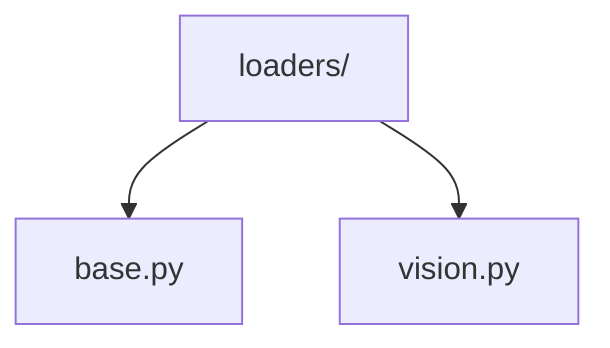

# Data Loaders 📥

> DataLoader utilities for efficient data loading and batching

## 📑 Table of Contents

- [Overview](#overview)
- [Directory Structure](#directory-structure)
- [Components](#components)
- [Usage Examples](#usage-examples)
- [Best Practices](#best-practices)

## Overview

The loaders/ module provides DataLoader utilities that handle efficient data loading, batching, and preprocessing for training and evaluation pipelines.

## Directory Structure



```
loaders/
├── base.py        # Base loader classes
└── vision.py      # Vision-specific loaders
```

## Components

### Base Loader

```python
from torch.utils.data import DataLoader
from typing import Any, Dict

class BaseLoader:
    """Base class for custom data loaders."""

    def __init__(self, dataset, batch_size=32, num_workers=4):
        self.dataset = dataset
        self.batch_size = batch_size
        self.num_workers = num_workers

    def get_loader(self) -> DataLoader:
        """Create and return a DataLoader instance."""
        return DataLoader(
            self.dataset,
            batch_size=self.batch_size,
            num_workers=self.num_workers,
            shuffle=True,
            pin_memory=True
        )
```

### Vision Loader

```python
from core.data.loaders import BaseLoader

class VisionLoader(BaseLoader):
    """DataLoader for vision tasks."""

    def __init__(self, dataset, batch_size=32, num_workers=4):
        super().__init__(dataset, batch_size, num_workers)

    def get_loader(self) -> DataLoader:
        return DataLoader(
            self.dataset,
            batch_size=self.batch_size,
            num_workers=self.num_workers,
            shuffle=True,
            pin_memory=True,
            collate_fn=self.collate_fn
        )

    def collate_fn(self, batch: List[Dict[str, Any]]) -> Dict[str, Any]:
        """Custom collate function for vision data."""
        pass
```

## Usage Examples

### Basic Usage

```python
from core.data.loaders import create_loader
from core.data.datasets import VisionDataset

# Create dataset
dataset = VisionDataset(root="data/")

# Create loader
loader = create_loader(
    dataset,
    batch_size=32,
    num_workers=4,
    shuffle=True
)

# Use in training
for batch in loader:
    images, labels = batch
    # Process batch
```

### Data Loading Flow


## Best Practices

### 1. Loader Configuration

- Set appropriate batch size
- Optimize num_workers
- Enable pin_memory
- Use appropriate sampler
- Configure prefetch factor

### 2. Implementation

1. **Basic Loader**

   ```python
   loader = DataLoader(
       dataset,
       batch_size=32,
       num_workers=4,
       shuffle=True,
       pin_memory=True
   )
   ```

2. **Custom Collate**

   ```python
   def custom_collate(batch):
       images = torch.stack([b['image'] for b in batch])
       labels = torch.tensor([b['label'] for b in batch])
       return {'images': images, 'labels': labels}
   ```

3. **Iterative Loading**
   ```python
   for epoch in range(num_epochs):
       for batch in loader:
           process_batch(batch)
   ```

### Performance Optimization

1. **Memory Efficiency**

   - Pin memory
   - Prefetch factor
   - Memory mapping
   - Shared memory

2. **Loading Speed**

   - Num workers
   - Batch size
   - Persistent workers
   - Custom collate

3. **Data Processing**
   - Pre-fetching
   - Caching
   - Async loading
   - GPU transfers

### Loader Types

1. **Training Loader**

   ```python
   train_loader = create_loader(
       dataset,
       batch_size=32,
       shuffle=True,
       drop_last=True
   )
   ```

2. **Validation Loader**

   ```python
   val_loader = create_loader(
       dataset,
       batch_size=64,
       shuffle=False,
       drop_last=False
   )
   ```

3. **Test Loader**
   ```python
   test_loader = create_loader(
       dataset,
       batch_size=1,
       shuffle=False,
       num_workers=1
   )
   ```

Remember: Configure loaders for optimal performance and efficiency! 💪

### Additional Resources

- [Loader Configuration Guide](docs/configuration.md)
- [Performance Optimization Tips](docs/performance.md)
- [Memory Management Guide](docs/memory.md)


_Placeholder: Insert diagram showing loader architecture and data flow_
