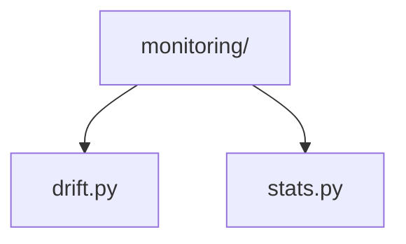
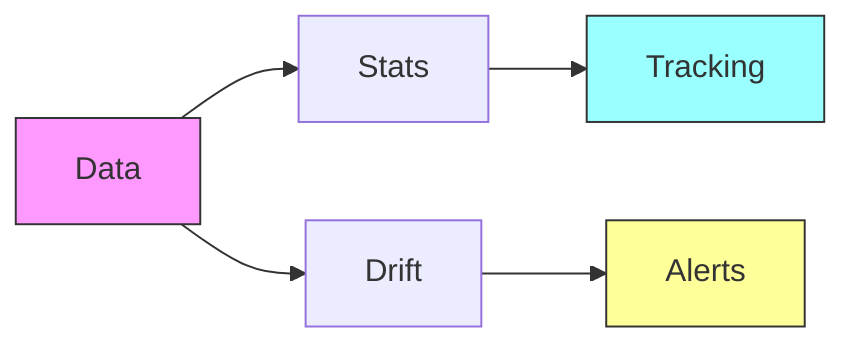

# Data Monitoring 📈

> Data quality monitoring and drift detection utilities

## 📑 Table of Contents

- [Overview](#overview)
- [Directory Structure](#directory-structure)
- [Components](#components)
- [Usage Examples](#usage-examples)
- [Best Practices](#best-practices)

## Overview

The monitoring/ module provides utilities for monitoring data quality, detecting distribution shifts, and tracking dataset statistics throughout the ML pipeline.

## Directory Structure



```
monitoring/
├── drift.py       # Data drift detection
└── stats.py       # Statistics tracking
```

## Components

### Drift Detection

```python
from core.data.monitoring.drift import DriftDetector

class DriftDetector:
    """Detects distribution shifts in data."""

    def __init__(self, reference_data=None):
        self.reference_data = reference_data
        self.metrics = ['ks_test', 'chi_square']

    def compute_drift(self, current_data):
        """Compute drift metrics between current and reference data."""
        drift_scores = {}
        for metric in self.metrics:
            score = self._compute_metric(current_data, metric)
            drift_scores[metric] = score
        return drift_scores
```

### Statistics Tracking

```python
from core.data.monitoring.stats import StatsTracker

class StatsTracker:
    """Tracks dataset statistics over time."""

    def __init__(self):
        self.stats = {}

    def update(self, data_batch):
        """Update statistics with new batch."""
        batch_stats = self._compute_batch_stats(data_batch)
        self._update_running_stats(batch_stats)

    def get_summary(self):
        """Get summary of tracked statistics."""
        return self._generate_summary()
```

## Usage Examples

### Monitoring Data Quality

```python
from core.data.monitoring import DataMonitor
from core.data.monitoring.drift import DriftDetector
from core.data.monitoring.stats import StatsTracker

# Initialize monitoring
monitor = DataMonitor(
    drift_detector=DriftDetector(),
    stats_tracker=StatsTracker()
)

# Monitor dataset
for batch in dataloader:
    # Update statistics
    monitor.update_stats(batch)

    # Check for drift
    if monitor.detect_drift(batch):
        logger.warning("Data drift detected!")

    # Log statistics
    monitor.log_stats()
```

### Monitoring Flow



## Best Practices

### 1. Drift Detection

- Set appropriate thresholds
- Monitor key features
- Track temporal changes
- Alert on anomalies
- Log all detections

### 2. Statistics Tracking

1. **Basic Statistics**

   ```python
   def compute_basic_stats(data):
       return {
           'mean': data.mean(),
           'std': data.std(),
           'min': data.min(),
           'max': data.max()
       }
   ```

2. **Distribution Metrics**
   ```python
   def compute_distribution_metrics(data):
       return {
           'skewness': compute_skewness(data),
           'kurtosis': compute_kurtosis(data),
           'entropy': compute_entropy(data)
       }
   ```

### Monitoring Features

1. **Data Quality**

   - Missing values
   - Outlier detection
   - Format validation
   - Range checks
   - Type validation

2. **Distribution Monitoring**

   - KS test
   - Chi-square test
   - Jensen-Shannon divergence
   - Earth Mover's distance
   - Population stability index

3. **Statistical Tracking**
   - Running statistics
   - Window statistics
   - Trend analysis
   - Anomaly detection
   - Correlation tracking

Remember: Monitor your data to maintain model reliability! 💪

### Additional Resources

- [Drift Detection Guide](docs/drift.md)
- [Statistics Tracking Tips](docs/statistics.md)
- [Monitoring Best Practices](docs/monitoring.md)


_Placeholder: Insert diagram showing monitoring pipeline components_

### Common Configurations

```python
# Basic monitoring setup
monitor_config = {
    'drift': {
        'metrics': ['ks_test', 'chi_square'],
        'threshold': 0.05,
        'window_size': 1000
    },
    'stats': {
        'basic': ['mean', 'std', 'quantiles'],
        'advanced': ['entropy', 'correlation'],
        'update_frequency': 100
    },
    'alerts': {
        'drift_threshold': 0.1,
        'anomaly_threshold': 3.0,
        'notification': ['email', 'dashboard']
    }
}

# Production monitoring
production_monitor = DataMonitor(
    config=monitor_config,
    reference_data=reference_dataset,
    logger=logging.getLogger('production')
)
```
