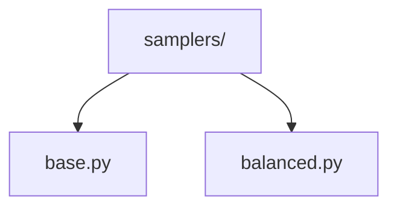
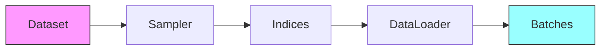

# Data Samplers 🎲

> Sampling strategies for balanced and efficient data loading

## 📑 Table of Contents

- [Overview](#overview)
- [Directory Structure](#directory-structure)
- [Components](#components)
- [Usage Examples](#usage-examples)
- [Best Practices](#best-practices)

## Overview

The samplers/ module provides various sampling strategies to control how data is selected during training and evaluation. This includes implementations for balanced sampling, weighted sampling, and other specialized sampling techniques.

## Directory Structure



```
samplers/
├── base.py        # Base sampler classes
└── balanced.py    # Balanced sampling implementations
```

## Components

### Base Sampler

```python
from torch.utils.data.sampler import Sampler
from typing import Iterator, List

class BaseSampler(Sampler):
    """Base class for custom samplers."""

    def __init__(self, data_source):
        self.data_source = data_source

    def __iter__(self) -> Iterator[int]:
        """Return iterator over indices."""
        pass

    def __len__(self) -> int:
        """Return length of sampler."""
        return len(self.data_source)
```

### Balanced Sampler

```python
class BalancedSampler(BaseSampler):
    """Sampler that maintains class balance."""

    def __init__(self, data_source, labels: List[int]):
        super().__init__(data_source)
        self.labels = labels
        self.indices_per_class = self._build_indices()

    def _build_indices(self):
        """Group indices by class."""
        pass

    def __iter__(self):
        """Return balanced iteration over indices."""
        pass
```

## Usage Examples

### Basic Usage

```python
from core.data.samplers import BalancedSampler
from torch.utils.data import DataLoader

# Create sampler
sampler = BalancedSampler(dataset, dataset.labels)

# Use with DataLoader
loader = DataLoader(
    dataset,
    batch_size=32,
    sampler=sampler,
    num_workers=4
)
```

### Sampling Flow



## Best Practices

### 1. Sampler Design

- Consider data distribution
- Handle imbalanced classes
- Support shuffling
- Enable deterministic mode
- Implement efficient iteration

### 2. Implementation Types

1. **Random Sampler**

   ```python
   class RandomSampler(BaseSampler):
       def __iter__(self):
           return iter(torch.randperm(len(self.data_source)))
   ```

2. **Class-Balanced Sampler**

   ```python
   class ClassBalancedSampler(BaseSampler):
       def __iter__(self):
           indices = self._get_balanced_indices()
           return iter(indices)
   ```

3. **Weighted Sampler**
   ```python
   class WeightedSampler(BaseSampler):
       def __iter__(self):
           weights = self._compute_weights()
           return iter(torch.multinomial(weights, len(weights)))
   ```

### Sampling Strategies

1. **Random Sampling**

   - Uniform distribution
   - With/without replacement
   - Shuffled access

2. **Balanced Sampling**

   - Class balance
   - Instance weights
   - Stratified sampling

3. **Advanced Sampling**
   - Hard example mining
   - Curriculum learning
   - Active learning

### Performance Tips

1. **Efficiency**

   - Pre-compute indices
   - Use efficient data structures
   - Minimize memory usage
   - Enable batch access

2. **Distribution Control**

   - Monitor class balance
   - Track sample frequency
   - Validate distribution
   - Adjust weights

3. **Integration**
   - DataLoader compatibility
   - Distributed training
   - Multi-GPU support
   - Reproducibility

Remember: Choose sampling strategies that suit your data distribution! 💪

### Additional Resources

- [Sampler Design Guide](docs/design.md)
- [Balancing Strategies](docs/balancing.md)
- [Performance Tips](docs/performance.md)


_Placeholder: Insert diagram showing different sampling strategies_

### Common Use Cases

```python
# Balanced training
balanced_sampler = BalancedSampler(
    dataset,
    labels=dataset.labels,
    replacement=True
)

# Hard example mining
hard_example_sampler = HardExampleSampler(
    dataset,
    loss_history=model.loss_history
)

# Curriculum learning
curriculum_sampler = CurriculumSampler(
    dataset,
    difficulty_fn=compute_difficulty
)
```
