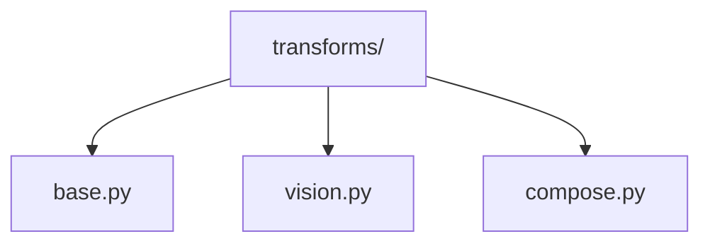
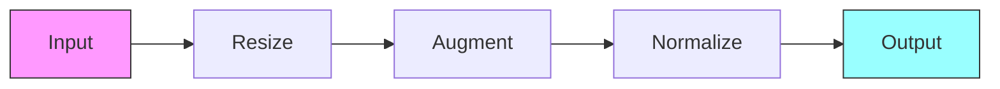

# Data Transforms 🔄

> Data augmentation and transformation operations for vision data

## 📑 Table of Contents

- [Overview](#overview)
- [Directory Structure](#directory-structure)
- [Components](#components)
- [Usage Examples](#usage-examples)
- [Best Practices](#best-practices)

## Overview

The transforms/ module provides data augmentation and transformation operations commonly used in computer vision tasks. These transforms can be composed together to create complex data preprocessing pipelines.

## Directory Structure



```
transforms/
├── base.py        # Base transform classes
├── vision.py      # Vision-specific transforms
└── compose.py     # Transform composition tools
```

## Components

### Base Transform

```python
from abc import ABC, abstractmethod
from typing import Any

class BaseTransform(ABC):
    """Abstract base class for all transforms."""

    @abstractmethod
    def __call__(self, data: Any) -> Any:
        """Apply the transform to the input data."""
        pass

    def __repr__(self):
        """Return string representation."""
        return self.__class__.__name__
```

### Vision Transforms

```python
from core.data.transforms import BaseTransform
import torch

class VisionTransform(BaseTransform):
    """Base class for vision transforms."""

    def __init__(self, **kwargs):
        self.params = kwargs

    def __call__(self, image: torch.Tensor) -> torch.Tensor:
        return self.apply_transform(image)

    def apply_transform(self, image):
        """Implement transform logic"""
        pass
```

## Usage Examples

### Creating Transform Pipelines

```python
from core.data.transforms import (
    Resize,
    RandomCrop,
    ColorJitter,
    Normalize,
    Compose
)

transform_pipeline = Compose([
    Resize(size=(224, 224)),
    RandomCrop(size=196),
    ColorJitter(brightness=0.2, contrast=0.2),
    Normalize(mean=[0.485, 0.456, 0.406],
             std=[0.229, 0.224, 0.225])
])
```

### Transform Flow



## Best Practices

### 1. Transform Design

- Keep transforms atomic
- Enable composition
- Maintain consistency
- Support batches
- Handle edge cases

### 2. Implementation

1. **Basic Transforms**

   ```python
   class Resize(VisionTransform):
       def apply_transform(self, image):
           return F.resize(image, self.params['size'])
   ```

2. **Augmentation Transforms**

   ```python
   class RandomAugment(VisionTransform):
       def apply_transform(self, image):
           if torch.rand(1) > self.params['p']:
               return image
           return self.augment(image)
   ```

3. **Geometric Transforms**
   ```python
   class RandomRotate(VisionTransform):
       def apply_transform(self, image):
           angle = torch.rand(1) * self.params['max_angle']
           return F.rotate(image, angle)
   ```

### Common Transform Types

1. **Spatial Transforms**

   - Resize
   - Crop
   - Rotate
   - Flip
   - Affine

2. **Color Transforms**

   - Brightness
   - Contrast
   - Saturation
   - Hue
   - Normalization

3. **Advanced Transforms**
   - Cutout
   - MixUp
   - CutMix
   - RandAugment

### Performance Tips

1. **Efficiency**

   - Optimize operations
   - Use vectorization
   - Enable GPU transforms
   - Batch processing

2. **Memory Usage**

   - In-place operations
   - Memory sharing
   - Efficient formats
   - Cache management

3. **Quality Control**
   - Validate outputs
   - Check ranges
   - Preserve metadata
   - Handle errors

Remember: Design transforms that are efficient and maintain data integrity! 💪

### Additional Resources

- [Transform Design Guide](docs/design.md)
- [Augmentation Strategies](docs/augmentation.md)
- [Performance Tips](docs/performance.md)


_Placeholder: Insert diagram showing transform pipeline stages_
