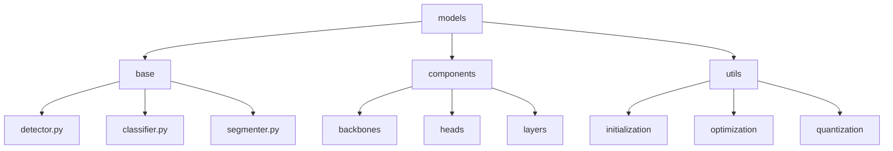
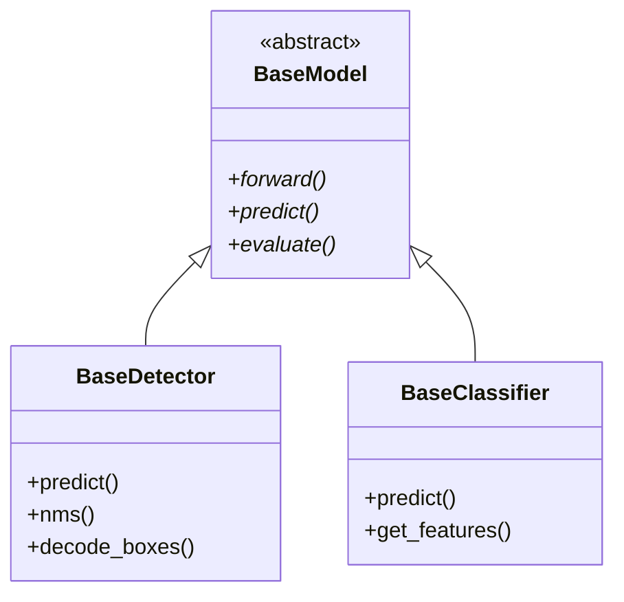
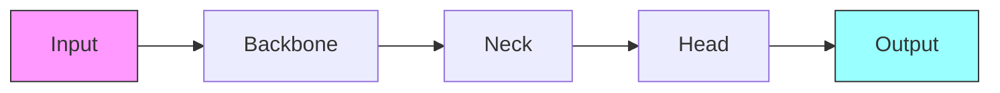
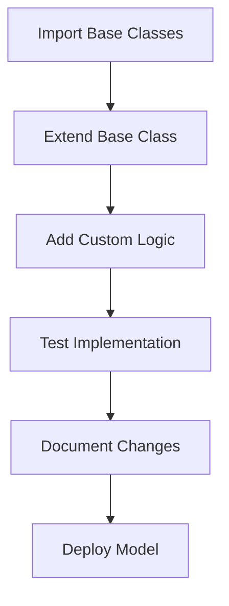

# Core Models 🧠

> Base model architectures and components for computer vision tasks

## 📑 Table of Contents

- [Overview](#overview)
- [Directory Structure](#directory-structure)
- [Component Guidelines](#component-guidelines)
- [Best Practices](#best-practices)
- [Usage Example](#usage-example)
- [Integration Guidelines](#integration-guidelines)
- [Model Registry](#model-registry)
- [Additional Resources](#additional-resources)

## Overview

This directory contains base model architectures and components that can be extended and used across different vision projects.

## Directory Structure



```
models/
├── base/               # Abstract base classes
│   ├── detector.py
│   ├── classifier.py
│   └── segmenter.py
├── components/         # Shared neural network components
│   ├── backbones/     # Feature extractors
│   ├── heads/         # Task-specific heads
│   └── layers/        # Custom layer implementations
└── utils/             # Model-specific utilities
    ├── initialization/
    ├── optimization/
    └── quantization/
```

## 🔧 Component Guidelines

### Base Models

- Implement abstract base classes for common model types
- Define standard interfaces for each model category
- Include type hints and comprehensive docstrings
- Provide default implementations where appropriate



Example base detector:

```python
from abc import ABC, abstractmethod
from typing import Dict, List, Union

class BaseDetector(ABC):
    @abstractmethod
    def predict(self,
        image: Union[np.ndarray, str],
        confidence: float = 0.5
    ) -> Dict[str, List]:
        """Detect objects in an image.

        Args:
            image: Input image or path
            confidence: Detection threshold

        Returns:
            Dictionary of detection results
        """
        pass
```

## ✨ Best Practices

### 1. Model Design



- Follow standard deep learning practices
- Support hardware acceleration
- Enable mixed precision training
- Implement gradient checkpointing

### 2. 📝 Documentation

- Document architecture details
- Include performance characteristics
- Provide usage examples
- List dependencies and requirements

### 3. 🧪 Testing

- Unit test all components
- Validate shapes and types
- Test edge cases
- Benchmark performance

## 🚀 Usage Example

```python
from core.models.base import BaseDetector
from core.models.components.backbones import ResNetBackbone
from core.models.components.heads import DetectionHead

class CustomDetector(BaseDetector):
    def __init__(self):
        super().__init__()
        self.backbone = ResNetBackbone()
        self.head = DetectionHead()

    def predict(self, image, confidence=0.5):
        features = self.backbone(image)
        return self.head(features, confidence)
```

## 🔄 Integration Guidelines



When integrating models into projects:

1. Import base classes from core
2. Extend with project-specific requirements
3. Maintain consistent interfaces
4. Document any deviations
5. Add project-specific optimizations

## 📊 Model Registry

Consider registering your model if it:

- 🎯 Solves a common computer vision task
- 🔄 Has broad applicability
- 📝 Is well-documented
- 🧪 Includes unit tests
- 📈 Demonstrates good performance

## 📚 Additional Resources

- [PyTorch Model Guidelines](https://pytorch.org/docs/stable/notes/extending.html)
- [TensorFlow Model Guidelines](https://www.tensorflow.org/guide/keras/custom_layers_and_models)
- [ML Model Design Patterns](https://www.oreilly.com/library/view/machine-learning-design/9781098115777/)

Remember: Build models that are easy to understand, maintain, and extend! 💪
