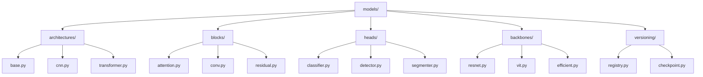

# Core Models 🧠

> Base model architectures and components for computer vision tasks

## 📑 Table of Contents

- [Overview](#overview)
- [Directory Structure](#directory-structure)
- [Components](#components)
- [Usage Examples](#usage-examples)
- [Best Practices](#best-practices)

## Overview

The models/ module contains shared model components that are used across various computer vision projects. This includes base architectures, reusable blocks, task-specific heads, feature extractors, and version control utilities.

## Directory Structure



```
models/
├── architectures/    # Neural network architectures
│   ├── base.py      # Base architecture classes
│   ├── cnn.py       # CNN architectures
│   └── transformer.py# Vision transformer architectures
├── blocks/          # Reusable model blocks
│   ├── attention.py # Attention mechanisms
│   ├── conv.py      # Convolution blocks
│   └── residual.py  # Residual connections
├── heads/           # Task-specific model heads
│   ├── classifier.py# Classification heads
│   ├── detector.py  # Detection heads
│   └── segmenter.py # Segmentation heads
├── backbones/       # Feature extractors
│   ├── resnet.py    # ResNet variants
│   ├── vit.py       # Vision Transformer
│   └── efficient.py # EfficientNet variants
└── versioning/      # Model versioning utilities
    ├── registry.py  # Model registry management
    └── checkpoint.py# Checkpoint handling
```

## Components

### Base Architecture

```python
from core.models.architectures import BaseArchitecture
from core.models.blocks import ConvBlock, AttentionBlock
from core.models.heads import ClassificationHead

class CustomModel(BaseArchitecture):
    def __init__(self, config):
        super().__init__()
        self.backbone = self.build_backbone(config)
        self.head = ClassificationHead(config)

    def build_backbone(self, config):
        return nn.Sequential(
            ConvBlock(config),
            AttentionBlock(config)
        )

    def forward(self, x):
        features = self.backbone(x)
        return self.head(features)
```

### Model Registry

```python
from core.models.versioning import ModelRegistry
from core.models.versioning.checkpoint import save_checkpoint

# Register model version
registry = ModelRegistry()
registry.register(
    name="custom_model",
    version="1.0.0",
    model=CustomModel,
    config=model_config
)

# Save checkpoint with versioning
save_checkpoint(
    model,
    optimizer,
    epoch,
    metrics,
    path="checkpoints/v1.0.0/"
)

# Load specific version
model = registry.load("custom_model", version="1.0.0")
```

## Usage Examples

### Model Creation

```python
from core.models import create_model
from core.models.blocks import create_backbone
from core.models.versioning import register_model

# Create new model
model = create_model(
    architecture="custom",
    backbone="resnet50",
    head="classifier",
    config=config
)

# Register model version
register_model(
    model,
    name="custom_model",
    version="1.0.0",
    tags=["production", "classifier"]
)
```

### Common Use Cases


_Placeholder: Insert diagram showing the interaction between different model components_

1. **Classification Models**

   ```python
   from core.models.architectures import CNNArchitecture
   from core.models.heads import ClassificationHead

   model = CNNArchitecture(
       backbone="resnet50",
       head=ClassificationHead(num_classes=10)
   )
   ```

2. **Detection Models**

   ```python
   from core.models.architectures import DetectionArchitecture
   from core.models.heads import DetectionHead

   model = DetectionArchitecture(
       backbone="efficient_net",
       head=DetectionHead(num_classes=20)
   )
   ```

## Best Practices

### 1. Architecture Design

- Use modular components
- Follow consistent interfaces
- Enable easy customization
- Support feature extraction

### 2. Model Implementation

- Implement clear forward passes
- Add docstrings and type hints
- Include shape assertions
- Enable model summary

### 3. Performance

- Profile memory usage
- Optimize forward pass
- Enable mixed precision
- Support distributed training

### 4. Version Control

- Version models properly
- Track experiments
- Save checkpoints regularly
- Document changes

Remember: Build models that are easy to understand, maintain, and extend! 💪

### Additional Resources

- [Documentation on CNN Architectures](docs/architectures.md)
- [Guide to Model Components](docs/components.md)
- [Performance Optimization Tips](docs/optimization.md)
- [Version Control Best Practices](docs/versioning.md)
