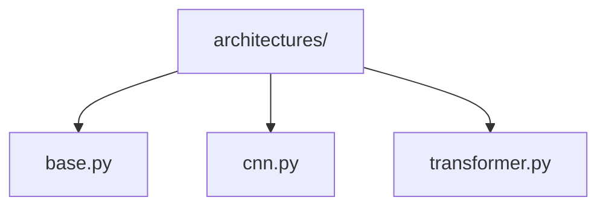

# Model Architectures 🏗️

> Neural network architectures for computer vision tasks

## 📑 Table of Contents

- [Overview](#overview)
- [Directory Structure](#directory-structure)
- [Components](#components)
- [Usage Examples](#usage-examples)
- [Best Practices](#best-practices)

## Overview

The architectures/ module provides base neural network architectures that can be extended and customized for specific vision tasks.

## Directory Structure



```
architectures/
├── base.py          # Base architecture classes
├── cnn.py           # CNN architecture implementations
└── transformer.py   # Vision transformer implementations
```

## Components

### Base Architecture

```python
from core.models.architectures.base import BaseArchitecture

class CustomArchitecture(BaseArchitecture):
    def __init__(self, config):
        super().__init__()
        self.build_network(config)

    def build_network(self, config):
        """Implement network architecture"""
        pass

    def forward(self, x):
        """Define forward pass"""
        pass
```

## Usage Examples

```python
from core.models.architectures import BaseArchitecture
from core.models.blocks import ConvBlock

class VisionArchitecture(BaseArchitecture):
    def __init__(self, config):
        super().__init__()
        self.features = nn.Sequential(
            ConvBlock(3, 64),
            ConvBlock(64, 128),
            ConvBlock(128, 256)
        )
```

### Architecture Pattern


_Placeholder: Insert diagram showing the architecture pattern_

## Best Practices

### 1. Design Principles

- Keep architectures modular
- Enable easy customization
- Support feature extraction
- Implement clear interfaces

### 2. Implementation

- Document layer structures
- Include shape comments
- Support different inputs
- Enable model summary

### 3. Performance

- Consider memory usage
- Optimize forward pass
- Enable mixed precision
- Support distributed training

Remember: Build flexible architectures that can be easily adapted! 💪

### Additional Resources

- [Architecture Design Guide](docs/design.md)
- [Implementation Tips](docs/implementation.md)
- [Performance Optimization](docs/performance.md)
