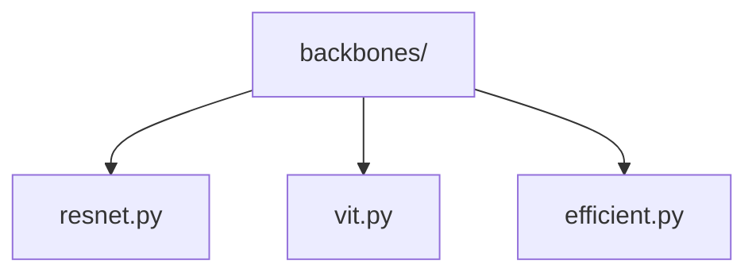
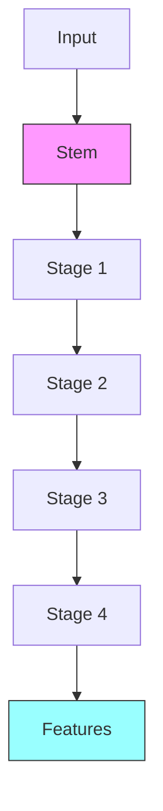

# Model Backbones 🦴

> Feature extraction networks for vision tasks

## 📑 Table of Contents

- [Overview](#overview)
- [Directory Structure](#directory-structure)
- [Components](#components)
- [Usage Examples](#usage-examples)
- [Best Practices](#best-practices)

## Overview

The backbones/ module provides common feature extraction networks that serve as the foundation for various computer vision tasks. These networks are typically pre-trained on large datasets and can be fine-tuned for specific tasks.

## Directory Structure



```
backbones/
├── resnet.py       # ResNet variants
├── vit.py         # Vision Transformer
└── efficient.py   # EfficientNet variants
```

## Components

### Base Backbone

```python
from core.models.backbones import BaseBackbone

class CustomBackbone(BaseBackbone):
    def __init__(self, config):
        super().__init__()
        self.build_backbone(config)

    def build_backbone(self, config):
        """Implement backbone architecture"""
        pass

    def forward(self, x):
        """Extract hierarchical features"""
        pass
```

## Usage Examples

### Feature Extraction

```python
from core.models.backbones import create_backbone

# Create backbone
backbone = create_backbone(
    name="resnet50",
    pretrained=True,
    features_only=True
)

# Extract features
features = backbone(images)  # Returns dict of features
```

### Backbone Integration



## Best Practices

### 1. Architecture Design

- Support feature extraction
- Enable stage outputs
- Maintain modularity
- Allow customization

### 2. Implementation

- Support pretrained weights
- Handle different inputs
- Enable feature selection
- Document architectures

### 3. Backbone Types

1. **CNN-based**

   - ResNet family
   - EfficientNet
   - MobileNet
   - RegNet

2. **Transformer-based**
   - Vision Transformer
   - Swin Transformer
   - ConvNeXt
   - Hybrid models

### Performance Considerations

1. **Memory Efficiency**

   - Gradient checkpointing
   - Feature caching
   - Memory-efficient blocks
   - Activation compression

2. **Computation Speed**

   - Optimized convolutions
   - Efficient attention
   - Layer fusion
   - Quantization support

3. **Feature Quality**
   - Multi-scale features
   - Receptive field size
   - Feature resolution
   - Information flow

Remember: Choose backbones that balance performance and efficiency! 💪

### Additional Resources

- [Backbone Selection Guide](docs/selection.md)
- [Feature Extraction Tips](docs/features.md)
- [Performance Optimization](docs/optimization.md)


_Placeholder: Insert diagram showing backbone architecture and feature hierarchy_

### Common Use Cases

```python
# Classification backbone
backbone = create_backbone(
    "resnet50",
    output_stride=32,
    pretrained=True
)

# Detection backbone
backbone = create_backbone(
    "efficient_net",
    output_indices=(2, 3, 4),
    features_only=True
)

# Segmentation backbone
backbone = create_backbone(
    "vit",
    patch_size=16,
    hierarchical=True
)
```

## Integration Tips

1. **Feature Selection**

   ```python
   class FeatureSelector(nn.Module):
       def __init__(self, backbone, output_indices):
           super().__init__()
           self.backbone = backbone
           self.output_indices = output_indices

       def forward(self, x):
           features = self.backbone(x)
           return [features[i] for i in self.output_indices]
   ```

2. **Feature Pyramid**
   ```python
   class FeaturePyramid(nn.Module):
       def __init__(self, backbone, fpn_channels):
           super().__init__()
           self.backbone = backbone
           self.fpn = build_fpn(fpn_channels)

       def forward(self, x):
           features = self.backbone(x)
           return self.fpn(features)
   ```
