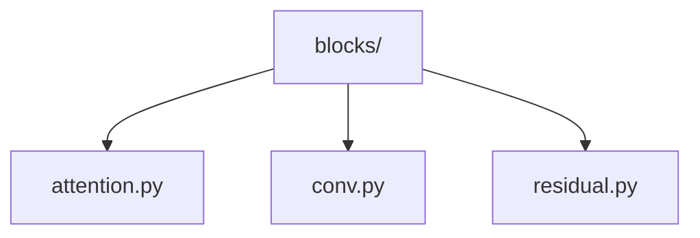
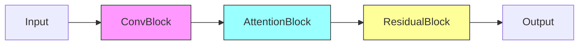

# Model Blocks 🧱

> Reusable neural network building blocks for vision models

## 📑 Table of Contents

- [Overview](#overview)
- [Directory Structure](#directory-structure)
- [Components](#components)
- [Usage Examples](#usage-examples)
- [Best Practices](#best-practices)

## Overview

The blocks/ module provides reusable neural network components that can be combined to create complex model architectures. These blocks implement common patterns and proven designs for computer vision tasks.

## Directory Structure



```
blocks/
├── attention.py     # Attention mechanisms
├── conv.py         # Convolution blocks
└── residual.py     # Residual connections
```

## Components

### Common Blocks

```python
from core.models.blocks.conv import ConvBlock
from core.models.blocks.attention import SelfAttention
from core.models.blocks.residual import ResidualBlock

class CustomBlock(nn.Module):
    def __init__(self, in_channels, out_channels):
        super().__init__()
        self.conv = ConvBlock(in_channels, out_channels)
        self.attention = SelfAttention(out_channels)
        self.residual = ResidualBlock(out_channels)

    def forward(self, x):
        x = self.conv(x)
        x = self.attention(x)
        x = self.residual(x)
        return x
```

## Usage Examples

### Building Complex Architectures

```python
from core.models.blocks import ConvBlock, ResidualBlock

class FeatureExtractor(nn.Module):
    def __init__(self, config):
        super().__init__()
        self.stages = nn.ModuleList([
            self._make_stage(config, i)
            for i in range(config.num_stages)
        ])

    def _make_stage(self, config, stage_idx):
        layers = []
        for _ in range(config.blocks_per_stage[stage_idx]):
            layers.append(ResidualBlock(
                in_channels=config.channels[stage_idx],
                out_channels=config.channels[stage_idx + 1]
            ))
        return nn.Sequential(*layers)
```

### Block Patterns



## Best Practices

### 1. Block Design

- Keep blocks self-contained
- Support variable inputs
- Enable easy integration
- Maintain consistency

### 2. Implementation

- Document block behavior
- Include shape checks
- Support configuration
- Enable block summary

### 3. Optimization

- Optimize memory usage
- Profile performance
- Enable fusing operations
- Support quantization

### Block Types

1. **Convolution Blocks**

   - Basic convolutions
   - Depthwise separable
   - Grouped convolutions
   - Dilated convolutions

2. **Attention Blocks**

   - Self-attention
   - Cross-attention
   - Multi-head attention
   - Position-wise FFN

3. **Residual Blocks**
   - Basic residual
   - Bottleneck
   - Pre-activation
   - SE blocks

Remember: Create blocks that are modular, efficient, and easy to use! 💪

### Additional Resources

- [Block Design Patterns](docs/patterns.md)
- [Implementation Guidelines](docs/guidelines.md)
- [Optimization Tips](docs/optimization.md)


_Placeholder: Insert diagram showing different block components_
