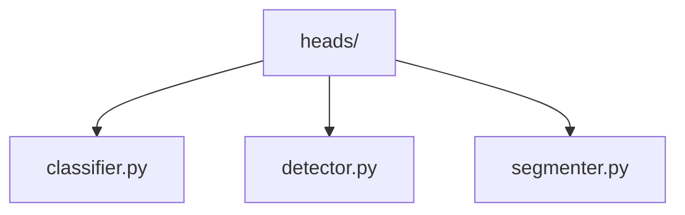
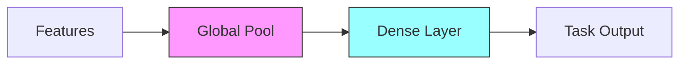

# Model Heads 👁️

> Task-specific output heads for vision models

## 📑 Table of Contents

- [Overview](#overview)
- [Directory Structure](#directory-structure)
- [Components](#components)
- [Usage Examples](#usage-examples)
- [Best Practices](#best-practices)

## Overview

The heads/ module provides task-specific output heads that can be attached to backbone networks for various computer vision tasks like classification, detection, and segmentation.

## Directory Structure



```
heads/
├── classifier.py    # Classification heads
├── detector.py     # Object detection heads
└── segmenter.py    # Segmentation heads
```

## Components

### Base Head

```python
from core.models.heads import BaseHead

class TaskHead(BaseHead):
    def __init__(self, in_features, config):
        super().__init__()
        self.build_head(in_features, config)

    def build_head(self, in_features, config):
        """Implement task-specific head"""
        pass

    def forward(self, features):
        """Define forward pass"""
        pass
```

## Usage Examples

### Classification Head

```python
from core.models.heads import ClassificationHead

class CustomClassifier(nn.Module):
    def __init__(self, num_classes):
        super().__init__()
        self.backbone = create_backbone()
        self.head = ClassificationHead(
            in_features=2048,
            num_classes=num_classes,
            dropout_rate=0.2
        )

    def forward(self, x):
        features = self.backbone(x)
        return self.head(features)
```

### Head Architecture



## Best Practices

### 1. Design Guidelines

- Keep heads modular
- Support feature inputs
- Enable easy swapping
- Maintain consistency

### 2. Implementation

- Handle varying inputs
- Support different pools
- Enable configuration
- Document outputs

### 3. Task-Specific

1. **Classification**

   - Multi-class support
   - Label smoothing
   - Class weighting
   - Feature pooling

2. **Detection**

   - Anchor generation
   - Box regression
   - NMS support
   - Multi-scale features

3. **Segmentation**
   - Upsampling layers
   - Skip connections
   - Multi-scale fusion
   - Boundary refinement

### Performance Tips

- Optimize computations
- Reduce memory usage
- Enable batch processing
- Support mixed precision

Remember: Design heads that are task-appropriate and efficient! 💪

### Additional Resources

- [Head Design Guide](docs/design.md)
- [Task-Specific Tips](docs/tasks.md)
- [Performance Tuning](docs/performance.md)


_Placeholder: Insert diagram showing different head architectures_
