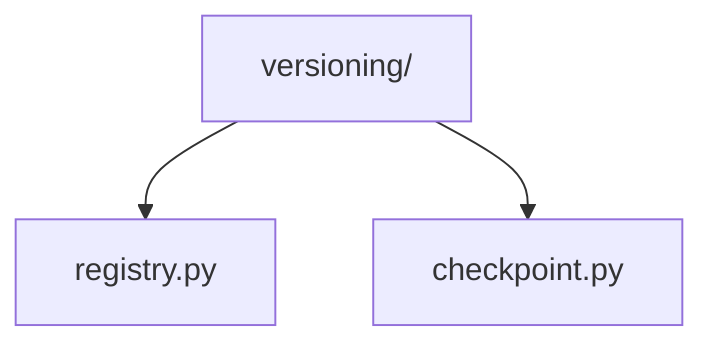
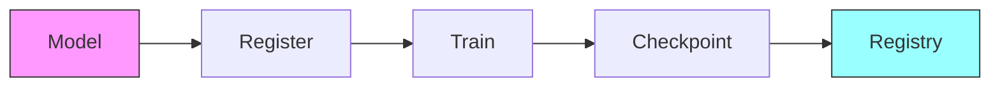

# Model Versioning 📦

> Model version control and checkpoint management utilities

## 📑 Table of Contents

- [Overview](#overview)
- [Directory Structure](#directory-structure)
- [Components](#components)
- [Usage Examples](#usage-examples)
- [Best Practices](#best-practices)

## Overview

The versioning/ module provides utilities for model version control, checkpoint management, and model registry operations. This ensures reproducibility and proper tracking of model iterations.

## Directory Structure



```
versioning/
├── registry.py     # Model registry management
└── checkpoint.py   # Checkpoint handling utilities
```

## Components

### Model Registry

```python
from core.models.versioning.registry import ModelRegistry

class ModelRegistry:
    """Manages model versions and configurations."""

    def register(self, name, version, model_cls, config):
        """Register a new model version."""
        self._validate_version(version)
        self._store_model(name, version, model_cls, config)

    def load(self, name, version):
        """Load a specific model version."""
        config = self._get_config(name, version)
        return self._create_model(name, config)
```

### Checkpoint Management

```python
from core.models.versioning.checkpoint import CheckpointManager

class CheckpointManager:
    """Handles model checkpoint operations."""

    def save(self, model, optimizer, epoch, metrics):
        """Save model checkpoint with metadata."""
        checkpoint = {
            'model_state': model.state_dict(),
            'optimizer_state': optimizer.state_dict(),
            'epoch': epoch,
            'metrics': metrics
        }
        self._save_checkpoint(checkpoint)

    def load(self, path):
        """Load model checkpoint."""
        return self._load_checkpoint(path)
```

## Usage Examples

### Version Control

```python
from core.models.versioning import ModelRegistry
from core.models.versioning.checkpoint import CheckpointManager

# Initialize registry
registry = ModelRegistry()

# Register model version
registry.register(
    name="efficientnet_classifier",
    version="2.0.0",
    model_cls=EfficientNetClassifier,
    config={
        'backbone': 'b0',
        'num_classes': 1000,
        'pretrained': True
    }
)

# Save checkpoint
checkpoint_manager = CheckpointManager(
    save_dir="checkpoints/",
    max_saves=5
)

checkpoint_manager.save(
    model=model,
    optimizer=optimizer,
    epoch=50,
    metrics={
        'accuracy': 0.95,
        'loss': 0.1
    }
)
```

### Version Management Flow



## Best Practices

### 1. Version Control

- Use semantic versioning
- Document changes
- Track dependencies
- Maintain changelog
- Tag releases

### 2. Checkpoint Management

1. **Saving Strategy**

   ```python
   def save_strategy(metrics, best_metrics):
       should_save = (
           metrics['accuracy'] > best_metrics['accuracy'] or
           (epoch + 1) % save_interval == 0
       )
       return should_save
   ```

2. **Metadata Tracking**
   ```python
   def save_with_metadata(model, metadata):
       """Save checkpoint with additional metadata."""
       return {
           'model_state': model.state_dict(),
           'metadata': {
               'version': metadata['version'],
               'dataset': metadata['dataset'],
               'metrics': metadata['metrics'],
               'timestamp': datetime.now().isoformat()
           }
       }
   ```

### Version Management Features

1. **Model Registry**

   - Version tracking
   - Config management
   - Dependency tracking
   - Model lookup

2. **Checkpoint System**

   - Incremental saves
   - Best model tracking
   - Metadata storage
   - Recovery points

3. **Release Management**
   - Release notes
   - Version tagging
   - Migration scripts
   - Rollback support

Remember: Maintain clear version control for reproducibility! 💪

### Additional Resources

- [Version Control Guide](docs/version_control.md)
- [Checkpoint Management](docs/checkpoints.md)
- [Release Process](docs/releases.md)


_Placeholder: Insert diagram showing version control workflow_

### Common Configurations

```python
# Production release
release_config = {
    'version': '1.0.0',
    'stage': 'production',
    'tracking': {
        'dataset_version': '2.0.0',
        'training_run': 'exp_001',
        'metrics': {
            'accuracy': 0.95,
            'latency': '10ms'
        }
    }
}

# Development version
dev_config = {
    'version': '1.1.0-dev',
    'stage': 'development',
    'tracking': {
        'dataset_version': '2.1.0-dev',
        'training_run': 'exp_002',
        'metrics': {
            'accuracy': 0.96,
            'latency': '12ms'
        }
    }
}
```
