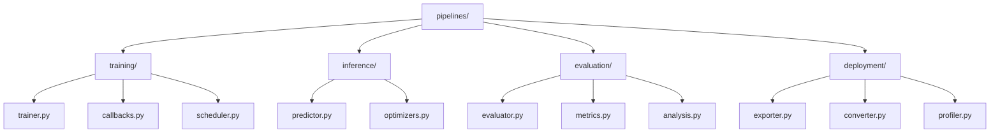
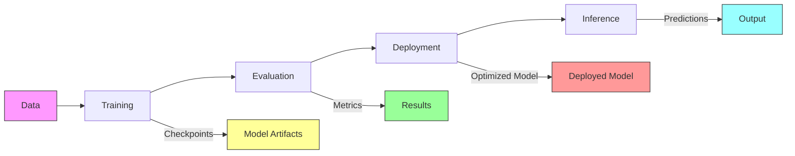

# Pipeline Components 🔄

> Efficient ML processing pipelines for computer vision tasks

## 📑 Table of Contents

- [Overview](#overview)
- [Directory Structure](#directory-structure)
- [Components](#components)
- [Usage Examples](#usage-examples)
- [Best Practices](#best-practices)

## Overview

This directory contains reusable ML processing pipelines for training, inference, evaluation, and deployment of vision models.

## Directory Structure



```
pipelines/
├── training/           # Training workflows
│   ├── trainer.py     # Base trainer class
│   ├── callbacks.py   # Training callbacks
│   └── scheduler.py   # Learning rate scheduling
├── inference/         # Inference pipelines
│   ├── predictor.py   # Base predictor class
│   └── optimizers.py  # Inference optimization
├── evaluation/        # Evaluation pipelines
│   ├── evaluator.py   # Base evaluator class
│   ├── metrics.py     # Evaluation metrics
│   └── analysis.py    # Result analysis
└── deployment/        # Deployment utilities
    ├── exporter.py    # Model export
    ├── converter.py   # Format conversion
    └── profiler.py    # Performance profiling
```

## Components

### Training Pipeline

```python
from core.pipelines.training import Trainer
from core.pipelines.training.callbacks import ModelCheckpoint

class CustomTrainer(Trainer):
    def __init__(self, model, config):
        super().__init__()
        self.model = model
        self.callbacks = [
            ModelCheckpoint(save_dir="checkpoints")
        ]

    def train_epoch(self):
        for batch in self.dataloader:
            loss = self.train_step(batch)
            self.log_metrics({'loss': loss})

    def validate_epoch(self):
        metrics = self.evaluate()
        self.log_metrics(metrics)
```

### Inference Pipeline

```python
from core.pipelines.inference import Predictor
from core.pipelines.inference.optimizers import optimize_for_inference
from core.pipelines.deployment import ModelExporter

class CustomPredictor(Predictor):
    def __init__(self, model, config):
        super().__init__()
        self.model = optimize_for_inference(model)

    def export_model(self, path):
        exporter = ModelExporter(self.model)
        exporter.export(
            path,
            format='onnx',
            optimize=True
        )

    def predict(self, image):
        processed = self.preprocess(image)
        return self.model(processed)
```

### Deployment Pipeline

```python
from core.pipelines.deployment import (
    ModelExporter,
    FormatConverter,
    PerformanceProfiler
)

# Export model
exporter = ModelExporter(model)
exported_path = exporter.export(
    "models/exported/",
    format="onnx",
    optimize=True
)

# Convert format
converter = FormatConverter(exported_path)
converted_path = converter.convert(
    target_format="tensorrt",
    precision="fp16"
)

# Profile performance
profiler = PerformanceProfiler(converted_path)
metrics = profiler.profile(
    batch_sizes=[1, 8, 16, 32],
    num_iterations=100
)
```

## Usage Examples

### Training Setup

```python
from core.pipelines.training import create_trainer
from core.pipelines.training.callbacks import (
    EarlyStopping,
    ModelCheckpoint,
    LearningRateScheduler
)

# Configure trainer
trainer = create_trainer(
    model=model,
    optimizer=optimizer,
    callbacks=[
        EarlyStopping(patience=10),
        ModelCheckpoint(save_best=True),
        LearningRateScheduler()
    ]
)

# Train model
trainer.fit(
    train_data=train_loader,
    val_data=val_loader,
    epochs=100
)
```

### Pipeline Workflow



## Best Practices

### 1. Training Best Practices

- Monitor metrics
- Save checkpoints
- Handle interruptions
- Log experiments
- Validate frequently

### 2. Inference Best Practices

- Optimize performance
- Batch predictions
- Cache results
- Monitor latency
- Profile memory

### 3. Evaluation Best Practices

- Use multiple metrics
- Cross-validate
- Compare baselines
- Statistical testing
- Visualize results

### 4. Deployment Best Practices

- Version models
- Optimize for target
- Profile thoroughly
- Monitor resources
- Handle errors gracefully

### Integration Examples

```python
from core.models import create_model
from core.data import create_dataloader
from core.pipelines.training import create_trainer
from core.pipelines.evaluation import create_evaluator
from core.pipelines.deployment import create_deployment

# Setup pipeline
model = create_model(config)
dataloader = create_dataloader(dataset, config)
trainer = create_trainer(model, config)
evaluator = create_evaluator(model, config)
deployment = create_deployment(model, config)

# Execute pipeline
trainer.fit(dataloader)
metrics = evaluator.evaluate(dataloader)
deployment.deploy(
    model_path="models/production/",
    format="tensorrt",
    optimize=True
)
```

Remember: Build pipelines that are efficient, reliable, and easy to maintain! 💪

### Additional Resources

- [Pipeline Design Patterns](docs/patterns.md)
- [Performance Optimization Guide](docs/optimization.md)
- [Monitoring and Logging Best Practices](docs/monitoring.md)
- [Deployment Guide](docs/deployment.md)
