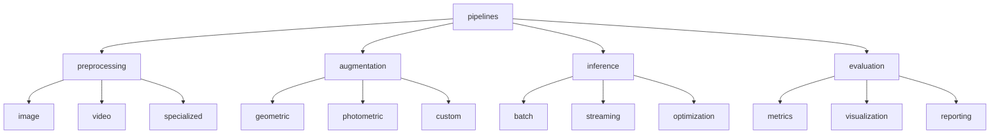
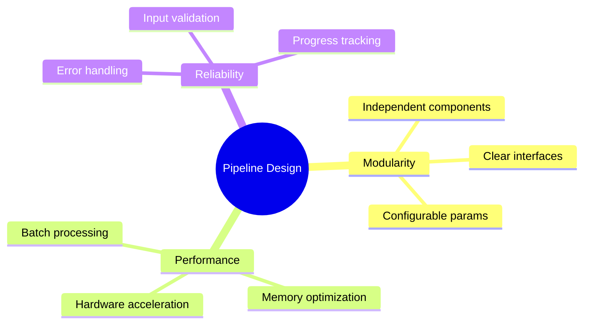
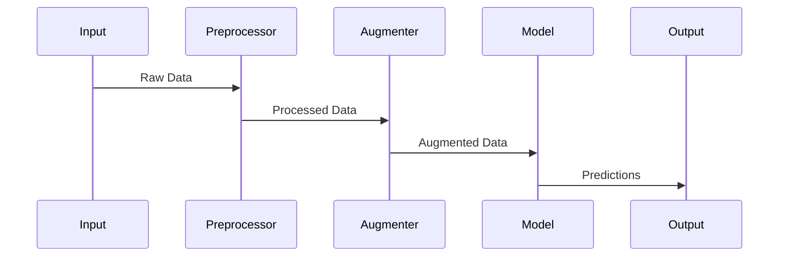
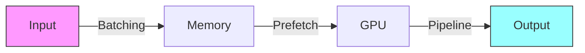
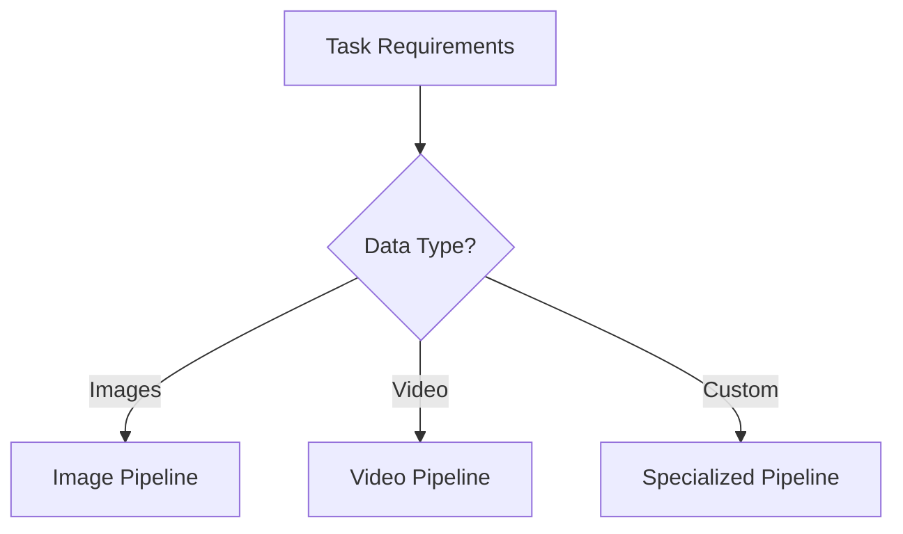

# Core Pipelines 🔄

> Efficient data processing workflows for computer vision tasks

## 📑 Table of Contents

- [Overview](#overview)
- [Directory Structure](#directory-structure)
- [Pipeline Guidelines](#pipeline-guidelines)
- [Best Practices](#best-practices)
- [Usage Guidelines](#usage-guidelines)
- [Testing Requirements](#testing-requirements)
- [Additional Resources](#additional-resources)

## Overview

This directory contains shared processing pipelines and data transformation workflows used across different vision projects.

## Directory Structure



```
pipelines/
├── preprocessing/        # Data preprocessing pipelines
│   ├── image/           # Image preprocessing
│   ├── video/           # Video preprocessing
│   └── specialized/     # Domain-specific preprocessing
├── augmentation/        # Data augmentation pipelines
│   ├── geometric/       # Geometric transformations
│   ├── photometric/     # Color and intensity
│   └── custom/         # Custom augmentations
├── inference/           # Inference pipelines
│   ├── batch/          # Batch processing
│   ├── streaming/      # Real-time processing
│   └── optimization/   # Optimized inference
└── evaluation/         # Evaluation pipelines
    ├── metrics/        # Performance metrics
    ├── visualization/  # Result visualization
    └── reporting/      # Report generation
```

## 🛠️ Pipeline Guidelines

### Design Principles



1. **🧩 Modularity**

   - Independent, reusable components
   - Clear input/output interfaces
   - Configurable parameters
   - Easy to extend and modify

2. **⚡ Performance**

   - Efficient data handling
   - Hardware acceleration
   - Memory optimization
   - Batch processing support

3. **🎯 Reliability**
   - Error handling
   - Input validation
   - Progress tracking
   - Logging support

### Pipeline Implementation



Example preprocessing pipeline:

```python
from typing import List, Optional
import numpy as np

class ImagePreprocessor:
    def __init__(self,
        target_size: tuple = (224, 224),
        normalize: bool = True,
        to_float: bool = True
    ):
        self.target_size = target_size
        self.normalize = normalize
        self.to_float = to_float

    def __call__(self,
        images: List[np.ndarray]
    ) -> List[np.ndarray]:
        """Process a batch of images.

        Args:
            images: List of input images

        Returns:
            List of processed images
        """
        processed = []
        for img in images:
            # Resize
            img = cv2.resize(img, self.target_size)

            # Convert to float
            if self.to_float:
                img = img.astype(np.float32) / 255.0

            # Normalize
            if self.normalize:
                img = (img - img.mean()) / img.std()

            processed.append(img)

        return processed
```

## ✨ Best Practices

### 📊 Data Handling

- Support multiple input formats
- Implement proper validation
- Handle edge cases
- Provide data inspection tools

### ⚡ Performance Optimization



- Use vectorized operations
- Implement parallel processing
- Enable GPU acceleration
- Optimize memory usage

### 🧪 Quality Assurance

- Unit test pipelines
- Validate transformations
- Monitor resource usage
- Document performance characteristics

## 🚀 Usage Guidelines

1. **Pipeline Selection**



2. **Configuration**
   - Set appropriate parameters
   - Document configurations
   - Version control settings
   - Monitor performance

Example usage:

```python
from core.pipelines.preprocessing import ImagePreprocessor
from core.pipelines.augmentation import AugmentationPipeline

# Setup pipelines
preprocessor = ImagePreprocessor(
    target_size=(224, 224),
    normalize=True
)

augmenter = AugmentationPipeline(
    rotate=True,
    flip=True,
    color_jitter=0.2
)

# Process data
processed_images = preprocessor(raw_images)
augmented_images = augmenter(processed_images)
```

## 🧪 Testing Requirements

1. **Unit Tests**

   - Test individual components
   - Validate transformations
   - Check edge cases
   - Verify error handling

2. **Integration Tests**

   - Test pipeline combinations
   - Verify data flow
   - Check resource usage
   - Validate outputs

3. **Performance Tests**
   - Measure throughput
   - Monitor memory usage
   - Test batch processing
   - Verify GPU utilization

## 📚 Additional Resources

- [Data Pipeline Best Practices](https://pytorch.org/docs/stable/data.html)
- [TensorFlow Data Pipelines](https://www.tensorflow.org/guide/data)
- [OpenCV Image Processing](https://docs.opencv.org/4.x/d2/d96/tutorial_py_table_of_contents_imgproc.html)

Remember: Efficient pipelines are the backbone of high-performance vision systems! 💪
