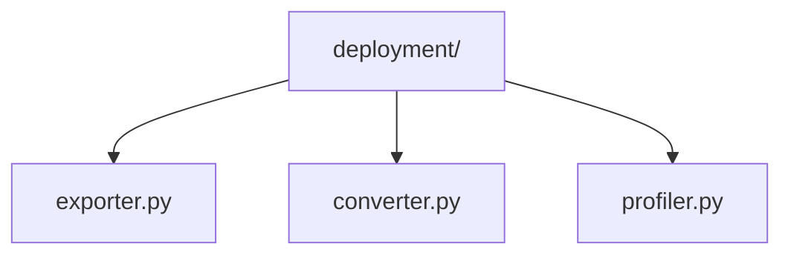

# Model Deployment 🚀

> Model deployment and optimization utilities

## 📑 Table of Contents

- [Overview](#overview)
- [Directory Structure](#directory-structure)
- [Components](#components)
- [Usage Examples](#usage-examples)
- [Best Practices](#best-practices)

## Overview

The deployment/ module provides utilities for exporting, converting, and optimizing models for production deployment. This includes tools for format conversion, performance profiling, and deployment optimization.

## Directory Structure



```
deployment/
├── exporter.py     # Model export utilities
├── converter.py    # Format conversion tools
└── profiler.py     # Performance profiling
```

## Components

### Model Exporter

```python
from core.pipelines.deployment.exporter import ModelExporter
from core.models.versioning import ModelRegistry

class ModelExporter:
    """Handles model export to various formats."""

    def __init__(self, model, version_info=None):
        self.model = model
        self.version_info = version_info

    def export(self, path, format='onnx', optimize=True):
        """Export model to specified format."""
        if self.version_info:
            path = f"{path}/v{self.version_info['version']}"

        if format == 'onnx':
            return self._export_onnx(path, optimize)
        elif format == 'torchscript':
            return self._export_torchscript(path, optimize)
```

### Format Converter

```python
from core.pipelines.deployment.converter import FormatConverter

class FormatConverter:
    """Converts models between different formats."""

    def __init__(self, model_path):
        self.model_path = model_path

    def convert(self, target_format, precision='fp32'):
        """Convert model to target format with specified precision."""
        if target_format == 'tensorrt':
            return self._convert_tensorrt(precision)
        elif target_format == 'openvino':
            return self._convert_openvino(precision)
```

## Usage Examples

### Model Export and Conversion

```python
from core.pipelines.deployment import (
    ModelExporter,
    FormatConverter,
    PerformanceProfiler
)
from core.models.versioning import ModelRegistry

# Get model from registry
registry = ModelRegistry()
model, version_info = registry.load(
    "efficientnet_classifier",
    version="2.0.0",
    return_info=True
)

# Export model
exporter = ModelExporter(model, version_info)
exported_path = exporter.export(
    path="models/exported/",
    format="onnx",
    optimize=True,
    input_shapes={"input": [1, 3, 224, 224]}
)

# Convert to TensorRT
converter = FormatConverter(exported_path)
optimized_path = converter.convert(
    target_format="tensorrt",
    precision="fp16",
    workspace_size=4096
)
```

### Deployment Flow


## Best Practices

### 1. Model Export

- Verify input shapes
- Set dynamic axes
- Include metadata
- Validate outputs
- Test inference
- Version tracking

### 2. Format Conversion

1. **Format Selection**

   ```python
   def select_format(requirements):
       if requirements.get('platform') == 'edge':
           return 'tflite'
       elif requirements.get('platform') == 'server':
           return 'tensorrt'
   ```

2. **Precision Management**
   ```python
   def optimize_precision(model, target_precision):
       if target_precision == 'fp16':
           return quantize_fp16(model)
       elif target_precision == 'int8':
           return quantize_int8(model)
   ```

### 3. Performance Profiling

```python
# Profile model performance
profiler = PerformanceProfiler(optimized_model)
results = profiler.profile({
    'batch_sizes': [1, 8, 16, 32],
    'iterations': 1000,
    'warmup': 100,
    'metrics': ['latency', 'throughput', 'memory']
})

# Generate report
report = profiler.generate_report(results)
```

### Deployment Features

1. **Model Optimization**

   - Graph optimization
   - Operator fusion
   - Constant folding
   - Dead code elimination

2. **Performance Features**

   - Batch inference
   - Dynamic batching
   - Kernel autotuning
   - Memory planning

3. **Monitoring**

   - Latency tracking
   - Resource usage
   - Throughput metrics
   - Error logging

4. **Version Management**
   - Version tracking
   - Artifact management
   - Rollback support
   - A/B testing

Remember: Optimize for production requirements and validate thoroughly! 💪

### Additional Resources

- [Export Guide](docs/export.md)
- [Conversion Tips](docs/conversion.md)
- [Optimization Guide](docs/optimization.md)
- [Version Management](docs/versioning.md)


_Placeholder: Insert diagram showing deployment pipeline stages_

### Common Configurations

```python
# Edge deployment
edge_config = {
    'format': 'tflite',
    'quantization': 'int8',
    'optimization_level': 3,
    'target': 'mobile',
    'version_tracking': True
}

# Server deployment
server_config = {
    'format': 'tensorrt',
    'precision': 'fp16',
    'workspace_size': 4096,
    'target': 'gpu',
    'version_tracking': True
}

# Cloud deployment
cloud_config = {
    'format': 'onnx',
    'optimization': 'basic',
    'target': 'cpu',
    'version_tracking': True
}

# Deployment with versioning
deployment = ModelDeployer(
    registry=ModelRegistry(),
    config=server_config
)

deployment.deploy(
    model_name="efficientnet_classifier",
    version="2.0.0",
    environment="production"
)
```
