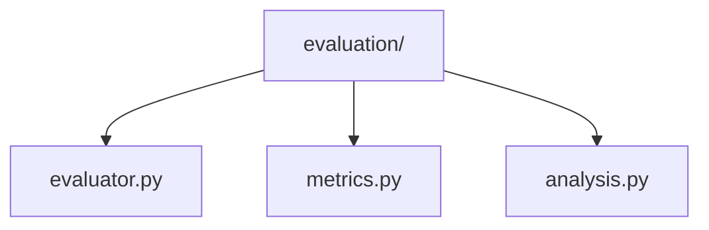
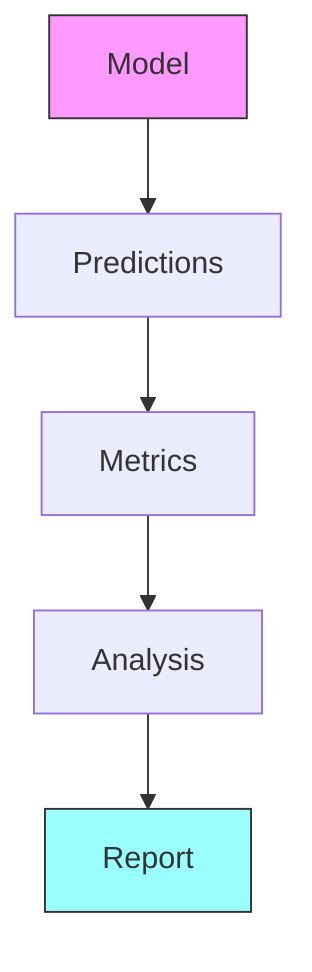

# Evaluation Pipeline 📊

> Model evaluation and metrics computation components

## 📑 Table of Contents

- [Overview](#overview)
- [Directory Structure](#directory-structure)
- [Components](#components)
- [Usage Examples](#usage-examples)
- [Best Practices](#best-practices)

## Overview

The evaluation/ module provides components for comprehensive model evaluation, including metrics computation, analysis tools, and evaluation pipelines.

## Directory Structure



```
evaluation/
├── evaluator.py    # Base evaluator implementation
├── metrics.py      # Evaluation metrics
└── analysis.py     # Results analysis tools
```

## Components

### Base Evaluator

```python
class BaseEvaluator:
    """Base class for model evaluation."""

    def __init__(self, model, metrics, config):
        self.model = model
        self.metrics = metrics
        self.config = config

    def evaluate(self, data_loader):
        """Run evaluation on the dataset."""
        results = self._compute_metrics(data_loader)
        self._analyze_results(results)
        return results

    def _compute_metrics(self, data_loader):
        """Compute evaluation metrics."""
        pass
```

## Usage Examples

### Basic Evaluation

```python
from core.pipelines.evaluation import Evaluator
from core.pipelines.evaluation.metrics import (
    Accuracy,
    Precision,
    Recall,
    F1Score
)

# Create evaluator
evaluator = Evaluator(
    model=model,
    metrics=[
        Accuracy(),
        Precision(),
        Recall(),
        F1Score()
    ]
)

# Run evaluation
results = evaluator.evaluate(test_loader)
```

### Evaluation Flow



## Best Practices

### 1. Evaluation Setup

- Define relevant metrics
- Use appropriate data
- Enable validation
- Track statistics
- Generate reports

### 2. Components

1. **Evaluator Implementation**

   ```python
   class CustomEvaluator(BaseEvaluator):
       def _compute_metrics(self, loader):
           predictions = self._get_predictions(loader)
           return {
               name: metric(predictions)
               for name, metric in self.metrics.items()
           }
   ```

2. **Metric Computation**

   ```python
   class Accuracy(BaseMetric):
       def __call__(self, predictions, targets):
           return (predictions == targets).float().mean()
   ```

3. **Results Analysis**
   ```python
   class ResultAnalyzer:
       def analyze(self, results):
           stats = self.compute_statistics(results)
           plots = self.generate_plots(results)
           return self.create_report(stats, plots)
   ```

### Evaluation Features

1. **Metrics**

   - Classification metrics
   - Detection metrics
   - Segmentation metrics
   - Custom metrics

2. **Analysis**

   - Error analysis
   - Performance profiling
   - Statistical tests
   - Visualization

3. **Reporting**
   - Metric summaries
   - Detailed breakdown
   - Visual reports
   - Export formats

### Performance Tips

1. **Efficiency**

   - Batch processing
   - Parallel computation
   - Metric caching
   - Memory management

2. **Accuracy**

   - Cross-validation
   - Statistical testing
   - Confidence intervals
   - Error bounds

3. **Visualization**
   - ROC curves
   - Confusion matrices
   - PR curves
   - Error examples

Remember: Thorough evaluation is key to model improvement! 💪

### Additional Resources

- [Evaluation Guide](docs/evaluation.md)
- [Metrics Reference](docs/metrics.md)
- [Analysis Tools](docs/analysis.md)


_Placeholder: Insert diagram showing evaluation pipeline components_

### Common Use Cases

```python
# Classification evaluation
classifier_evaluator = Evaluator(
    model=classifier,
    metrics={
        'accuracy': Accuracy(),
        'precision': Precision(average='macro'),
        'recall': Recall(average='macro'),
        'f1': F1Score(average='macro')
    }
)

# Detection evaluation
detector_evaluator = Evaluator(
    model=detector,
    metrics={
        'map': MeanAveragePrecision(),
        'recall': DetectionRecall(),
        'precision': DetectionPrecision()
    }
)

# Segmentation evaluation
segmentation_evaluator = Evaluator(
    model=segmenter,
    metrics={
        'iou': IoU(),
        'dice': DiceCoefficient(),
        'accuracy': PixelAccuracy()
    }
)
```

### Report Generation

```python
class EvaluationReport:
    def __init__(self, results):
        self.results = results

    def generate(self):
        """Generate comprehensive evaluation report."""
        return {
            'metrics': self.compute_metrics(),
            'analysis': self.analyze_results(),
            'visualizations': self.create_plots(),
            'summary': self.create_summary()
        }
```
