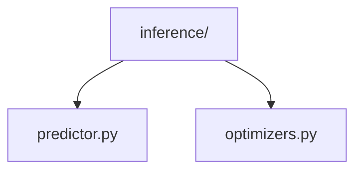
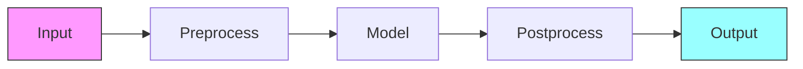

# Inference Pipeline 🔮

> Model inference and prediction components

## 📑 Table of Contents

- [Overview](#overview)
- [Directory Structure](#directory-structure)
- [Components](#components)
- [Usage Examples](#usage-examples)
- [Best Practices](#best-practices)

## Overview

The inference/ module provides components for efficient model inference and prediction, including optimized predictors and inference-time optimizations.

## Directory Structure



```
inference/
├── predictor.py    # Base predictor implementation
└── optimizers.py   # Inference optimization utilities
```

## Components

### Base Predictor

```python
class BasePredictor:
    """Base class for model inference."""

    def __init__(self, model, config):
        self.model = model
        self.config = config
        self._optimize_model()

    def _optimize_model(self):
        """Apply inference optimizations."""
        pass

    def predict(self, data):
        """Run inference on input data."""
        pass

    def predict_batch(self, batch):
        """Run inference on a batch of data."""
        pass
```

## Usage Examples

### Basic Inference

```python
from core.pipelines.inference import Predictor
from core.pipelines.inference.optimizers import optimize_for_inference

# Create predictor
predictor = Predictor(
    model=model,
    optimize_model=True,
    batch_size=32
)

# Run inference
predictions = predictor.predict(input_data)
```

### Inference Flow



## Best Practices

### 1. Inference Setup

- Optimize model for inference
- Enable batching
- Cache predictions
- Monitor latency
- Track resource usage

### 2. Components

1. **Predictor Implementation**

   ```python
   class CustomPredictor(BasePredictor):
       def predict(self, data):
           preprocessed = self.preprocess(data)
           predictions = self.model(preprocessed)
           return self.postprocess(predictions)
   ```

2. **Model Optimization**

   ```python
   def optimize_for_inference(model):
       model.eval()
       torch.jit.trace(model, example_input)
       return model
   ```

3. **Batch Processing**
   ```python
   def predict_batch(self, batch):
       with torch.no_grad():
           return self.model(batch)
   ```

### Inference Features

1. **Optimization**

   - Model quantization
   - Graph optimization
   - Kernel fusion
   - Memory reduction

2. **Performance**

   - Batch processing
   - Async inference
   - Pipeline parallelism
   - Caching

3. **Monitoring**
   - Latency tracking
   - Memory usage
   - GPU utilization
   - Throughput

### Performance Tips

1. **Model Optimization**

   - Use TorchScript
   - Enable fusion
   - Quantize weights
   - Optimize memory

2. **Inference Speed**

   - Batch inference
   - Parallel processing
   - Input pipelining
   - Output caching

3. **Resource Usage**
   - Monitor memory
   - Track GPU usage
   - Profile latency
   - Measure throughput

Remember: Optimize inference for production deployment! 💪

### Additional Resources

- [Inference Guide](docs/inference.md)
- [Optimization Tips](docs/optimization.md)
- [Deployment Best Practices](docs/deployment.md)


_Placeholder: Insert diagram showing inference pipeline components_

### Common Configurations

```python
# Basic inference setup
predictor = Predictor(
    model=model,
    config={
        'batch_size': 32,
        'device': 'cuda',
        'precision': 'fp16',
        'optimize': True
    }
)

# Optimized inference
optimized_predictor = Predictor(
    model=model,
    optimizations=[
        'quantization',
        'graph_optimization',
        'kernel_fusion'
    ],
    cache_size=1000
)

# Batch inference
results = predictor.predict_batch(
    data=large_dataset,
    batch_size=64,
    num_workers=4
)
```

### Error Handling

```python
from core.exceptions import InferenceError

class RobustPredictor(BasePredictor):
    def predict(self, data):
        try:
            return self._safe_predict(data)
        except Exception as e:
            raise InferenceError(f"Prediction failed: {e}")

    def _safe_predict(self, data):
        if self._validate_input(data):
            return self.model(data)
        raise ValueError("Invalid input data")
```
