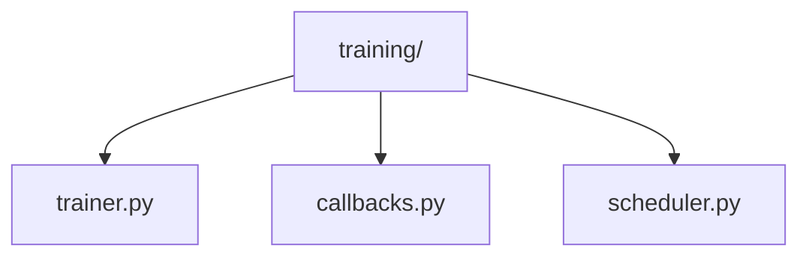
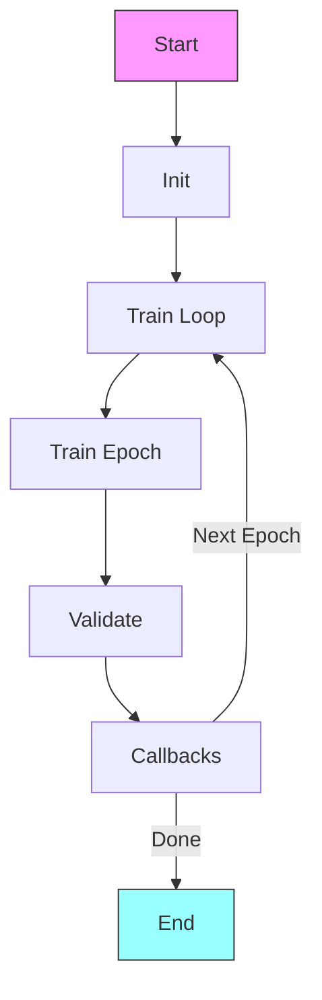

# Training Pipeline 🏋️‍♂️

> Training workflows and components for ML model training

## 📑 Table of Contents

- [Overview](#overview)
- [Directory Structure](#directory-structure)
- [Components](#components)
- [Usage Examples](#usage-examples)
- [Best Practices](#best-practices)

## Overview

The training/ module provides components and utilities for training machine learning models, including trainers, callbacks, and learning rate schedulers.

## Directory Structure



```
training/
├── trainer.py      # Base trainer implementation
├── callbacks.py    # Training callbacks
└── scheduler.py    # Learning rate scheduling
```

## Components

### Base Trainer

```python
class BaseTrainer:
    """Base class for model training."""

    def __init__(self, model, optimizer, config):
        self.model = model
        self.optimizer = optimizer
        self.config = config
        self.callbacks = []

    def train(self, train_loader, val_loader=None):
        """Training loop implementation."""
        for epoch in range(self.config.epochs):
            self._train_epoch(train_loader)
            if val_loader:
                self._validate_epoch(val_loader)

    def _train_epoch(self, train_loader):
        """Single epoch training."""
        pass
```

## Usage Examples

### Basic Training

```python
from core.pipelines.training import Trainer
from core.pipelines.training.callbacks import (
    ModelCheckpoint,
    EarlyStopping
)

# Configure trainer
trainer = Trainer(
    model=model,
    optimizer=optimizer,
    callbacks=[
        ModelCheckpoint(save_dir='checkpoints/'),
        EarlyStopping(patience=10)
    ]
)

# Train model
trainer.train(
    train_loader=train_loader,
    val_loader=val_loader,
    epochs=100
)
```

### Training Flow



## Best Practices

### 1. Training Setup

- Configure optimizers properly
- Set appropriate learning rates
- Enable gradient clipping
- Implement validation
- Use callbacks effectively

### 2. Components

1. **Trainer Implementation**

   ```python
   class CustomTrainer(BaseTrainer):
       def _train_epoch(self, loader):
           for batch in loader:
               loss = self._train_step(batch)
               self._log_metrics(loss)
   ```

2. **Callback System**

   ```python
   class ModelCheckpoint:
       def on_epoch_end(self, trainer):
           if trainer.best_score:
               trainer.save_checkpoint()
   ```

3. **Learning Rate Scheduling**
   ```python
   class LRScheduler:
       def step(self, metrics=None):
           if metrics > self.best_metrics:
               self.reduce_lr()
   ```

### Training Features

1. **Progress Tracking**

   - Metric logging
   - Loss monitoring
   - Learning rate tracking
   - Memory usage
   - Training time

2. **Model Management**

   - Checkpointing
   - Best model saving
   - State restoration
   - Model versioning

3. **Optimization**
   - Gradient clipping
   - Loss scaling
   - Mixed precision
   - Multi-GPU support

### Performance Tips

1. **Memory Efficiency**

   - Gradient accumulation
   - Mixed precision training
   - Memory pinning
   - Efficient backprop

2. **Training Speed**

   - DataLoader optimization
   - GPU utilization
   - Batch size tuning
   - Profile bottlenecks

3. **Monitoring**
   - Resource usage
   - Learning curves
   - Gradient norms
   - Layer statistics

Remember: Implement robust training pipelines that scale! 💪

### Additional Resources

- [Training Guide](docs/training.md)
- [Callback System](docs/callbacks.md)
- [Optimization Tips](docs/optimization.md)


_Placeholder: Insert diagram showing training pipeline components_

### Common Configurations

```python
# Basic training setup
trainer = Trainer(
    model=model,
    optimizer=optimizer,
    scheduler=scheduler,
    callbacks=[
        ModelCheckpoint(
            monitor='val_loss',
            save_best_only=True
        ),
        EarlyStopping(
            monitor='val_loss',
            patience=10
        ),
        LearningRateScheduler(
            scheduler='reduce_on_plateau',
            factor=0.1,
            patience=5
        )
    ]
)

# Training with metrics
trainer.train(
    train_loader=train_loader,
    val_loader=val_loader,
    epochs=100,
    metrics=['accuracy', 'f1_score'],
    callbacks=[MetricLogger()]
)
```
