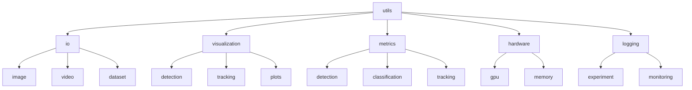
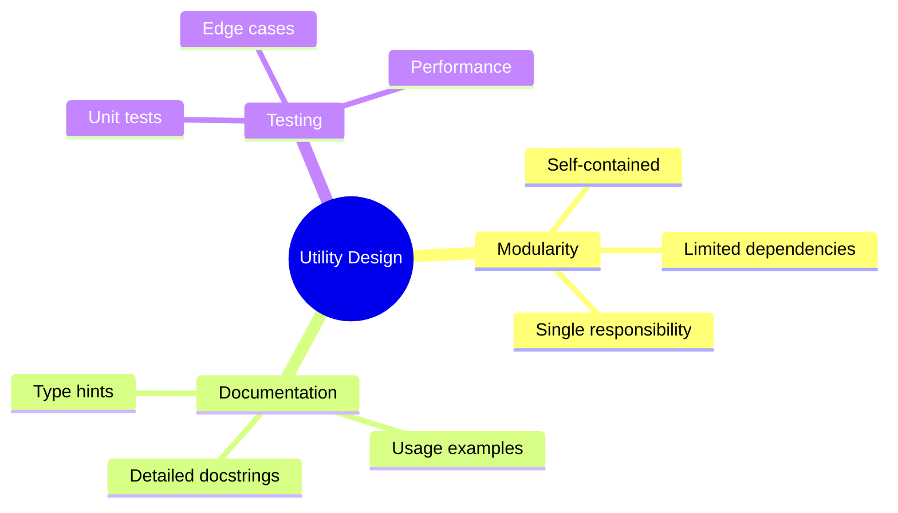
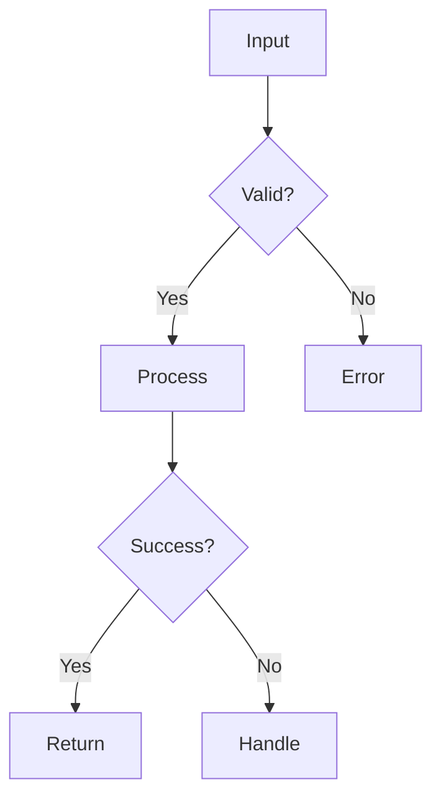
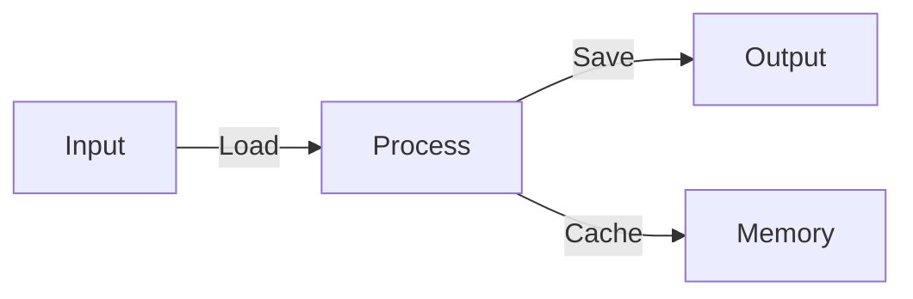
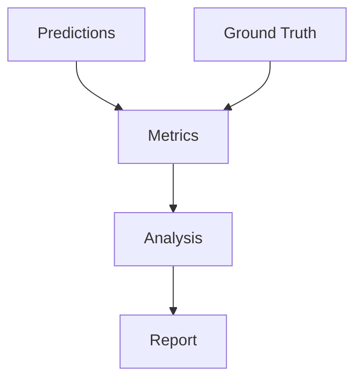

# Core Utilities 🛠️

> Common utilities and tools for computer vision tasks

## 📑 Table of Contents

- [Overview](#overview)
- [Directory Structure](#directory-structure)
- [Utility Guidelines](#utility-guidelines)
- [Categories of Utilities](#categories-of-utilities)
- [Usage Examples](#usage-examples)
- [Contributing Guidelines](#contributing-guidelines)
- [Testing Requirements](#testing-requirements)
- [Additional Resources](#additional-resources)

## Overview

This directory contains common utility functions, helpers, and tools used across all vision projects.

## Directory Structure



```
utils/
├── io/                  # Input/Output utilities
│   ├── image/          # Image reading/writing
│   ├── video/          # Video handling
│   └── dataset/        # Dataset management
├── visualization/       # Visualization tools
│   ├── detection/      # Detection visualization
│   ├── tracking/       # Tracking visualization
│   └── plots/          # Performance plots
├── metrics/            # Evaluation metrics
│   ├── detection/      # Detection metrics
│   ├── classification/ # Classification metrics
│   └── tracking/       # Tracking metrics
├── hardware/           # Hardware utilities
│   ├── gpu/           # GPU management
│   └── memory/        # Memory management
└── logging/           # Logging utilities
    ├── experiment/    # Experiment logging
    └── monitoring/    # Performance monitoring
```

## 🔧 Utility Guidelines

### Code Organization



Example utility function:

```python
from typing import Union, Tuple
import numpy as np

def resize_preserve_aspect(
    image: np.ndarray,
    target_size: Tuple[int, int],
    padding_value: Union[int, Tuple[int, ...]] = 0
) -> np.ndarray:
    """Resize image preserving aspect ratio with padding.

    Args:
        image: Input image array
        target_size: Desired output size (width, height)
        padding_value: Value for padding

    Returns:
        Resized and padded image

    Example:
        >>> img = load_image("example.jpg")
        >>> resized = resize_preserve_aspect(img, (224, 224))
    """
    # Implementation
    ...
```

### ✨ Best Practices

1. **🎯 Error Handling**



- Validate inputs
- Descriptive error messages
- Proper exception types
- Graceful fallbacks

2. **⚡ Performance**

   - Optimize common operations
   - Cache when appropriate
   - Profile critical paths
   - Document characteristics

3. **🧪 Testing**
   - Unit test coverage
   - Edge case handling
   - Performance benchmarks
   - Integration tests

## 📦 Categories of Utilities

### 🔄 IO Utilities



- Image loading/saving
- Video reading/writing
- Dataset management
- Cache handling
- Format conversion

### 📊 Visualization

- Bounding box drawing
- Segmentation masks
- Tracking trajectories
- Performance plots
- Interactive visualizations

### 📈 Metrics



- Standard metrics implementation
- Custom metric utilities
- Statistical analysis
- Evaluation helpers

### 🖥️ Hardware Management

- GPU memory management
- CPU/GPU synchronization
- Memory optimization
- Device selection

### 📝 Logging

- Experiment tracking
- Performance monitoring
- Debug logging
- Progress tracking

## 🚀 Usage Examples

### Image Processing

```python
from core.utils.io import load_image
from core.utils.visualization import draw_boxes

# Load and process image
image = load_image("example.jpg")
boxes = detector.predict(image)
visualized = draw_boxes(image, boxes)
```

### Metrics Calculation

```python
from core.utils.metrics import calculate_map

# Calculate metrics
results = calculate_map(
    predictions=pred_boxes,
    ground_truth=gt_boxes,
    iou_threshold=0.5
)
```

### Hardware Management

```python
from core.utils.hardware import gpu_memory_info

# Monitor GPU usage
memory_stats = gpu_memory_info()
print(f"GPU Memory Used: {memory_stats['used_gb']:.2f} GB")
```

## 🤝 Contributing Guidelines

When adding new utilities:

1. Follow existing directory structure
2. Document thoroughly
3. Include usage examples
4. Add unit tests
5. Consider performance
6. Maintain compatibility

## 🧪 Testing Requirements

1. **Unit Tests**

   - Test all public functions
   - Cover edge cases
   - Validate error handling
   - Check performance

2. **Documentation**

   - Clear docstrings
   - Usage examples
   - Parameter descriptions
   - Return value specs

3. **Performance**
   - Benchmark critical utilities
   - Profile memory usage
   - Test with large inputs
   - Document limitations

## 📚 Additional Resources

- [NumPy Documentation](https://numpy.org/doc/stable/)
- [OpenCV Python Tutorials](https://docs.opencv.org/4.x/d6/d00/tutorial_py_root.html)
- [Python Performance Tips](https://wiki.python.org/moin/PythonSpeed/PerformanceTips)

Remember: Well-designed utilities make your code cleaner, faster, and more maintainable! 💪
