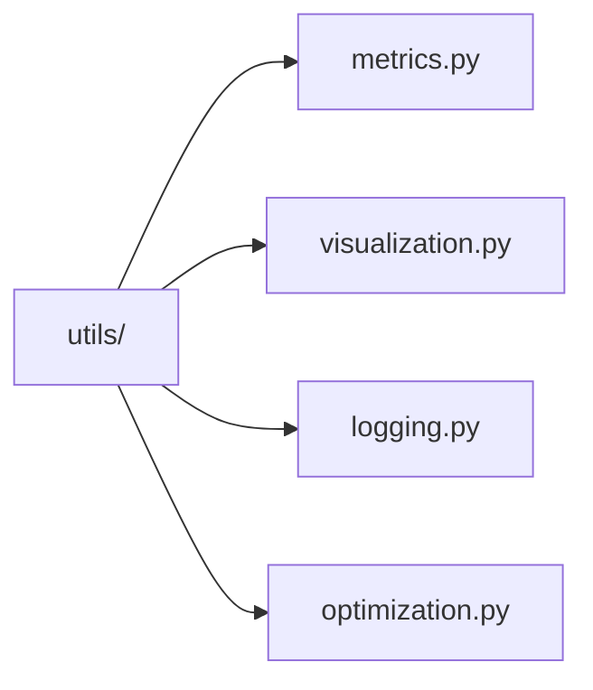
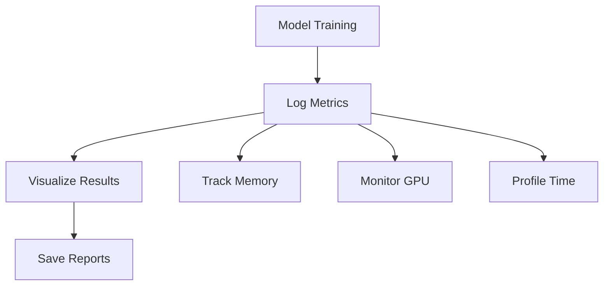

# Core Utilities 🛠️

> Common utility functions and tools for ML vision projects

## 📑 Table of Contents

- [Overview](#overview)
- [Directory Structure](#directory-structure)
- [Utilities](#utilities)
- [Usage Examples](#usage-examples)
- [Best Practices](#best-practices)

## Overview

The utils/ module provides essential utility functions and tools used across the ML vision projects. These utilities handle common tasks like metric calculation, visualization, logging, and optimization.

## Directory Structure



```
utils/
├── metrics.py        # Evaluation metrics and calculations
├── visualization.py  # Plotting and visualization tools
├── logging.py       # Logging and experiment tracking
└── optimization.py  # Performance optimization utilities
```

## Utilities

### metrics.py

Core metrics implementation for model evaluation:

```python
from core.utils.metrics import (
    calculate_accuracy,
    calculate_precision_recall,
    calculate_f1_score,
    calculate_confusion_matrix
)

# Calculate metrics
accuracy = calculate_accuracy(predictions, targets)
precision, recall = calculate_precision_recall(predictions, targets)
f1 = calculate_f1_score(precision, recall)
conf_matrix = calculate_confusion_matrix(predictions, targets)
```

### visualization.py

Tools for visualizing results and model outputs:

```python
from core.utils.visualization import (
    plot_training_curves,
    plot_confusion_matrix,
    plot_predictions,
    save_visualization
)

# Create visualizations
plot_training_curves(metrics_history)
plot_confusion_matrix(conf_matrix)
plot_predictions(images, predictions)
save_visualization("results/", "training_curves.png")
```

### logging.py

Logging utilities for experiment tracking:

```python
from core.utils.logging import (
    setup_logger,
    log_metrics,
    log_experiment,
    save_config
)

# Setup logging
logger = setup_logger(__name__)
log_metrics({"accuracy": 0.95, "loss": 0.1})
log_experiment(experiment_name="training_run_1")
save_config(config, "configs/experiment.yaml")
```

### optimization.py

Performance optimization tools:

```python
from core.utils.optimization import (
    enable_mixed_precision,
    optimize_memory_usage,
    profile_performance,
    benchmark_model
)

# Optimize performance
enable_mixed_precision()
optimize_memory_usage(model)
profile_performance(model, sample_input)
benchmark_results = benchmark_model(model, dataloader)
```

## Usage Examples

### Comprehensive Evaluation

```python
from core.utils.metrics import calculate_metrics
from core.utils.visualization import plot_results
from core.utils.logging import log_results

def evaluate_model(model, test_loader):
    # Calculate metrics
    metrics = calculate_metrics(model, test_loader)

    # Visualize results
    plots = plot_results(metrics)

    # Log everything
    log_results(metrics, plots)

    return metrics
```

### Performance Monitoring



## Best Practices

### 1. Metrics

- Use appropriate metrics for tasks
- Implement error handling
- Support batch processing
- Enable custom metrics
- Validate calculations

### 2. Visualization

- Create clear, labeled plots
- Use consistent styling
- Support various formats
- Enable interactive plots
- Save high-quality outputs

### 3. Logging

- Structure log messages
- Include timestamps
- Handle different log levels
- Support multiple outputs
- Enable/disable as needed

### 4. Optimization

- Profile before optimizing
- Monitor resource usage
- Benchmark improvements
- Document optimizations
- Consider trade-offs

Remember: Good utilities improve development efficiency and code quality! 💪

### Additional Resources

- [Metrics Documentation](docs/metrics.md)
- [Visualization Guide](docs/visualization.md)
- [Logging Best Practices](docs/logging.md)
- [Optimization Tips](docs/optimization.md)


_Placeholder: Insert diagram showing the relationship between utility functions_
