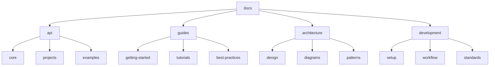
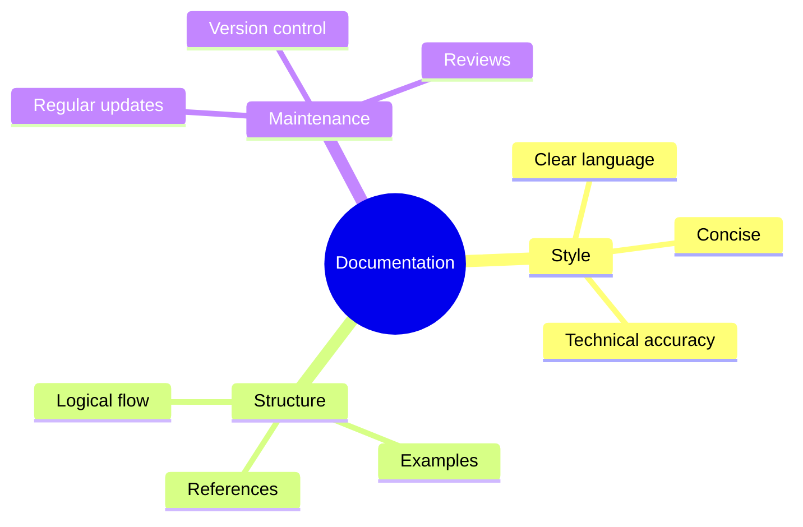
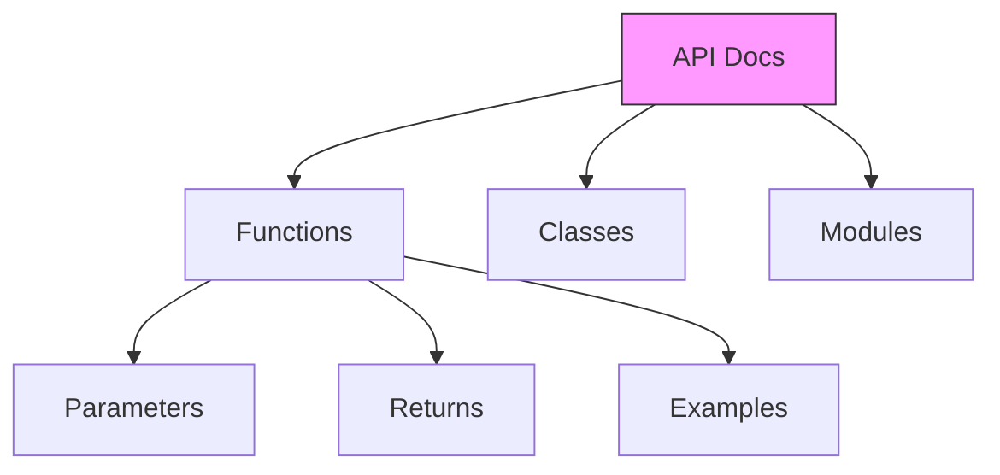
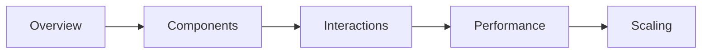
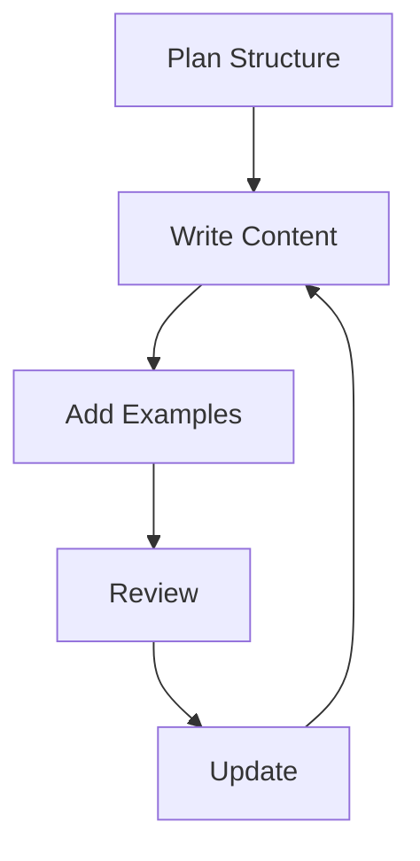

# Documentation 📚

> Comprehensive guides, tutorials, and API references for ML Vision Lab

## 📑 Table of Contents

- [Overview](#overview)
- [Directory Structure](#directory-structure)
- [Documentation Guidelines](#documentation-guidelines)
- [Document Types](#document-types)
- [Best Practices](#best-practices)
- [Contribution Guidelines](#contribution-guidelines)
- [Tools and Resources](#tools-and-resources)
- [Maintenance](#maintenance)

## Overview

This directory contains comprehensive documentation for the ML Vision Lab project, including guides, tutorials, API references, and best practices.

## Directory Structure



```
docs/
├── api/                 # API documentation
│   ├── core/           # Core components API
│   ├── projects/       # Project-specific APIs
│   └── examples/       # API usage examples
├── guides/             # User guides
│   ├── getting-started/# Getting started guides
│   ├── tutorials/      # Step-by-step tutorials
│   └── best-practices/ # Best practices guides
├── architecture/       # Architecture documentation
│   ├── design/        # Design decisions
│   ├── diagrams/      # System diagrams
│   └── patterns/      # Design patterns
└── development/       # Development documentation
    ├── setup/         # Development setup
    ├── workflow/      # Development workflow
    └── standards/     # Coding standards
```

## 📝 Documentation Guidelines

### Writing Style



- Use clear, concise language
- Follow Google technical writing style
- Include practical examples
- Keep content up-to-date
- Link related documentation

### 📘 Document Types

#### 1. API Documentation



Example API documentation:

```python
def process_image(
    image_path: str,
    target_size: Tuple[int, int] = (224, 224),
    normalize: bool = True
) -> np.ndarray:
    """Process an image for model inference.

    Args:
        image_path: Path to input image
        target_size: Desired output size (width, height)
        normalize: Whether to normalize pixel values

    Returns:
        Processed image as numpy array

    Raises:
        FileNotFoundError: If image_path doesn't exist
        ValueError: If target_size is invalid

    Example:
        >>> img = process_image("image.jpg", (224, 224))
        >>> print(img.shape)
        (224, 224, 3)
    """
```

#### 2. 📖 User Guides

- Step-by-step instructions
- Clear explanations
- Screenshots/diagrams
- Common use cases
- Troubleshooting tips

#### 3. 🏗️ Architecture Documentation



- System overview
- Component interactions
- Design decisions
- Performance considerations
- Scaling guidelines

#### 4. 🛠️ Development Guides

- Setup instructions
- Workflow guidelines
- Best practices
- Code standards
- Testing requirements

## ✨ Best Practices

### Documentation Organization



1. **📁 Hierarchy**

   - Logical grouping
   - Clear navigation
   - Consistent structure
   - Easy to maintain

2. **📝 Content**

   - Regular updates
   - Version control
   - Review process
   - Quality checks

3. **🎨 Format**
   - Markdown formatting
   - Consistent style
   - Code highlighting
   - Proper headings

## 🤝 Contributing Guidelines

When adding documentation:

1. Follow directory structure
2. Use consistent formatting
3. Include examples
4. Add proper references
5. Update navigation
6. Review existing docs

## 🔧 Tools and Resources

### Documentation Tools

- Sphinx for API docs
- MkDocs for guides
- Docstring parsers
- Markdown linters
- Link checkers

### Style Guides

- [Google Python Style Guide](https://google.github.io/styleguide/pyguide.html)
- [Google Technical Writing](https://developers.google.com/tech-writing)
- [NumPy Docstring Guide](https://numpydoc.readthedocs.io/en/latest/format.html)
- [Markdown Guide](https://www.markdownguide.org/)

### 🔍 Recommended VS Code Extensions

- markdownlint
- Markdown All in One
- Python Docstring Generator
- Code Spell Checker

## 🔄 Maintenance

Regular documentation maintenance includes:

1. Updating content
2. Fixing broken links
3. Adding new examples
4. Improving clarity
5. Addressing feedback
6. Version updates

Remember: Great documentation is the key to project adoption and user success! 🌟
