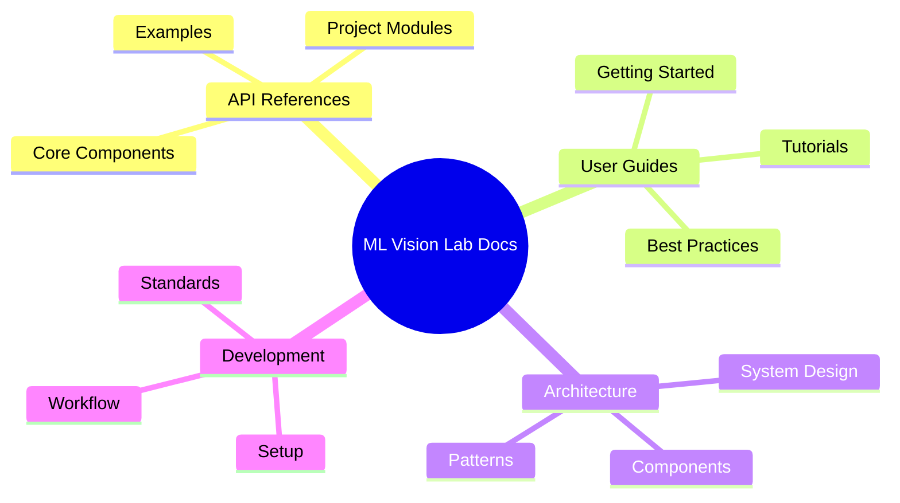
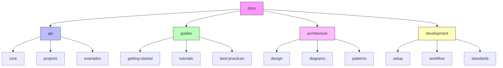
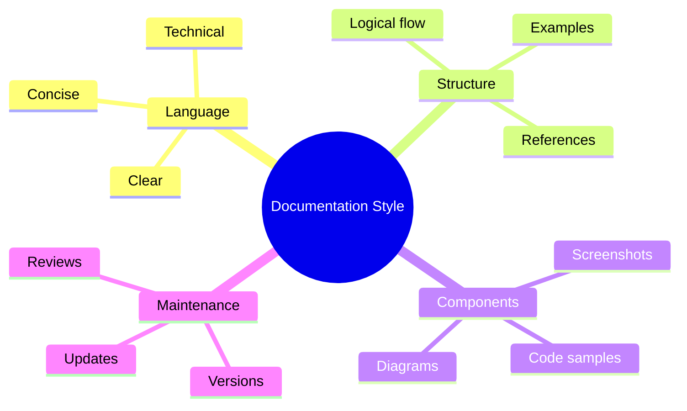
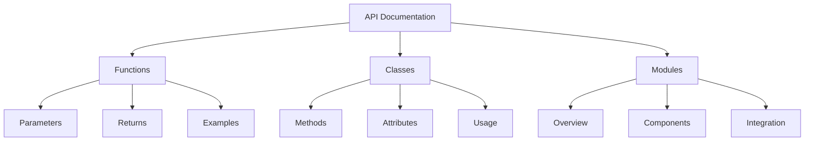
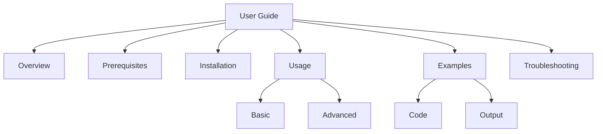
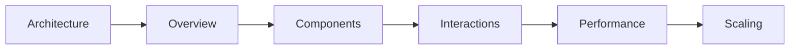
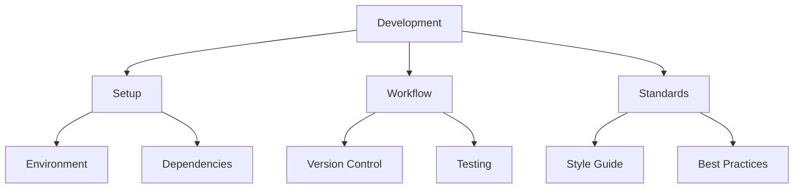
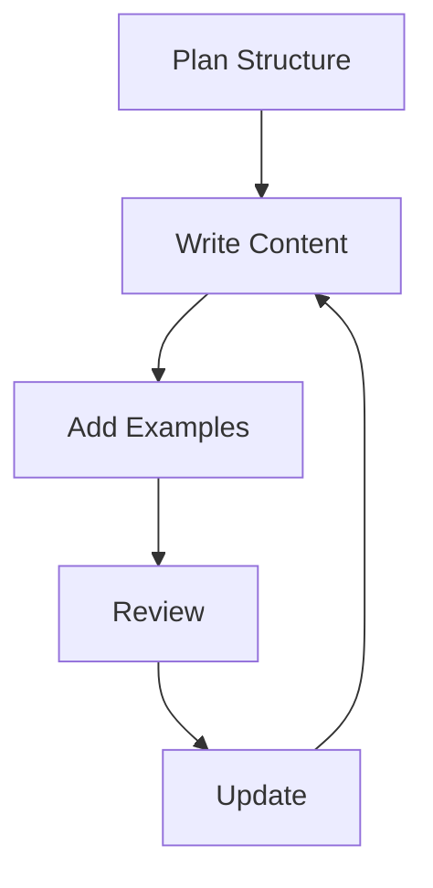
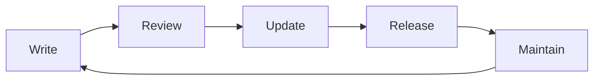

# Documentation 📚

> Comprehensive guides, tutorials, and API references for ML Vision Lab

## 📑 Table of Contents

- [Overview](#overview)
- [Directory Structure](#directory-structure)
- [Documentation Guidelines](#-documentation-guidelines)
- [Document Types](#-document-types)
- [Best Practices](#-best-practices)
- [Contribution Guidelines](#-contribution-guidelines)
- [Tools and Resources](#-tools-and-resources)
- [Maintenance](#-maintenance)

## Overview



This directory contains comprehensive documentation for the ML Vision Lab project, including guides, tutorials, API references, and best practices.

## Directory Structure



```
docs/
├── api/                 # API documentation
│   ├── core/           # Core components API
│   ├── projects/       # Project-specific APIs
│   └── examples/       # API usage examples
├── guides/             # User guides
│   ├── getting-started/# Getting started guides
│   ├── tutorials/      # Step-by-step tutorials
│   └── best-practices/ # Best practices guides
├── architecture/       # Architecture documentation
│   ├── design/        # Design decisions
│   ├── diagrams/      # System diagrams
│   └── patterns/      # Design patterns
└── development/       # Development documentation
    ├── setup/         # Development setup
    ├── workflow/      # Development workflow
    └── standards/     # Coding standards
```

## 📝 Documentation Guidelines

### Writing Style



- Use clear, concise language
- Follow Google technical writing style
- Include practical examples
- Keep content up-to-date
- Link related documentation
- Add visual elements when beneficial

### Style Guide Reference

```python
# Example of good documentation style
def process_image(
    image_path: str,
    target_size: tuple[int, int] = (224, 224),
    normalize: bool = True
) -> np.ndarray:
    """Process an image for model inference.

    Loads, resizes, and normalizes an image for neural network input.
    Supports common image formats (JPEG, PNG, BMP) and handles color
    space conversion automatically.

    Args:
        image_path: Path to input image file
        target_size: Desired output dimensions (width, height)
        normalize: Whether to normalize pixel values to [0,1]

    Returns:
        Processed image as numpy array of shape (H,W,C)

    Raises:
        FileNotFoundError: If image_path doesn't exist
        ValueError: If target_size contains non-positive values

    Examples:
        >>> img = process_image("image.jpg", (224, 224))
        >>> print(img.shape)
        (224, 224, 3)
    """
```

## 📘 Document Types

### 1. API Documentation



### 2. User Guides



### 3. Architecture Documentation



### 4. Development Guides



## ✨ Best Practices

### Documentation Organization



1. **📁 Hierarchy**

   - Logical grouping
   - Clear navigation
   - Consistent structure
   - Easy to maintain

2. **📝 Content**

   - Regular updates
   - Version control
   - Review process
   - Quality checks

3. **🎨 Format**
   - Markdown formatting
   - Consistent style
   - Code highlighting
   - Proper headings

## 🤝 Contributing Guidelines

When adding documentation:

1. Follow directory structure
2. Use consistent formatting
3. Include examples
4. Add proper references
5. Update navigation
6. Review existing docs

## 🔧 Tools and Resources

### Documentation Tools

- Sphinx for API docs
- MkDocs for guides
- Docstring parsers
- Markdown linters
- Link checkers
- Diagram generators

### Style Guides

- [Google Python Style Guide](https://google.github.io/styleguide/pyguide.html)
- [Google Technical Writing](https://developers.google.com/tech-writing)
- [NumPy Docstring Guide](https://numpydoc.readthedocs.io/en/latest/format.html)
- [Markdown Guide](https://www.markdownguide.org/)

### 🔍 Recommended VS Code Extensions

- markdownlint
- Markdown All in One
- Python Docstring Generator
- Code Spell Checker
- Mermaid Preview
- PlantUML

## 🔄 Maintenance

Regular documentation maintenance includes:

1. Updating content
2. Fixing broken links
3. Adding new examples
4. Improving clarity
5. Addressing feedback
6. Version updates
7. Diagram updates
8. Screenshot updates

### Version Control for Documentation



### Documentation Review Checklist

- [ ] Content is accurate and up-to-date
- [ ] Examples are working and relevant
- [ ] Links are valid
- [ ] Images/diagrams are current
- [ ] Code snippets follow style guide
- [ ] Markdown formatting is correct
- [ ] Table of contents is updated
- [ ] Cross-references are valid

Remember: Documentation is a living entity that requires regular care and updates to maintain its value! 🌟

---


_Note: Keep this documentation updated as the project evolves. Good documentation is key to project success!_
