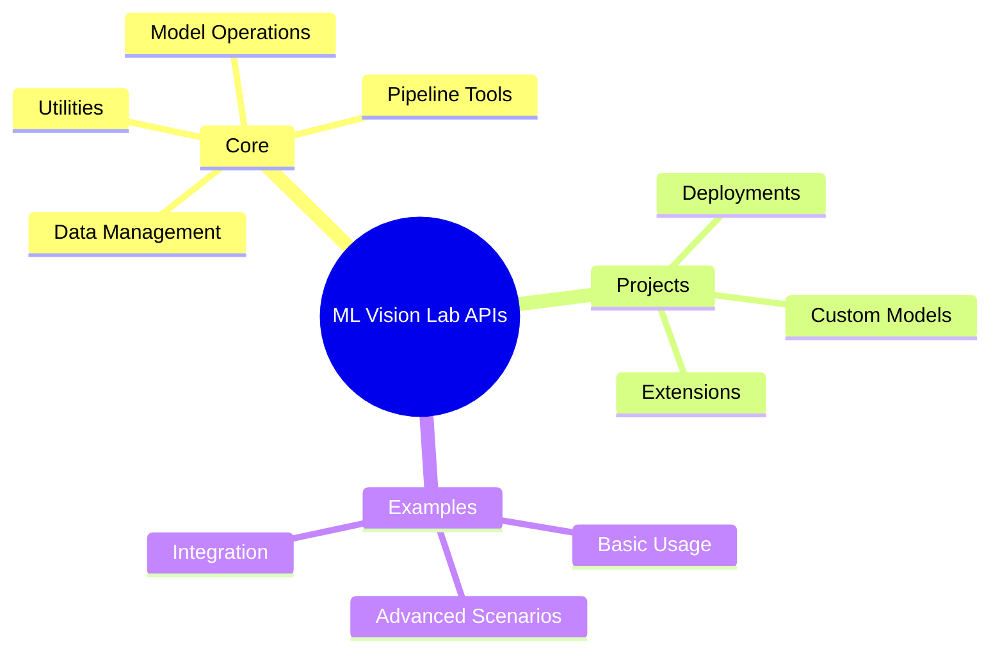
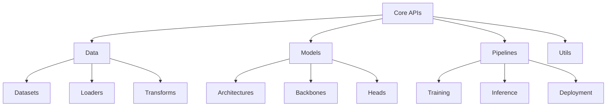
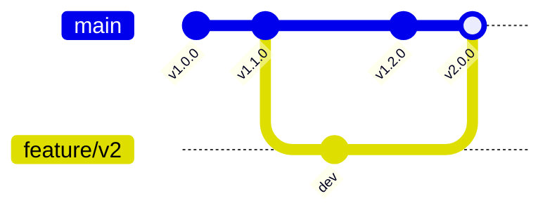

# API Documentation 📚

> Technical reference for ML Vision Lab's core APIs and components

## 📑 Table of Contents

- [Overview](#overview)
- [Core Components](#core-components)
- [Project APIs](#project-apis)
- [Code Examples](#code-examples)
- [Best Practices](#best-practices)
- [API Versioning](#api-versioning)

## Overview



This directory contains comprehensive API documentation for all ML Vision Lab components.

## Core Components



### Available Components

- **Data Management**

  - Dataset interfaces
  - Data loaders
  - Transforms and augmentations
  - Monitoring tools
  - Sampling utilities

- **Model Operations**

  - Model architectures
  - Backbone networks
  - Custom heads
  - Version control

- **Pipeline Tools**
  - Training workflows
  - Inference pipelines
  - Deployment utilities
  - Evaluation tools

## Project APIs

Each project in ML Vision Lab has its own API documentation:

- Model implementations
- Custom components
- Project-specific utilities
- Integration guides

## Code Examples

```python
# Example: Loading and preprocessing an image dataset
from ml_vision_lab.data import DataLoader, ImageTransform

# Configure transforms
transform = ImageTransform(
    resize=(224, 224),
    normalize=True,
    augment=True
)

# Create data loader
loader = DataLoader(
    dataset_path="path/to/dataset",
    batch_size=32,
    transform=transform
)

# Iterate through batches
for images, labels in loader:
    # Process batch
    print(f"Batch shape: {images.shape}")
```

## Best Practices

1. **API Usage**

   - Follow type hints
   - Handle exceptions properly
   - Use context managers
   - Implement proper cleanup

2. **Performance**

   - Batch operations
   - Use appropriate data types
   - Implement caching
   - Monitor memory usage

3. **Integration**
   - Follow dependency guidelines
   - Use version control
   - Document breaking changes
   - Maintain backwards compatibility

## API Versioning

We follow [Semantic Versioning](https://semver.org/):

- MAJOR version for incompatible API changes
- MINOR version for backwards-compatible features
- PATCH version for backwards-compatible fixes

### Version History



## Further Reading

- [Core API Documentation](./core/README.md)
- [Project APIs](./projects/README.md)
- [Example Collection](./examples/README.md)
- [Development Guidelines](../development/README.md)

---

For implementation details, refer to the source code documentation and inline comments.
