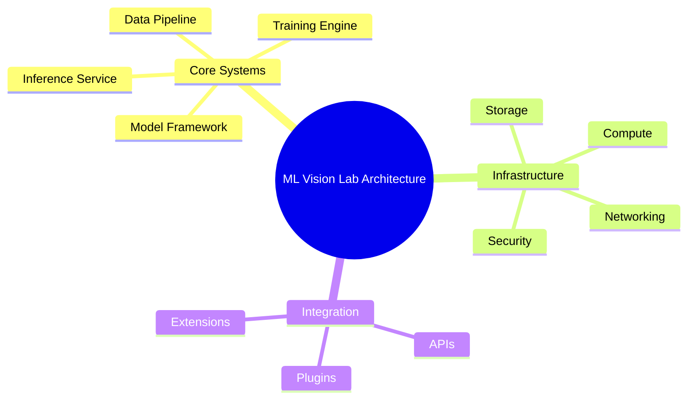
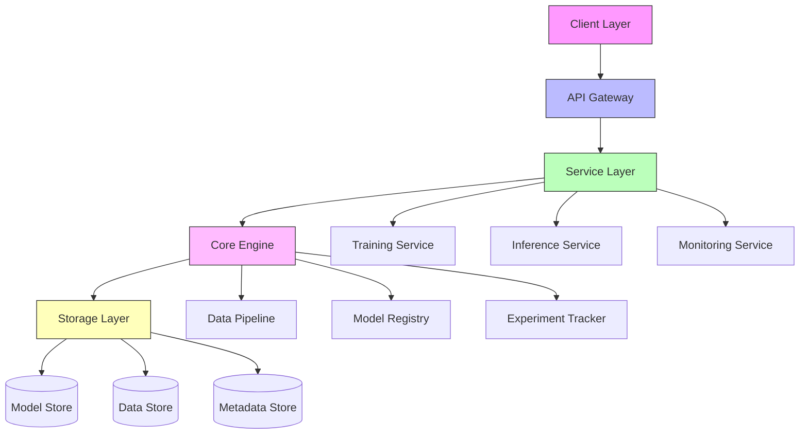
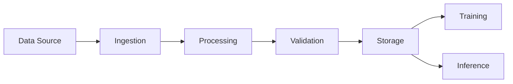
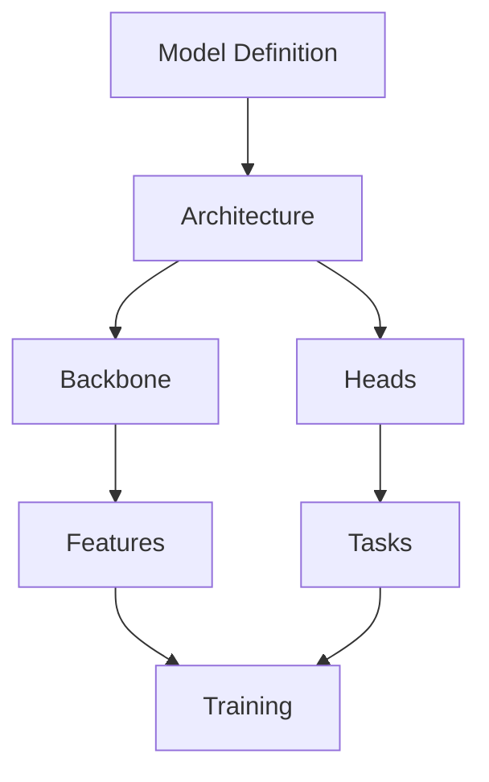
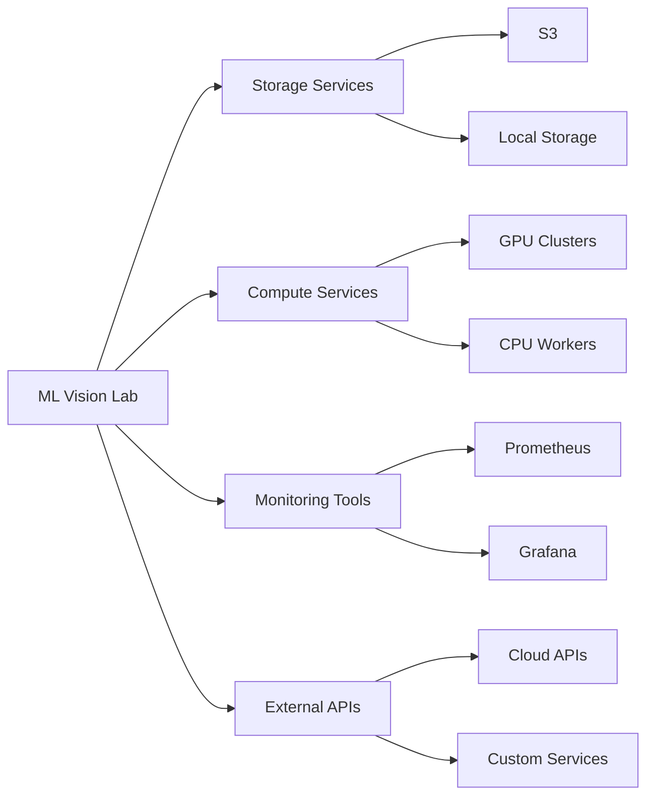
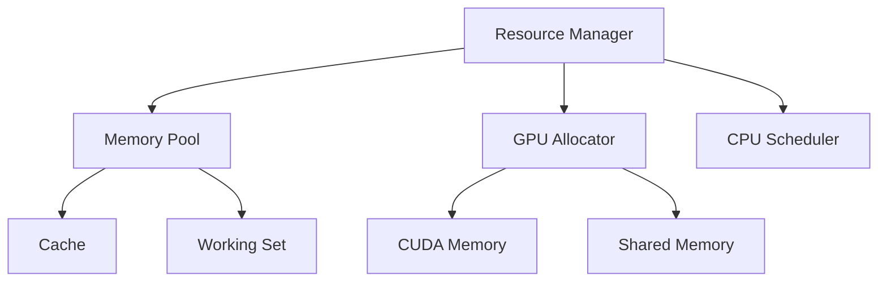

# Architecture Documentation 🏗️

> System design, components, and architectural patterns for ML Vision Lab

## 📑 Table of Contents

- [Overview](#overview)
- [System Architecture](#system-architecture)
- [Components](#components)
- [Design Patterns](#design-patterns)
- [Integration Points](#integration-points)
- [Performance Considerations](#performance-considerations)

## Overview



This directory contains detailed architecture documentation for ML Vision Lab's system design and implementation.

## System Architecture



### Key Components

1. **Client Layer**

   - Web Interface
   - CLI Tools
   - SDK/API Clients

2. **Service Layer**

   - RESTful APIs
   - gRPC Services
   - WebSocket Endpoints

3. **Core Engine**
   - Data Management
   - Model Operations
   - Pipeline Execution

## Components

### Data Pipeline Architecture



### Model Framework



## Design Patterns

### 1. Factory Pattern Implementation

```python
from abc import ABC, abstractmethod

class ModelFactory(ABC):
    """Abstract factory for creating models."""

    @abstractmethod
    def create_model(self, config: dict):
        """Create a model instance."""
        pass

class ClassificationFactory(ModelFactory):
    """Factory for classification models."""

    def create_model(self, config: dict):
        """Create a classification model."""
        return ClassificationModel(**config)
```

### 2. Observer Pattern for Training

```python
class TrainingObserver:
    """Observer for training events."""

    def update(self, metrics: dict):
        """Handle training update."""
        self.log_metrics(metrics)
        self.check_early_stopping(metrics)
```

### 3. Strategy Pattern for Data Loading

```python
class DataLoadStrategy(ABC):
    """Abstract strategy for data loading."""

    @abstractmethod
    def load_data(self, source: str):
        """Load data using specific strategy."""
        pass
```

## Integration Points



### API Integration

1. **REST APIs**

   ```python
   @app.route("/api/v1/models", methods=["POST"])
   def create_model():
       """Create a new model."""
       config = request.get_json()
       model = ModelFactory.create(config)
       return jsonify(model.to_dict())
   ```

2. **gRPC Services**
   ```protobuf
   service ModelService {
     rpc CreateModel (ModelConfig) returns (Model);
     rpc TrainModel (TrainingConfig) returns (TrainingJob);
     rpc InferModel (InferenceRequest) returns (Prediction);
   }
   ```

## Performance Considerations

### Resource Management



### Optimization Strategies

1. **Data Pipeline**

   - Parallel processing
   - Prefetching
   - Caching
   - Memory mapping

2. **Computation**

   - Batch processing
   - Mixed precision
   - Model parallelism
   - Gradient accumulation

3. **Distribution**
   - Load balancing
   - Sharding
   - Replication
   - Fault tolerance

## Additional Resources

- [System Design Diagrams](./diagrams/README.md)
- [Design Patterns Guide](./patterns/README.md)
- [Performance Tuning](./design/performance.md)
- [Integration Guide](./design/integration.md)

---

_Note: This architecture documentation is continuously updated as the system evolves._
