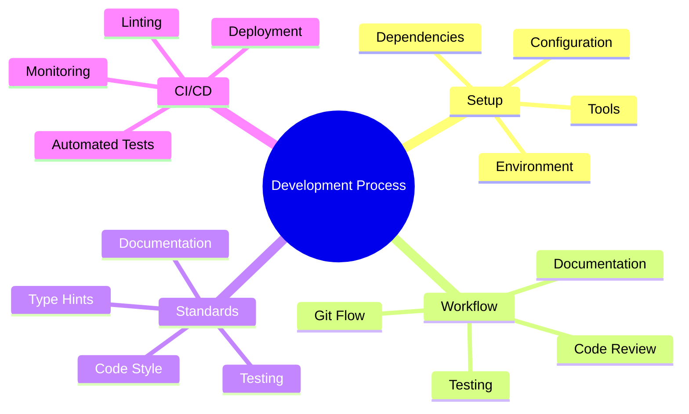
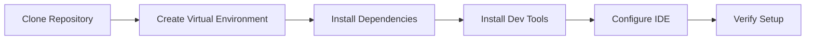
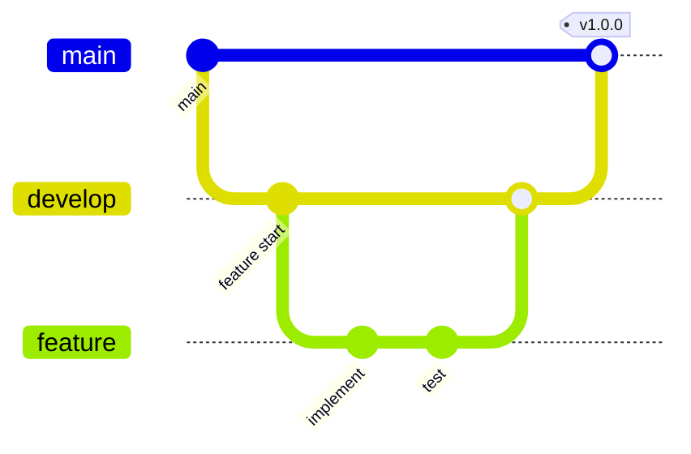
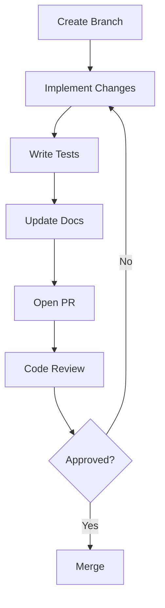
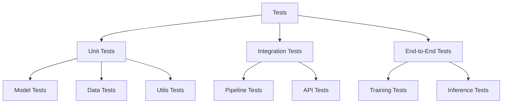
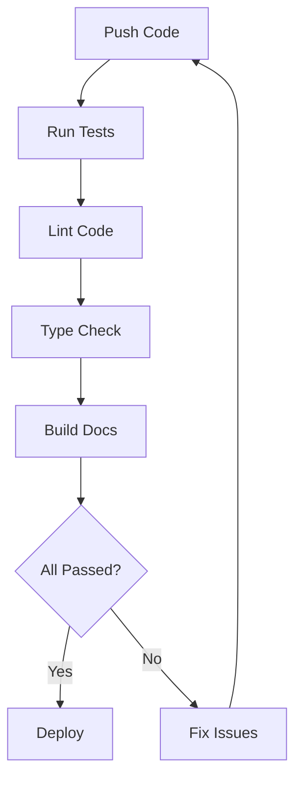
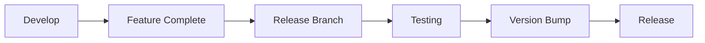

# ML Vision Lab Development Guide 🛠️

> Comprehensive guide for developers contributing to ML Vision Lab

## 📑 Table of Contents

- [Overview](#overview)
- [Environment Setup](#environment-setup)
- [Development Workflow](#development-workflow)
- [Coding Standards](#coding-standards)
- [Testing Guidelines](#testing-guidelines)
- [CI/CD Integration](#cicd-integration)
- [Documentation](#documentation)
- [Release Process](#release-process)

## Overview

This guide provides essential information for developers working on ML Vision Lab. Follow these guidelines to ensure consistent and high-quality contributions to the project.



## Environment Setup

### Prerequisites

- Python 3.8+
- CUDA Toolkit 11.0+ (for GPU support)
- Git
- Visual Studio Code (recommended)

### Installation Steps



1. **Clone Repository**

   ```bash
   git clone https://github.com/organization/ml-vision-lab.git
   cd ml-vision-lab
   ```

2. **Create Virtual Environment**

   ```bash
   python -m venv .venv
   source .venv/bin/activate  # Linux/macOS
   # or
   .\.venv\Scripts\activate   # Windows
   ```

3. **Install Dependencies**

   ```bash
   pip install -r requirements.txt
   pip install -r requirements-dev.txt
   ```

4. **Install Development Tools**
   ```bash
   pre-commit install
   pip install -e ".[dev]"
   ```

## Development Workflow

### Git Workflow



### Branch Naming Convention

- Feature branches: `feature/short-description`
- Bug fixes: `fix/issue-description`
- Documentation: `docs/topic-description`
- Release branches: `release/vX.Y.Z`

### Commit Guidelines

```bash
# Format
<type>(<scope>): <description>

# Examples
feat(model): add vision transformer support
fix(dataloader): resolve memory leak in batching
docs(api): update model configuration guide
test(training): add unit tests for optimizer
```

### Pull Request Process



## Coding Standards

### Python Style Guide

```python
from typing import Optional, List, Dict
import torch
import torch.nn as nn

class VisionModel(nn.Module):
    """Vision model implementation.

    Implements a vision model following ML Vision Lab standards.

    Args:
        config: Model configuration dictionary
        pretrained: Whether to load pretrained weights

    Attributes:
        backbone: Model backbone network
        head: Model head network
        config: Model configuration
    """

    def __init__(
        self,
        config: Dict[str, any],
        pretrained: bool = False
    ) -> None:
        super().__init__()
        self.config = config
        self.backbone = self._build_backbone()
        self.head = self._build_head()

        if pretrained:
            self._load_pretrained_weights()

    def forward(self, x: torch.Tensor) -> torch.Tensor:
        """Forward pass of the model.

        Args:
            x: Input tensor of shape (B, C, H, W)

        Returns:
            Output tensor of shape (B, num_classes)
        """
        features = self.backbone(x)
        return self.head(features)
```

### Code Quality Tools

```bash
# Run linting
flake8 src tests
pylint src

# Check types
mypy src

# Format code
black src tests
isort src tests

# Run tests
pytest tests
```

## Testing Guidelines

### Test Structure



### Writing Tests

```python
import pytest
import torch

@pytest.fixture
def model_config():
    return {
        "backbone": "resnet18",
        "num_classes": 10,
        "pretrained": False
    }

def test_model_initialization(model_config):
    """Test model initialization."""
    model = VisionModel(model_config)

    assert isinstance(model.backbone, nn.Module)
    assert isinstance(model.head, nn.Module)
    assert model.config == model_config

@pytest.mark.parametrize(
    "batch_size,channels,height,width",
    [
        (1, 3, 224, 224),
        (4, 3, 224, 224),
        (16, 3, 224, 224)
    ]
)
def test_model_forward(
    model_config,
    batch_size,
    channels,
    height,
    width
):
    """Test model forward pass with different input sizes."""
    model = VisionModel(model_config)
    x = torch.randn(batch_size, channels, height, width)
    output = model(x)

    assert output.shape == (batch_size, model_config["num_classes"])
```

## CI/CD Integration



### CI Pipeline Steps

1. **Code Quality**

   - Run linters (flake8, pylint)
   - Check types (mypy)
   - Format verification (black, isort)

2. **Testing**

   - Run unit tests
   - Run integration tests
   - Generate coverage report

3. **Documentation**

   - Build documentation
   - Check links
   - Validate examples

4. **Deployment**
   - Build package
   - Run security checks
   - Deploy to staging/production

## Documentation

### Documentation Requirements

- Update API documentation for new features
- Include docstrings for all public functions/classes
- Provide usage examples in docstrings
- Update README.md when needed
- Keep CHANGELOG.md current

### Example Docstring

```python
def train_model(
    model: nn.Module,
    dataset: Dataset,
    epochs: int = 100,
    learning_rate: float = 0.001
) -> Dict[str, List[float]]:
    """Train a vision model.

    Trains a model using the specified dataset and hyperparameters.
    Implements early stopping and learning rate scheduling.

    Args:
        model: The model to train
        dataset: Training dataset
        epochs: Number of training epochs
        learning_rate: Initial learning rate

    Returns:
        Dictionary containing training metrics (loss, accuracy)

    Raises:
        ValueError: If epochs <= 0 or learning_rate <= 0

    Example:
        >>> model = VisionModel(config)
        >>> dataset = ImageDataset("path/to/data")
        >>> metrics = train_model(model, dataset)
        >>> print(f"Final accuracy: {metrics['accuracy'][-1]}")
    """
```

## Release Process

### Version Control



### Release Checklist

- [ ] All tests passing
- [ ] Documentation updated
- [ ] CHANGELOG.md updated
- [ ] Version bumped
- [ ] Release notes written
- [ ] Dependencies checked
- [ ] Performance verified
- [ ] Security scan completed

---

Remember: Quality code is well-tested, well-documented, and maintainable! 🚀
