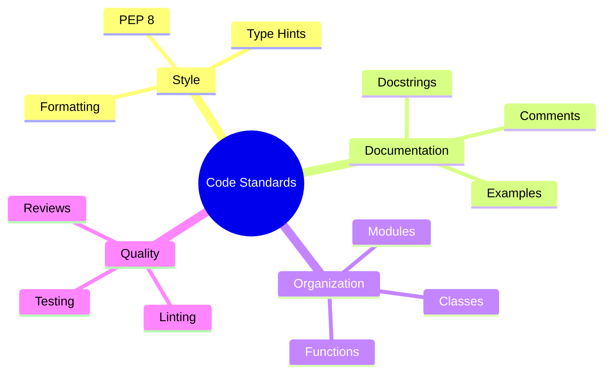
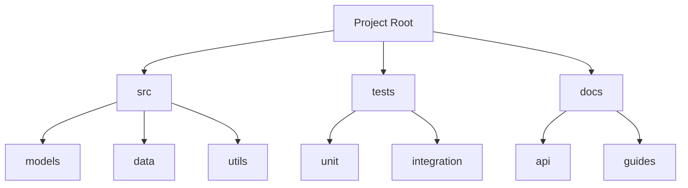

# Coding Standards 📝

> Style guide and best practices for ML Vision Lab development

## 📑 Table of Contents

- [Overview](#overview)
- [Python Style Guide](#python-style-guide)
- [Documentation Standards](#documentation-standards)
- [Type Hints](#type-hints)
- [Code Organization](#code-organization)
- [ML-Specific Guidelines](#ml-specific-guidelines)
- [Code Quality Tools](#code-quality-tools)
- [Best Practices](#best-practices)

## Overview

This guide defines coding standards and best practices for ML Vision Lab projects, ensuring consistency and maintainability across the codebase.



## Python Style Guide

### General Rules

1. **Line Length**

   - Maximum 88 characters (Black default)
   - Exception for URLs and strings

2. **Indentation**

   - 4 spaces (no tabs)
   - Align with opening delimiter

3. **Imports**

   ```python
   # Standard library
   import os
   import sys
   from typing import List, Optional

   # Third-party
   import numpy as np
   import torch
   import torch.nn as nn

   # Local
   from ml_vision_lab.models import BaseModel
   from ml_vision_lab.utils import setup_logger
   ```

4. **Naming Conventions**

   ```python
   # Modules/Packages
   import vision_module

   # Classes
   class VisionModel:
       pass

   # Functions/Variables
   def process_image():
       temp_variable = 1

   # Constants
   MAX_BATCH_SIZE = 32
   DEFAULT_CONFIG = {
       "learning_rate": 0.001
   }
   ```

## Documentation Standards

### Docstring Format

```python
def train_model(
    model: nn.Module,
    dataset: Dataset,
    epochs: int = 100,
    learning_rate: float = 0.001
) -> dict:
    """Train a vision model.

    Trains a model using the specified dataset and hyperparameters.
    Implements early stopping and learning rate scheduling.

    Args:
        model: The model to train
        dataset: Training dataset
        epochs: Number of training epochs
        learning_rate: Initial learning rate

    Returns:
        dict: Training metrics including:
            - loss (float): Final training loss
            - accuracy (float): Final accuracy
            - history (List[dict]): Training history

    Raises:
        ValueError: If epochs <= 0 or learning_rate <= 0

    Example:
        >>> model = VisionModel(num_classes=10)
        >>> dataset = ImageDataset("path/to/data")
        >>> metrics = train_model(model, dataset)
        >>> print(f"Final accuracy: {metrics['accuracy']:.2f}")
    """
```

### Class Documentation

```python
class DataLoader:
    """DataLoader for vision datasets.

    Implements efficient data loading with prefetching and
    memory pinning for optimal GPU training.

    Attributes:
        batch_size (int): Size of each batch
        num_workers (int): Number of worker processes
        pin_memory (bool): Whether to pin memory for GPU transfer

    Example:
        >>> loader = DataLoader(
        ...     dataset,
        ...     batch_size=32,
        ...     num_workers=4
        ... )
        >>> for batch in loader:
        ...     process_batch(batch)
    """
```

## Type Hints

### Basic Usage

```python
from typing import List, Optional, Tuple, Union, Dict

def process_batch(
    images: torch.Tensor,
    labels: torch.Tensor,
    weights: Optional[torch.Tensor] = None
) -> Tuple[torch.Tensor, float]:
    """Process a batch of images."""
    pass

class ModelConfig(TypedDict):
    """Model configuration type hints."""

    name: str
    num_classes: int
    learning_rate: float
    optimizer: Optional[str]
```

### Complex Types

```python
from typing import Protocol, TypeVar, Generic

T = TypeVar('T', bound='BaseModel')

class ModelProtocol(Protocol):
    """Protocol for model interfaces."""

    def forward(self, x: torch.Tensor) -> torch.Tensor:
        ...

    def save(self, path: str) -> None:
        ...

class ModelRegistry(Generic[T]):
    """Type-safe model registry."""
    pass
```

## Code Organization

### Module Structure

```python
"""Module docstring describing purpose."""

# Standard imports
import os
from typing import Optional

# Third-party imports
import torch
import numpy as np

# Local imports
from .utils import setup_logger

# Constants
DEFAULT_SIZE = (224, 224)
MAX_WORKERS = 4

# Classes
class MainClass:
    """Main class docstring."""
    pass

# Functions
def main_function():
    """Main function docstring."""
    pass

# Main execution
if __name__ == "__main__":
    main_function()
```

### Project Structure



## ML-Specific Guidelines

### Model Definitions

```python
class VisionModel(nn.Module):
    """Vision model implementation."""

    def __init__(
        self,
        in_channels: int = 3,
        num_classes: int = 1000
    ) -> None:
        super().__init__()
        self.backbone = self._build_backbone()
        self.head = self._build_head(num_classes)

    def _build_backbone(self) -> nn.Module:
        """Build model backbone."""
        pass

    def forward(self, x: torch.Tensor) -> torch.Tensor:
        """Forward pass implementation."""
        pass
```

### Training Loop

```python
def train_epoch(
    model: nn.Module,
    loader: DataLoader,
    optimizer: torch.optim.Optimizer,
    device: torch.device
) -> dict:
    """Single training epoch implementation."""
    model.train()
    total_loss = 0.0

    for batch in loader:
        # Move to device
        images = batch["images"].to(device)
        labels = batch["labels"].to(device)

        # Forward pass
        optimizer.zero_grad()
        outputs = model(images)
        loss = criterion(outputs, labels)

        # Backward pass
        loss.backward()
        optimizer.step()

        total_loss += loss.item()

    return {"loss": total_loss / len(loader)}
```

## Code Quality Tools

### Tool Configuration

```toml
# pyproject.toml
[tool.black]
line-length = 88
target-version = ['py38']
include = '\.pyi?$'

[tool.isort]
profile = "black"
multi_line_output = 3
line_length = 88

[tool.mypy]
python_version = "3.8"
warn_return_any = true
warn_unused_configs = true
disallow_untyped_defs = true

[tool.pylint]
max-line-length = 88
disable = ["C0111", "C0103"]
```

### Pre-commit Setup

```yaml
# .pre-commit-config.yaml
repos:
  - repo: https://github.com/psf/black
    rev: 22.3.0
    hooks:
      - id: black
        language_version: python3

  - repo: https://github.com/pycqa/isort
    rev: 5.10.1
    hooks:
      - id: isort

  - repo: https://github.com/pre-commit/mirrors-mypy
    rev: v0.982
    hooks:
      - id: mypy
        additional_dependencies: [types-all]
```

## Best Practices

1. **Code Quality**

   - Write clear, self-documenting code
   - Follow SOLID principles
   - Use meaningful variable names
   - Keep functions focused

2. **ML Best Practices**

   - Document model architectures
   - Log experiments properly
   - Track random seeds
   - Monitor performance

3. **Error Handling**
   ```python
   def process_data(path: str) -> None:
       """Process data with proper error handling."""
       try:
           data = load_data(path)
       except FileNotFoundError:
           logger.error(f"Data file not found: {path}")
           raise
       except Exception as e:
           logger.error(f"Error processing data: {e}")
           raise
   ```

---

Remember:

- Consistency is key
- Document thoroughly
- Use type hints
- Follow best practices
