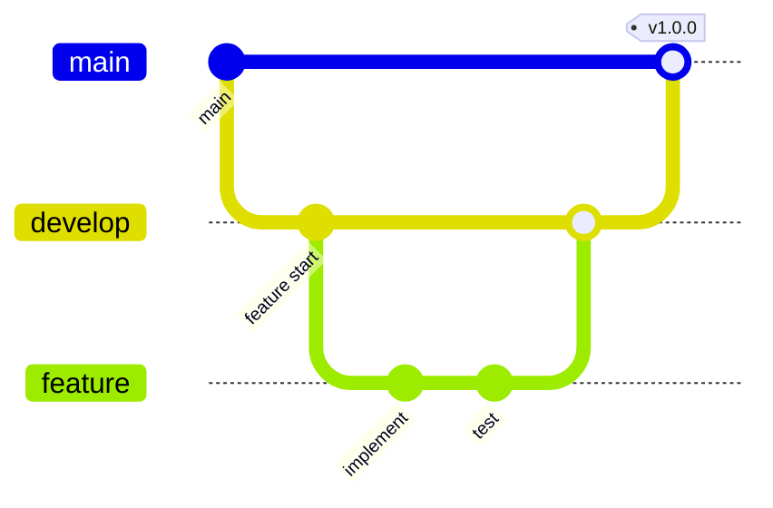
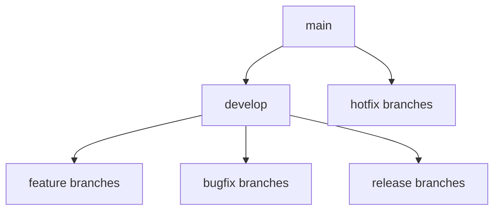
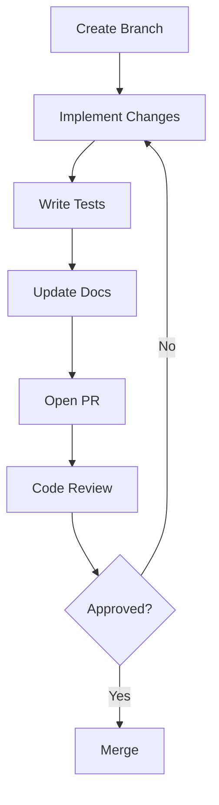
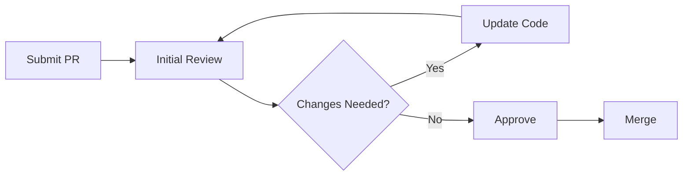
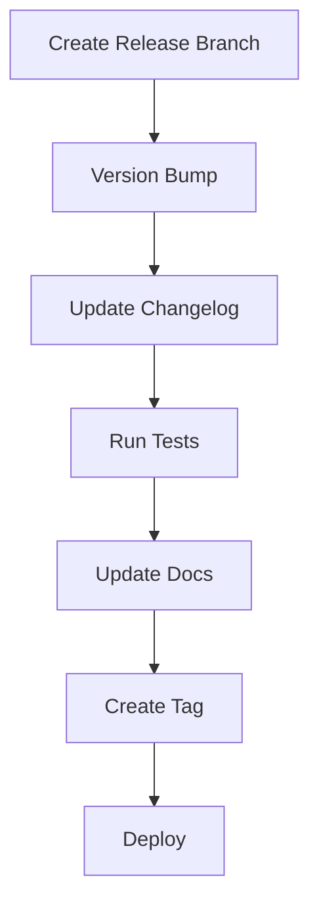

# Git Workflow Guide 🌳

> Best practices for version control in ML Vision Lab projects

## 📑 Table of Contents

- [Overview](#overview)
- [Branch Strategy](#branch-strategy)
- [Commit Guidelines](#commit-guidelines)
- [Pull Request Process](#pull-request-process)
- [Code Review Guidelines](#code-review-guidelines)
- [Release Process](#release-process)
- [Best Practices](#best-practices)

## Overview

This guide outlines our Git workflow and best practices for maintaining high-quality code in ML Vision Lab projects.



## Branch Strategy

### Branch Types



1. **Main Branches**

   - `main` - Production-ready code
   - `develop` - Integration branch for features

2. **Supporting Branches**
   - `feature/*` - New features
   - `bugfix/*` - Bug fixes
   - `release/*` - Release preparation
   - `hotfix/*` - Production fixes

### Naming Convention

```bash
# Feature branches
feature/add-vision-transformer
feature/improve-data-pipeline

# Bug fixes
bugfix/memory-leak
bugfix/cuda-error

# Releases
release/v1.2.0
release/v2.0.0

# Hotfixes
hotfix/critical-inference-bug
hotfix/security-vulnerability
```

## Commit Guidelines

### Commit Message Format

```
<type>(<scope>): <description>

[optional body]

[optional footer]
```

### Types

- `feat`: New feature
- `fix`: Bug fix
- `docs`: Documentation
- `style`: Formatting
- `refactor`: Code restructuring
- `test`: Adding tests
- `chore`: Maintenance

### Examples

```bash
# Feature
feat(model): add vision transformer architecture

# Bug fix
fix(training): resolve CUDA memory leak in batch processing

# Documentation
docs(api): update model configuration guide

# Testing
test(inference): add unit tests for TensorRT optimization
```

## Pull Request Process



### PR Template

```markdown
## Description

Brief description of changes

## Type of Change

- [ ] Bug fix
- [ ] New feature
- [ ] Breaking change
- [ ] Documentation update

## Testing

- [ ] Unit tests added/updated
- [ ] Integration tests added/updated
- [ ] Manual testing performed

## Documentation

- [ ] Documentation updated
- [ ] Code comments added/updated
- [ ] API docs updated

## Additional Notes

Any additional information
```

## Code Review Guidelines

### Review Checklist

1. **Code Quality**

   - [ ] Follows style guide
   - [ ] Clear and maintainable
   - [ ] No redundant code
   - [ ] Proper error handling

2. **Testing**

   - [ ] Tests added/updated
   - [ ] Tests pass
   - [ ] Edge cases covered
   - [ ] Performance tested

3. **Documentation**
   - [ ] Docstrings complete
   - [ ] README updated
   - [ ] API docs current
   - [ ] Comments clear

### Review Process



## Release Process

### Version Numbers

We follow [Semantic Versioning](https://semver.org/):

- MAJOR version for incompatible API changes
- MINOR version for new features
- PATCH version for bug fixes

### Release Checklist



1. **Preparation**

   - [ ] Create release branch
   - [ ] Update version numbers
   - [ ] Update CHANGELOG.md
   - [ ] Run full test suite
   - [ ] Update documentation

2. **Release**
   - [ ] Create GitHub release
   - [ ] Tag version
   - [ ] Deploy to production
   - [ ] Monitor deployment

## Best Practices

### 1. Branch Management

- Keep branches focused and short-lived
- Regularly sync with develop
- Delete merged branches
- Use descriptive branch names

### 2. Commits

- Write clear commit messages
- Make atomic commits
- Reference issues/PRs
- Sign your commits

### 3. Code Review

- Review in small chunks
- Provide constructive feedback
- Test changes locally
- Consider edge cases

### 4. Release Management

- Plan releases carefully
- Document changes thoroughly
- Test in staging
- Monitor after release

## Examples

### Feature Development

```bash
# Create feature branch
git checkout develop
git checkout -b feature/add-transformer

# Make changes
git add .
git commit -m "feat(model): implement vision transformer

- Add transformer architecture
- Include attention mechanism
- Add configuration options
- Add unit tests

Closes #123"

# Push changes
git push origin feature/add-transformer

# Create PR through GitHub
```

### Release Process

```bash
# Create release branch
git checkout develop
git checkout -b release/v1.2.0

# Update version
bump2version minor
git add .
git commit -m "chore(release): bump version to 1.2.0"

# Create tag
git tag -a v1.2.0 -m "Release version 1.2.0"
git push origin v1.2.0

# Merge to main
git checkout main
git merge release/v1.2.0
```

---

Remember:

- Keep your commits clean and focused
- Write clear documentation
- Follow the review process
- Test thoroughly before merging
