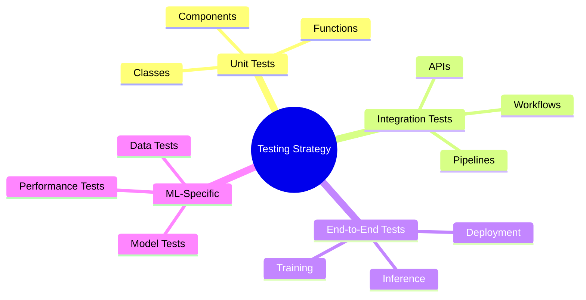
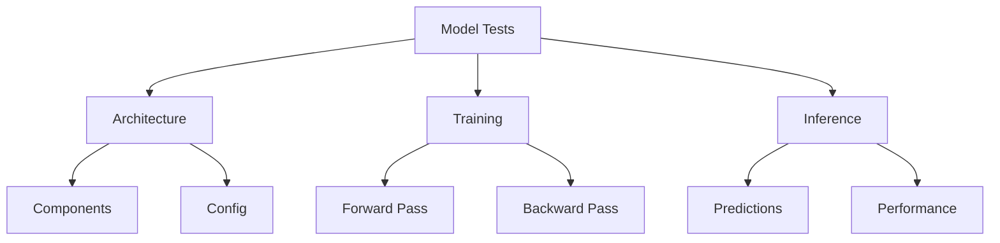

# Testing Guidelines 🧪

> Comprehensive testing practices for ML Vision Lab projects

## 📑 Table of Contents

- [Overview](#overview)
- [Test Structure](#test-structure)
- [Testing Types](#testing-types)
- [Writing Tests](#writing-tests)
- [ML-Specific Testing](#ml-specific-testing)
- [Test Coverage](#test-coverage)
- [Best Practices](#best-practices)
- [CI/CD Integration](#cicd-integration)

## Overview

This guide outlines testing practices for ML Vision Lab projects, ensuring code quality and reliability across all components.



## Test Structure

### Directory Organization

```
tests/
├── unit/                 # Unit tests
│   ├── models/          # Model component tests
│   ├── data/            # Data processing tests
│   └── utils/           # Utility function tests
├── integration/         # Integration tests
│   ├── pipelines/      # Pipeline tests
│   └── api/            # API tests
├── e2e/                # End-to-end tests
│   ├── training/       # Training workflow tests
│   └── inference/      # Inference tests
└── conftest.py         # Shared fixtures
```

### Test Configuration

```python
# conftest.py
import pytest
import torch
import numpy as np

@pytest.fixture
def model_config():
    """Fixture for model configuration."""
    return {
        "backbone": "resnet18",
        "num_classes": 10,
        "pretrained": False
    }

@pytest.fixture
def sample_batch():
    """Fixture for sample batch data."""
    return {
        "images": torch.randn(4, 3, 224, 224),
        "labels": torch.randint(0, 10, (4,))
    }
```

## Testing Types

### 1. Unit Tests

```python
# test_model.py
import pytest
import torch
from ml_vision_lab.models import VisionModel

def test_model_initialization(model_config):
    """Test model initialization."""
    model = VisionModel(model_config)

    assert isinstance(model.backbone, torch.nn.Module)
    assert isinstance(model.head, torch.nn.Module)
    assert model.num_classes == model_config["num_classes"]

@pytest.mark.parametrize(
    "batch_size,channels,height,width",
    [
        (1, 3, 224, 224),
        (4, 3, 224, 224),
        (16, 3, 224, 224)
    ]
)
def test_model_forward(
    model_config,
    batch_size,
    channels,
    height,
    width
):
    """Test model forward pass with different input sizes."""
    model = VisionModel(model_config)
    x = torch.randn(batch_size, channels, height, width)
    output = model(x)

    assert output.shape == (batch_size, model_config["num_classes"])
```

### 2. Integration Tests

```python
# test_training_pipeline.py
def test_training_workflow(model_config, sample_batch):
    """Test complete training workflow."""
    model = VisionModel(model_config)
    trainer = Trainer(model)

    # Train for one epoch
    metrics = trainer.train_epoch(sample_batch)

    assert "loss" in metrics
    assert "accuracy" in metrics
    assert metrics["loss"] > 0
    assert 0 <= metrics["accuracy"] <= 1
```

### 3. End-to-End Tests

```python
# test_inference_pipeline.py
def test_inference_pipeline():
    """Test complete inference pipeline."""
    # Load model
    model = VisionModel.load("path/to/model")

    # Run inference
    image = load_image("test.jpg")
    result = model.predict(image)

    assert result.shape[-1] == model.num_classes
    assert result.dtype == torch.float32
```

## ML-Specific Testing

### Model Testing



```python
def test_model_reproducibility():
    """Test model training reproducibility."""
    torch.manual_seed(42)
    model1 = train_model(config)

    torch.manual_seed(42)
    model2 = train_model(config)

    # Check weights are identical
    for p1, p2 in zip(model1.parameters(), model2.parameters()):
        assert torch.allclose(p1, p2)
```

### Data Testing

```python
def test_dataset_integrity():
    """Test dataset loading and preprocessing."""
    dataset = VisionDataset("path/to/data")

    # Check basic properties
    assert len(dataset) > 0
    assert all(img.shape == (3, 224, 224) for img, _ in dataset)

    # Check class distribution
    labels = [label for _, label in dataset]
    assert len(set(labels)) == dataset.num_classes
```

## Test Coverage

### Coverage Configuration

```ini
# .coveragerc
[run]
source = ml_vision_lab
omit =
    */tests/*
    */__init__.py
    */setup.py

[report]
exclude_lines =
    pragma: no cover
    def __repr__
    raise NotImplementedError
```

### Running Tests with Coverage

```bash
# Run tests with coverage
pytest --cov=ml_vision_lab tests/

# Generate HTML report
pytest --cov=ml_vision_lab --cov-report=html tests/
```

## Best Practices

### 1. Test Organization

- Group related tests
- Use meaningful names
- Create shared fixtures
- Maintain test independence

### 2. Testing Standards

```python
# Good test example
def test_model_prediction_shape():
    """
    Test that model predictions have correct shape.

    Given:
    - Model with 10 classes
    - Input image of shape (3, 224, 224)

    Then:
    - Output should be shape (1, 10)
    - Output should be probabilities
    """
    model = VisionModel(num_classes=10)
    image = torch.randn(1, 3, 224, 224)

    prediction = model(image)

    assert prediction.shape == (1, 10)
    assert torch.allclose(prediction.sum(), torch.tensor(1.0))
```

### 3. Performance Testing

```python
@pytest.mark.benchmark
def test_inference_speed(benchmark):
    """Test model inference speed."""
    model = VisionModel()
    image = torch.randn(1, 3, 224, 224)

    # Benchmark inference time
    result = benchmark(model.forward, image)

    assert result.stats.mean < 0.1  # Less than 100ms
```

## CI/CD Integration

### GitHub Actions Example

```yaml
name: Tests

on: [push, pull_request]

jobs:
  test:
    runs-on: ubuntu-latest
    steps:
      - uses: actions/checkout@v3
      - name: Set up Python
        uses: actions/setup-python@v4
        with:
          python-version: "3.11"

      - name: Install dependencies
        run: |
          python -m pip install --upgrade pip
          pip install -r requirements-dev.txt

      - name: Run tests
        run: |
          pytest --cov=ml_vision_lab tests/
          coverage xml

      - name: Upload coverage
        uses: codecov/codecov-action@v3
```

---

Remember:

- Write tests first (TDD)
- Keep tests simple and focused
- Test edge cases
- Maintain test coverage
- Document test requirements
