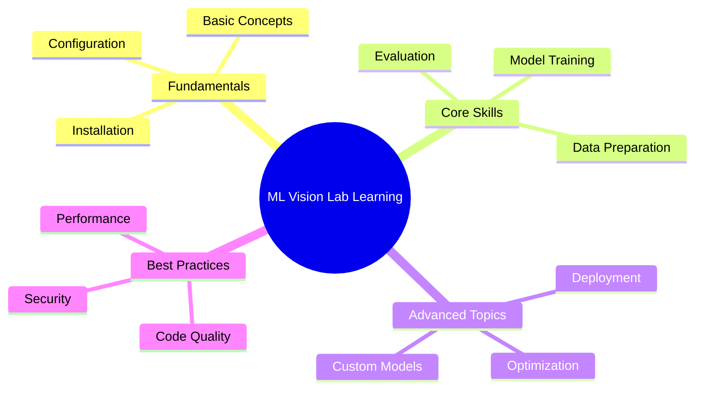
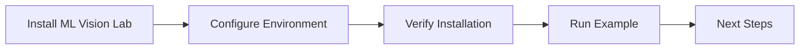
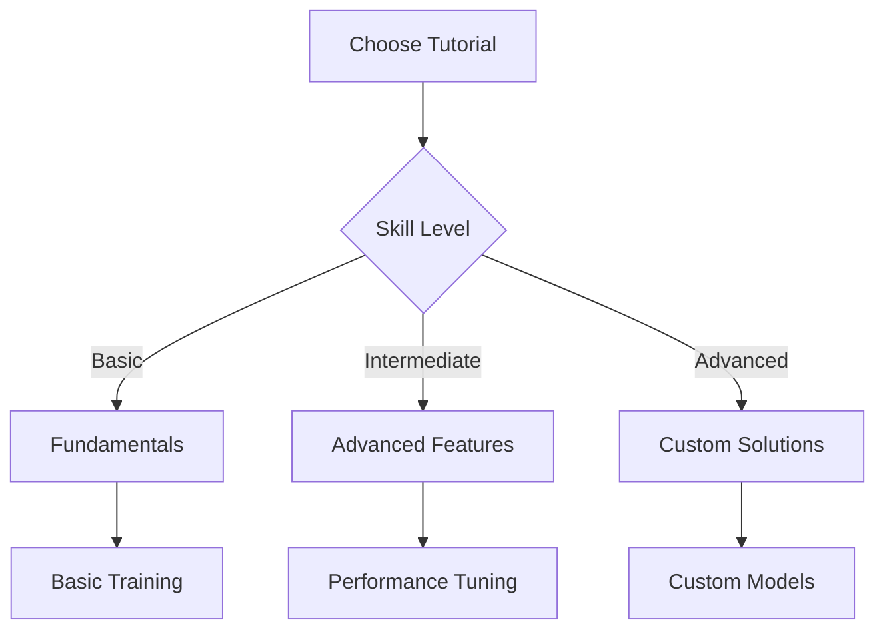
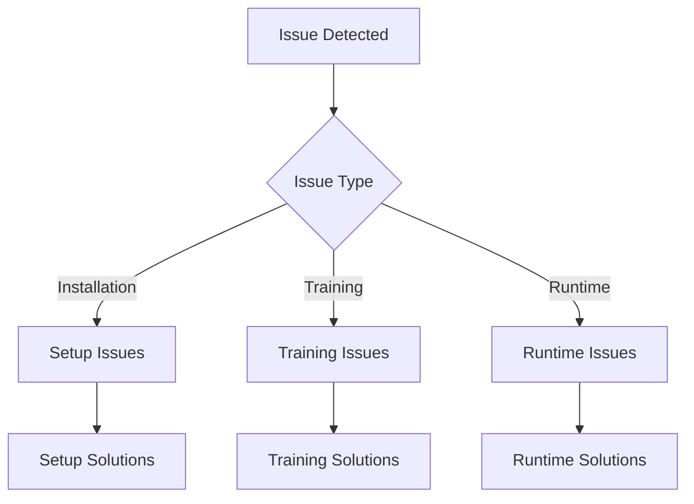

# ML Vision Lab Guides 📚

> Learn, build, and deploy vision models with ML Vision Lab - from basics to advanced techniques

## 📑 Table of Contents

- [Overview](#overview)
- [Getting Started Guides](#getting-started-guides)
- [Step-by-Step Tutorials](#step-by-step-tutorials)
- [Best Practices](#best-practices)
- [Troubleshooting](#troubleshooting)
- [Learning Path](#learning-path)

## Overview

Welcome to the ML Vision Lab guides! This section contains comprehensive documentation to help you learn and effectively use ML Vision Lab. Whether you're just starting out or looking to master advanced topics, you'll find resources tailored to your needs.



## Getting Started Guides

Follow these guides to begin your journey with ML Vision Lab:

### 1. Initial Setup



- [Installation Guide](getting-started/installation.md)
- [Environment Setup](getting-started/environment.md)
- [Basic Configuration](getting-started/configuration.md)
- [First Steps](getting-started/first-steps.md)
- [Creating New Projects](getting-started/create-project.md)


### 2. Core Concepts

Learn the fundamental concepts behind ML Vision Lab:

- [Understanding Vision Models](getting-started/vision-models.md)
- [Data Pipeline Overview](getting-started/data-pipeline.md)
- [Training Basics](getting-started/training.md)
- [Model Evaluation](getting-started/evaluation.md)

## Step-by-Step Tutorials

### Basic Tutorials

1. **Image Classification**

   - [Simple Classification Model](tutorials/classification/basic.md)
   - [Custom Dataset Training](tutorials/classification/custom-dataset.md)
   - [Model Evaluation](tutorials/classification/evaluation.md)

2. **Object Detection**
   - [Basic Object Detection](tutorials/detection/basic.md)
   - [Custom Object Detection](tutorials/detection/custom.md)
   - [Multi-Object Tracking](tutorials/detection/tracking.md)

### Advanced Tutorials



1. **Advanced Model Development**

   - [Custom Architecture Design](tutorials/advanced/custom-architecture.md)
   - [Multi-Task Learning](tutorials/advanced/multi-task.md)
   - [Transfer Learning](tutorials/advanced/transfer-learning.md)

2. **Performance Optimization**
   - [Model Optimization](tutorials/optimization/model.md)
   - [Training Speed](tutorials/optimization/training.md)
   - [Inference Optimization](tutorials/optimization/inference.md)

## Best Practices

### Code Organization

```python
# Example: Structured training script
from ml_vision_lab import Model, Dataset, Trainer

def train_classification_model(
    data_path: str,
    model_config: dict,
    **kwargs
):
    """Train a classification model following best practices.

    Args:
        data_path: Path to training data
        model_config: Model configuration
        **kwargs: Additional training parameters
    """
    # 1. Prepare dataset
    dataset = Dataset.from_path(
        data_path,
        transforms=get_default_transforms()
    )

    # 2. Create model
    model = Model.create(
        config=model_config,
        pretrained=True
    )

    # 3. Configure training
    trainer = Trainer(
        model=model,
        dataset=dataset,
        **kwargs
    )

    # 4. Train and evaluate
    results = trainer.train()
    print(f"Training complete: {results}")
```

### Best Practice Guides

1. **Code Quality**

   - [Code Style Guide](best-practices/code-style.md)
   - [Documentation Standards](best-practices/documentation.md)
   - [Testing Guidelines](best-practices/testing.md)

2. **Performance**

   - [Optimization Guide](best-practices/optimization.md)
   - [Memory Management](best-practices/memory.md)
   - [GPU Utilization](best-practices/gpu.md)

3. **Production**
   - [Deployment Guide](best-practices/deployment.md)
   - [Monitoring](best-practices/monitoring.md)
   - [Maintenance](best-practices/maintenance.md)

## Troubleshooting

Common issues and solutions:



### Common Problems

1. **Installation Issues**

   - [Dependency Conflicts](troubleshooting/dependencies.md)
   - [CUDA Setup](troubleshooting/cuda.md)
   - [Environment Problems](troubleshooting/environment.md)

2. **Training Issues**
   - [Memory Errors](troubleshooting/memory.md)
   - [Training Stability](troubleshooting/stability.md)
   - [Performance Problems](troubleshooting/performance.md)

## Learning Path

Follow this recommended learning path:

1. **Beginner Path**

   - Complete installation
   - Run example project
   - Understand basic concepts
   - Train simple model

2. **Intermediate Path**

   - Custom dataset training
   - Model optimization
   - Performance tuning
   - Basic deployment

3. **Advanced Path**
   - Custom architectures
   - Advanced optimization
   - Production deployment
   - Contributing back


---

Need help? Check our [FAQ](getting-started/faq.md) or join our [Community Forum](https://community.mlvisionlab.org).
