# ML Development Best Practices 🧠

> Guidelines for developing robust and maintainable machine learning systems

## 📑 Table of Contents

- [Overview](#overview)
- [Project Organization](#project-organization)
- [Data Management](#data-management)
- [Model Development](#model-development)
- [Training Pipeline](#training-pipeline)
- [Evaluation](#evaluation)
- [Deployment](#deployment)
- [Monitoring](#monitoring)

## Overview

This guide outlines best practices for developing machine learning systems in ML Vision Lab projects, focusing on reproducibility, maintainability, and production readiness.

```mermaid
mindmap
  root((ML Development))
    Data
      Collection
      Processing
      Versioning
      Validation
    Models
      Architecture
      Training
      Evaluation
      Versioning
    Infrastructure
      Pipeline
      Deployment
      Monitoring
      Scaling
```



## Project Organization

### Directory Structure


### Configuration Management

```python
# config/model.yaml
model:
  name: "vision_transformer"
  params:
    hidden_size: 768
    num_heads: 12
    num_layers: 12
    dropout: 0.1

training:
  batch_size: 32
  learning_rate: 0.0001
  num_epochs: 100
  early_stopping:
    patience: 10
    min_delta: 0.001
```

## Data Management

### Data Version Control

```bash
# Initialize DVC
dvc init

# Add data to DVC
dvc add data/raw
dvc add data/processed

# Push to remote storage
dvc push
```

### Data Validation

```python
from ml_vision_lab.validation import DataValidator

class ImageDataValidator(DataValidator):
    """Validate image dataset integrity."""

    def validate_sample(self, image, label):
        """Validate a single sample."""
        assert image.shape == (224, 224, 3)
        assert label in self.valid_labels
        assert image.max() <= 1.0
        assert image.min() >= 0.0

    def validate_batch(self, batch):
        """Validate a batch of data."""
        assert batch["images"].shape[0] == batch["labels"].shape[0]
        self._check_batch_statistics(batch["images"])
```

## Model Development

### Architecture Design

```python
class VisionTransformer(nn.Module):
    """Vision Transformer implementation with best practices."""

    def __init__(self, config: dict):
        super().__init__()
        self.config = config
        self.logger = setup_logger(self.__class__.__name__)

        # Initialize components
        self._build_model()
        self._init_weights()

        # Log model statistics
        self.logger.info(
            f"Model initialized with {self.num_parameters:,} parameters"
        )

    def _build_model(self):
        """Build model architecture."""
        self._validate_config()
        # Model implementation...

    def forward(self, x: torch.Tensor) -> torch.Tensor:
        """Forward pass with proper error handling."""
        try:
            return self._forward_impl(x)
        except RuntimeError as e:
            self.logger.error(f"Forward pass failed: {e}")
            raise
```

### Model Versioning

```python
from ml_vision_lab.versioning import ModelRegistry

# Register model version
registry = ModelRegistry()
registry.register(
    name="vision_transformer",
    version="1.0.0",
    model_class=VisionTransformer,
    metadata={
        "description": "Vision Transformer implementation",
        "architecture": "ViT-B/16",
        "parameters": "86M",
        "input_size": (224, 224),
        "dataset": "ImageNet-1K"
    }
)
```

## Training Pipeline

### Training Loop

```python
def train_model(
    model: nn.Module,
    train_loader: DataLoader,
    val_loader: DataLoader,
    config: dict
) -> dict:
    """Training implementation with best practices."""
    # Setup
    device = setup_device()
    optimizer = setup_optimizer(model, config)
    scheduler = setup_scheduler(optimizer, config)
    tracker = MetricsTracker()

    # Training loop
    for epoch in range(config["epochs"]):
        # Train epoch
        train_metrics = train_epoch(
            model, train_loader, optimizer, device
        )
        tracker.update_train(train_metrics)

        # Validate epoch
        val_metrics = validate_epoch(
            model, val_loader, device
        )
        tracker.update_val(val_metrics)

        # Learning rate scheduling
        scheduler.step(val_metrics["loss"])

        # Model checkpointing
        save_checkpoint(
            model,
            optimizer,
            epoch,
            val_metrics,
            config["checkpoint_dir"]
        )

        # Early stopping
        if tracker.should_stop():
            break

    return tracker.get_best_metrics()
```

### Experiment Tracking

```python
from ml_vision_lab.tracking import MLflowTracker

def run_experiment(config: dict):
    """Run ML experiment with tracking."""
    tracker = MLflowTracker()

    with tracker.start_run():
        # Log configuration
        tracker.log_params(config)

        # Load data
        train_loader, val_loader = setup_data(config)

        # Train model
        model = setup_model(config)
        metrics = train_model(
            model, train_loader, val_loader, config
        )

        # Log metrics
        tracker.log_metrics(metrics)

        # Log artifacts
        tracker.log_model(model, "model")
        tracker.log_file(config["path"], "config.yaml")
```

## Evaluation

### Metrics Computation

```python
class MetricsComputer:
    """Compute and track metrics."""

    def __init__(self):
        self.metrics = defaultdict(list)

    def update(self, outputs, targets):
        """Update metrics with batch results."""
        self.metrics["accuracy"].append(
            compute_accuracy(outputs, targets)
        )
        self.metrics["precision"].append(
            compute_precision(outputs, targets)
        )
        self.metrics["recall"].append(
            compute_recall(outputs, targets)
        )

    def compute_epoch(self):
        """Compute epoch-level metrics."""
        return {
            name: np.mean(values)
            for name, values in self.metrics.items()
        }
```

## Deployment

### Model Serving

```python
from ml_vision_lab.serving import ModelServer

class VisionModelServer(ModelServer):
    """Production model serving implementation."""

    def __init__(self, model_path: str):
        self.model = self.load_model(model_path)
        self.transforms = self.setup_transforms()
        self.device = self.setup_device()

    def preprocess(self, image: np.ndarray) -> torch.Tensor:
        """Preprocess input image."""
        return self.transforms(image).to(self.device)

    def predict(self, image: np.ndarray) -> dict:
        """Run inference with error handling."""
        try:
            tensor = self.preprocess(image)
            with torch.no_grad():
                output = self.model(tensor)
            return self.postprocess(output)
        except Exception as e:
            self.logger.error(f"Prediction failed: {e}")
            raise
```

## Monitoring

### Production Monitoring

```python
from ml_vision_lab.monitoring import ModelMonitor

class VisionModelMonitor(ModelMonitor):
    """Monitor model performance in production."""

    def __init__(self):
        self.metrics = self.setup_metrics()
        self.alerts = self.setup_alerts()

    def track_prediction(
        self,
        input_data: dict,
        prediction: dict,
        latency: float
    ):
        """Track prediction metrics."""
        self.metrics.track_latency(latency)
        self.metrics.track_confidence(prediction["confidence"])
        self.metrics.track_input_statistics(input_data)

        # Check for drift
        if self.detect_drift(input_data):
            self.alerts.send_drift_alert()
```

---

Remember:

- Write reproducible code
- Version everything
- Monitor performance
- Document decisions
- Test thoroughly
- Handle errors gracefully
