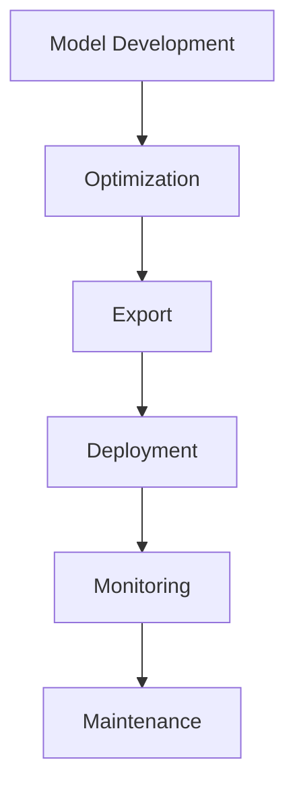
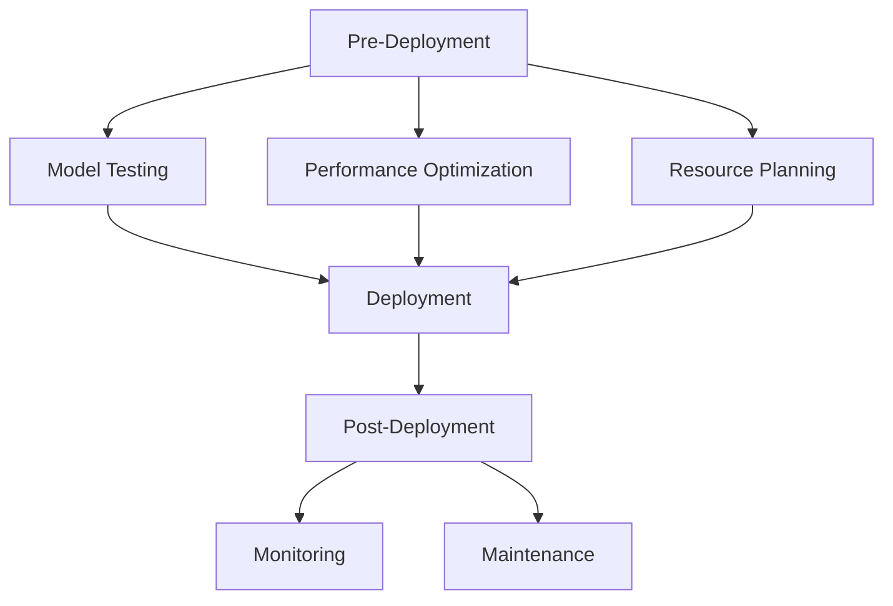

# Deployment Guide 🚀

> Guide for deploying ML Vision Lab models to production

## 📑 Table of Contents

- [Overview](#overview)
- [Deployment Options](#deployment-options)
- [Model Optimization](#model-optimization)
- [Serving Infrastructure](#serving-infrastructure)
- [Monitoring](#monitoring)
- [Best Practices](#best-practices)
- [Troubleshooting](#troubleshooting)

## Overview

This guide covers the deployment process for ML Vision Lab models, including optimization, serving, and monitoring in production environments.



## Deployment Options

### 1. REST API Service

```python
from fastapi import FastAPI
from ml_vision_lab.serving import ModelServer

app = FastAPI()
model_server = ModelServer("path/to/model")

@app.post("/predict")
async def predict(data: dict):
    """Handle prediction request."""
    try:
        result = model_server.predict(data)
        return {"status": "success", "prediction": result}
    except Exception as e:
        return {"status": "error", "message": str(e)}
```

### 2. Batch Processing

```python
class BatchProcessor:
    """Batch processing implementation."""

    def __init__(self, model_path: str):
        self.model = self.load_model(model_path)
        self.logger = setup_logger(__name__)

    def process_batch(
        self,
        input_path: str,
        output_path: str
    ) -> dict:
        """Process a batch of data."""
        try:
            data = self.load_data(input_path)
            results = self.model.predict_batch(data)
            self.save_results(results, output_path)
            return {"status": "success", "count": len(results)}
        except Exception as e:
            self.logger.error(f"Batch processing failed: {e}")
            raise
```

### 3. Edge Deployment

```python
class EdgeModel:
    """Edge device model implementation."""

    def __init__(self, model_path: str):
        self.model = self.load_optimized_model(model_path)
        self.config = self.load_config()

    def load_optimized_model(self, path: str):
        """Load TensorRT optimized model."""
        return torch.jit.load(path)

    def predict(self, image: np.ndarray) -> dict:
        """Run inference on edge device."""
        tensor = self.preprocess(image)
        return self.model(tensor)
```

## Model Optimization

### TensorRT Optimization

```python
from ml_vision_lab.optimization import TensorRTOptimizer

def optimize_model(model_path: str, output_path: str):
    """Optimize model for deployment."""
    optimizer = TensorRTOptimizer()

    # Convert model
    optimized_model = optimizer.convert(
        model_path,
        input_shape=(1, 3, 224, 224),
        precision="fp16"
    )

    # Validate performance
    optimizer.benchmark(
        optimized_model,
        batch_sizes=[1, 8, 16]
    )

    # Save optimized model
    optimizer.save(optimized_model, output_path)
```

### Quantization

```python
def quantize_model(model: nn.Module) -> nn.Module:
    """Quantize model for reduced size and faster inference."""
    return torch.quantization.quantize_dynamic(
        model,
        {nn.Linear, nn.Conv2d},
        dtype=torch.qint8
    )
```

## Serving Infrastructure

### Docker Deployment

```dockerfile
# Dockerfile
FROM pytorch/pytorch:2.3.0-cuda12.1-cudnn8-runtime

# Install dependencies
COPY requirements.txt .
RUN pip install -r requirements.txt

# Copy model and code
COPY model/ /app/model/
COPY src/ /app/src/

# Set up environment
ENV MODEL_PATH=/app/model/model.pt
ENV NUM_WORKERS=4
ENV BATCH_SIZE=32

# Run server
CMD ["uvicorn", "src.server:app", "--host", "0.0.0.0", "--port", "8000"]
```

### Kubernetes Deployment

```yaml
# deployment.yaml
apiVersion: apps/v1
kind: Deployment
metadata:
  name: vision-model
spec:
  replicas: 3
  selector:
    matchLabels:
      app: vision-model
  template:
    metadata:
      labels:
        app: vision-model
    spec:
      containers:
        - name: vision-model
          image: vision-model:latest
          resources:
            limits:
              nvidia.com/gpu: 1
          ports:
            - containerPort: 8000
```

## Monitoring

### Metrics Collection

```python
from ml_vision_lab.monitoring import MetricsCollector

class ModelMetricsCollector(MetricsCollector):
    """Collect model performance metrics."""

    def __init__(self):
        self.prometheus = setup_prometheus()
        self.setup_metrics()

    def track_prediction(
        self,
        latency: float,
        confidence: float
    ):
        """Track prediction metrics."""
        self.prometheus.histogram(
            "inference_latency",
            latency,
            buckets=[0.01, 0.05, 0.1, 0.5]
        )
        self.prometheus.gauge(
            "prediction_confidence",
            confidence
        )
```

### Health Checks

```python
@app.get("/health")
async def health_check():
    """Health check endpoint."""
    return {
        "status": "healthy",
        "gpu_available": torch.cuda.is_available(),
        "gpu_memory": get_gpu_memory_usage(),
        "model_loaded": model_server.is_ready()
    }
```

## Best Practices

### 1. Deployment Checklist



1. **Pre-Deployment**

   - Comprehensive testing
   - Performance optimization
   - Resource planning
   - Documentation review

2. **Deployment Process**

   - Gradual rollout
   - Monitoring setup
   - Backup strategy
   - Rollback plan

3. **Post-Deployment**
   - Performance monitoring
   - Error tracking
   - Resource usage
   - User feedback

### 2. Security Considerations

- Model access control
- Input validation
- Rate limiting
- Secure communication
- Data encryption

## Troubleshooting

### Common Issues

1. **Performance Problems**

   - Check batch size
   - Monitor GPU usage
   - Validate input pipeline
   - Profile inference time

2. **Memory Issues**

   - Monitor memory usage
   - Check for memory leaks
   - Optimize batch processing
   - Use memory profiling

3. **Scaling Issues**
   - Monitor load balancing
   - Check resource allocation
   - Validate autoscaling
   - Profile network usage

---

Remember:

- Test thoroughly before deployment
- Monitor performance constantly
- Plan for scaling
- Keep security in mind
- Document deployment process
