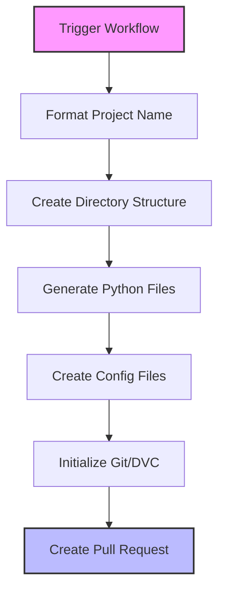
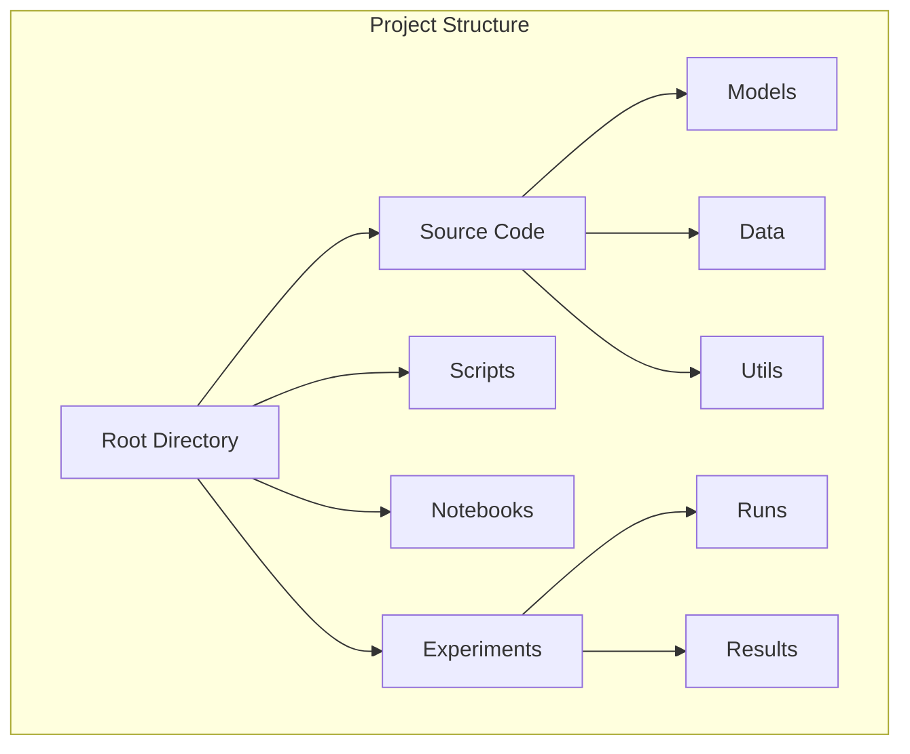

# Creating New Projects with GitHub Actions

> A comprehensive guide to using the automated project creation workflow

[](https://github.com/features/actions)

## Table of Contents

- [Overview](#overview)
- [Prerequisites](#prerequisites)
- [Usage](#usage)
  - [Running the Workflow](#running-the-workflow)
  - [Input Parameters](#input-parameters)
  - [Generated Structure](#generated-structure)
- [Project Structure](#project-structure)
- [Best Practices](#best-practices)
- [Troubleshooting](#troubleshooting)
- [Additional Resources](#additional-resources)

## Overview

The `create-project.yml` GitHub Actions workflow automates the creation of new ML/CV projects with a standardized structure and configuration. This workflow ensures consistency across projects and reduces setup time by automatically generating all necessary files and directories.



## Prerequisites

- GitHub repository access with workflow permissions
- Understanding of basic Git concepts
- Familiarity with ML/CV project requirements

## Usage

### Running the Workflow

1. Navigate to the **Actions** tab in your GitHub repository
2. Select the **Create New Project** workflow
3. Click **Run workflow**
4. Fill in the required parameters
5. Click **Run workflow** to start the process

### Input Parameters

| Parameter             | Description                                                           | Example                                   |
| --------------------- | --------------------------------------------------------------------- | ----------------------------------------- |
| `project_name`        | Name of the new project (will be converted to lowercase with hyphens) | `Object Detection` → `object-detection`   |
| `project_description` | Brief description of the project                                      | "Real-time object detection using YOLOv8" |
| `version`             | Project version (semantic versioning)                                 | `0.1.0`                                   |

### Generated Structure

The workflow creates a comprehensive project structure:

```
projects/[project-name]/
├── src/               # Source code
├── scripts/           # Training/evaluation scripts
├── notebooks/         # Jupyter notebooks
├── experiments/       # Experiment tracking
├── artifacts/         # Model artifacts
├── docs/             # Documentation
├── ui/               # Web interface
├── tests/            # Unit tests
└── configs/          # Configuration files
```

## Project Structure

The generated project follows a standardized structure optimized for ML/CV development:



## Best Practices

1. **Project Naming**

   - Use descriptive, hyphen-separated names
   - Avoid special characters or spaces
   - Example: `semantic-segmentation-v2`

2. **Version Control**

   - Follow semantic versioning (MAJOR.MINOR.PATCH)
   - Start with `0.1.0` for new projects
   - Example: `1.0.0` for first stable release

3. **Project Description**
   - Be clear and concise
   - Include key technologies/frameworks
   - Mention primary objectives

## Troubleshooting

Common issues and solutions:

1. **Invalid Project Name**

   - Error: Project name contains invalid characters
   - Solution: Use only alphanumeric characters and hyphens

2. **Version Format**

   - Error: Invalid version format
   - Solution: Use semantic versioning (X.Y.Z)

3. **Workflow Permissions**
   - Error: Insufficient permissions
   - Solution: Ensure proper GitHub Actions permissions are set

## Additional Resources

- [GitHub Actions Documentation](https://docs.github.com/en/actions)
- [Project Templates Guide](../best-practices/ml-development.md)
- [Development Workflow](../../development/workflow/git.md)

---

**Note**: This workflow is designed to create projects within the `projects/` directory. For custom locations or requirements, please modify the workflow configuration accordingly.
