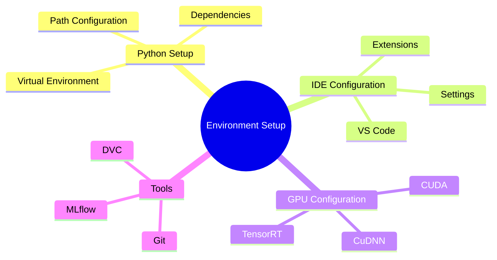
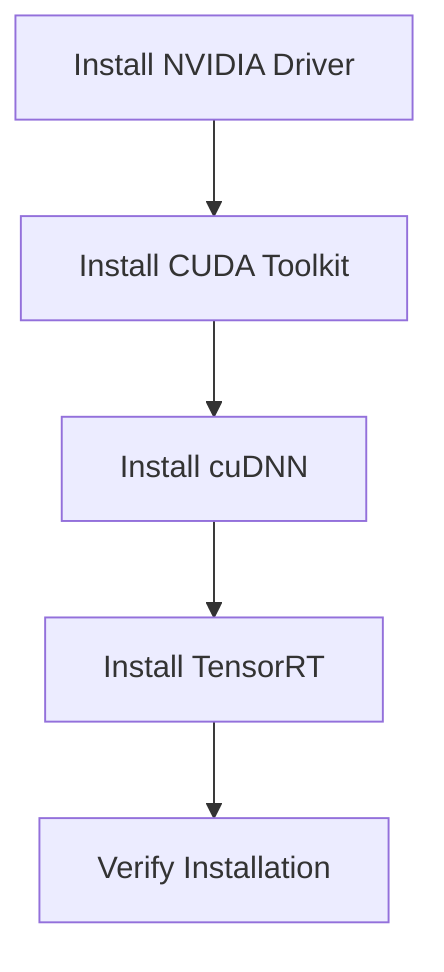
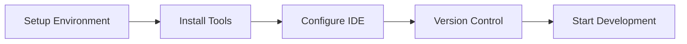

# Environment Setup Guide 🔧

> Configure your development environment for ML Vision Lab

## 📑 Table of Contents

- [Overview](#overview)
- [Development Environment](#development-environment)
- [IDE Configuration](#ide-configuration)
- [GPU Setup](#gpu-setup)
- [Environment Variables](#environment-variables)
- [Development Tools](#development-tools)
- [Best Practices](#best-practices)

## Overview

This guide helps you set up a proper development environment for ML Vision Lab, including IDE configuration, GPU setup, and essential development tools.



## Development Environment

### Python Virtual Environment

```bash
# Create a new virtual environment
python -m venv .venv

# Activate the environment
source .venv/bin/activate  # Linux/MacOS
# or
.venv\Scripts\activate     # Windows

# Verify Python version
python --version  # Should be 3.11+
```

### Dependencies Management

Using Poetry (recommended):

```bash
# Install Poetry
curl -sSL https://install.python-poetry.org | python3 -

# Initialize project
poetry init

# Install dependencies
poetry install
```

Using pip:

```bash
# Install requirements
pip install -r requirements.txt
pip install -r requirements-dev.txt
```

## IDE Configuration

### VS Code Setup

1. **Install Extensions**

   ```json
   {
     "recommendations": [
       "ms-python.python",
       "ms-python.vscode-pylance",
       "ms-toolsai.jupyter",
       "njpwerner.autodocstring",
       "eamodio.gitlens",
       "mhutchie.git-graph",
       "bierner.markdown-mermaid"
     ]
   }
   ```

2. **Configure Settings**

   ```json
   {
     "python.defaultInterpreterPath": "${workspaceFolder}/.venv/bin/python",
     "python.linting.enabled": true,
     "python.linting.pylintEnabled": true,
     "python.formatting.provider": "black",
     "editor.formatOnSave": true,
     "editor.rulers": [80, 100],
     "files.trimTrailingWhitespace": true
   }
   ```

3. **Setup Debugging**
   ```json
   {
     "version": "0.2.0",
     "configurations": [
       {
         "name": "Python: Current File",
         "type": "python",
         "request": "launch",
         "program": "${file}",
         "console": "integratedTerminal",
         "env": {
           "PYTHONPATH": "${workspaceFolder}"
         }
       }
     ]
   }
   ```

## GPU Setup

### CUDA Installation



1. **Install NVIDIA Driver**

   ```bash
   # Check GPU
   nvidia-smi

   # Check CUDA version
   nvcc --version
   ```

2. **Install CUDA Toolkit**

   - Download from [NVIDIA CUDA](https://developer.nvidia.com/cuda-downloads)
   - Add to PATH:

   ```bash
   # Linux
   export PATH=/usr/local/cuda-12.2/bin:$PATH
   export LD_LIBRARY_PATH=/usr/local/cuda-12.2/lib64:$LD_LIBRARY_PATH

   # Windows
   set PATH=C:\Program Files\NVIDIA GPU Computing Toolkit\CUDA\v12.2\bin;%PATH%
   ```

3. **Verify GPU Setup**
   ```python
   import torch
   print(f"CUDA available: {torch.cuda.is_available()}")
   print(f"GPU device name: {torch.cuda.get_device_name(0)}")
   ```

## Environment Variables

Create a `.env` file:

```bash
# ML Vision Lab Environment Variables
PYTHONPATH=${PYTHONPATH}:/path/to/ml-vision-lab
CUDA_VISIBLE_DEVICES=0,1  # Specify GPU devices
TORCH_CUDA_ARCH_LIST="6.0 6.1 7.0 7.5 8.0 8.6 9.0+PTX"
ML_VISION_DATA_DIR=/path/to/data
ML_VISION_MODELS_DIR=/path/to/models
```

Load environment variables:

```python
from dotenv import load_dotenv
import os

load_dotenv()
data_dir = os.getenv("ML_VISION_DATA_DIR")
```

## Development Tools

### Essential Tools

1. **Version Control**

   ```bash
   # Git configuration
   git config --global user.name "Your Name"
   git config --global user.email "your.email@domain.com"

   # Git LFS for large files
   git lfs install
   ```

2. **DVC Setup**

   ```bash
   # Install DVC
   pip install dvc[s3]

   # Initialize DVC
   dvc init
   dvc remote add -d storage s3://your-bucket/path
   ```

3. **MLflow Configuration**

   ```bash
   # Install MLflow
   pip install mlflow

   # Configure tracking server
   export MLFLOW_TRACKING_URI=http://localhost:5000
   mlflow server --host 0.0.0.0 --port 5000
   ```

### Code Quality Tools

```bash
# Install tools
pip install black isort mypy pylint pytest pytest-cov

# Configure pre-commit
pip install pre-commit
pre-commit install
```

## Best Practices

### 1. Environment Management

- Use virtual environments for isolation
- Keep dependencies updated
- Document environment setup
- Use version control for configs

### 2. GPU Best Practices

```python
# Set memory growth
import tensorflow as tf
gpus = tf.config.experimental.list_physical_devices('GPU')
for gpu in gpus:
    tf.config.experimental.set_memory_growth(gpu, True)

# Set PyTorch device
import torch
device = torch.device("cuda" if torch.cuda.is_available() else "cpu")
model = model.to(device)
```

### 3. Development Workflow



Remember:

- Keep environments reproducible
- Document setup steps
- Use consistent tooling
- Follow coding standards

---

Next Steps:

- [First Steps Guide](first-steps.md)
- [Configuration Guide](configuration.md)
- [Development Standards](../../development/standards/README.md)
