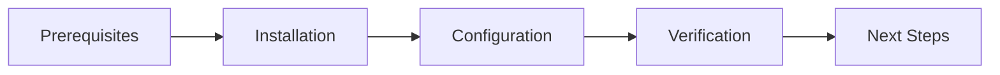
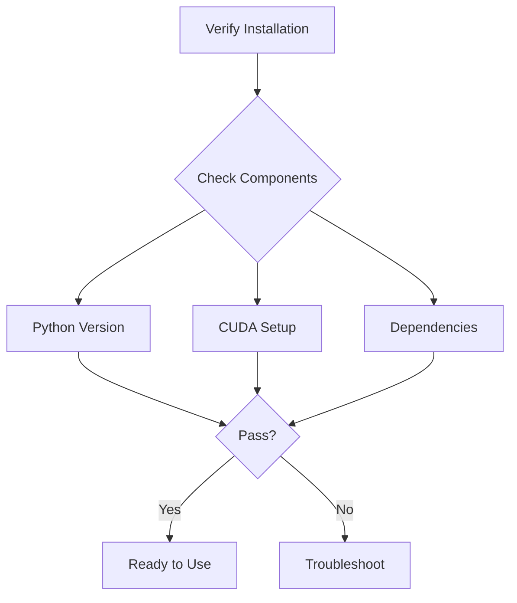

# Installation Guide 📦

> Get started with ML Vision Lab - Installation and setup instructions

## 📑 Table of Contents

- [Overview](#overview)
- [Prerequisites](#prerequisites)
- [Installation Steps](#installation-steps)
- [Verification](#verification)
- [Troubleshooting](#troubleshooting)
- [Next Steps](#next-steps)

## Overview

This guide walks you through the installation process for ML Vision Lab, ensuring you have all required dependencies and proper configuration for development or deployment.



## Prerequisites

Before installing ML Vision Lab, ensure you have:

- Python 3.11+
- CUDA 12.2+ (for GPU support)
- OpenCV 5.0+
- PyTorch 2.3+
- TensorFlow 2.15+
- NVIDIA GPU with Compute Capability 6.0+ (recommended)

### System Requirements

| Component | Minimum         | Recommended      |
| --------- | --------------- | ---------------- |
| CPU       | 4 cores         | 8+ cores         |
| RAM       | 16GB            | 32GB+            |
| GPU       | NVIDIA GTX 1060 | NVIDIA RTX 3060+ |
| Storage   | 20GB            | 50GB+            |

## Installation Steps

### 1. Environment Setup

```bash
# Clone repository
git clone https://github.com/BjornMelin/ml-vision-lab.git
cd ml-vision-lab

# Create virtual environment
python -m venv .venv
source .venv/bin/activate  # Linux/MacOS
# or
.venv\Scripts\activate  # Windows
```

### 2. Install Dependencies

```bash
# Install core requirements
pip install -r requirements.txt

# Optional: Install project-specific requirements
pip install -r projects/food-classification/requirements.txt
```

### 3. CUDA Configuration

Ensure CUDA is properly configured:

```python
import torch
print(f"CUDA available: {torch.cuda.is_available()}")
print(f"CUDA version: {torch.version.cuda}")
```

### 4. Install Development Tools

```bash
# Install development requirements
pip install -r requirements-dev.txt

# Setup pre-commit hooks
pre-commit install
```

## Verification

Run the verification script to ensure everything is installed correctly:

```python
from ml_vision_lab import verify_installation

# Check installation
status = verify_installation()
print(f"Installation status: {'✅ Success' if status else '❌ Failed'}")
```

### Component Verification



## Troubleshooting

### Common Issues

1. **CUDA Not Found**

   ```bash
   # Check NVIDIA driver installation
   nvidia-smi

   # Verify CUDA installation
   nvcc --version
   ```

2. **Package Conflicts**

   ```bash
   # Create fresh environment
   python -m venv .venv.new
   source .venv.new/bin/activate
   pip install -r requirements.txt
   ```

3. **OpenCV Issues**
   ```bash
   # Try headless version
   pip uninstall opencv-python
   pip install opencv-python-headless
   ```

### Environment Variables

Make sure to set required environment variables:

```bash
# Linux/MacOS
export PYTHONPATH="${PYTHONPATH}:/path/to/ml-vision-lab"
export CUDA_VISIBLE_DEVICES="0"  # Specify GPU device

# Windows
set PYTHONPATH=%PYTHONPATH%;C:\path\to\ml-vision-lab
set CUDA_VISIBLE_DEVICES=0
```

## Next Steps

1. **Get Started**

   - Run example projects
   - Read the documentation
   - Try tutorials

2. **Configure Your Project**

   - Set up your development environment
   - Configure your IDE
   - Initialize your first project

3. **Explore Features**
   - Check out the examples
   - Try different models
   - Experiment with datasets

For more information, visit:

- [Core Documentation](../../README.md)
- [Project Examples](../../projects/README.md)
- [Development Guide](../../development/README.md)

---

Need help? Check our [FAQ](faq.md) or join our [Community Forum](https://community.mlvisionlab.org)
