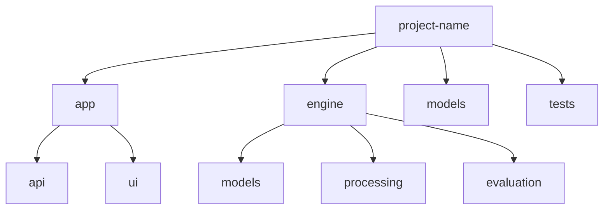
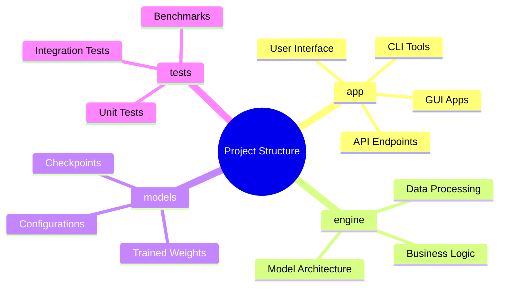
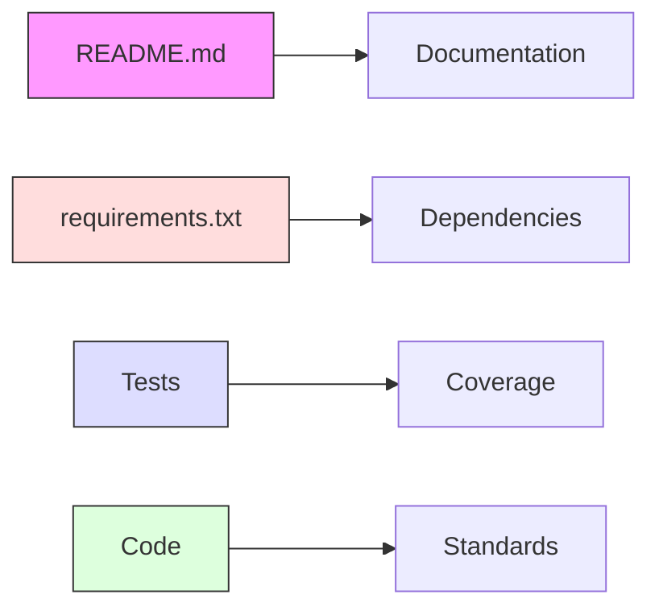
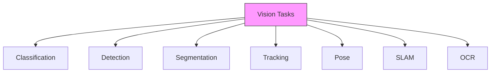
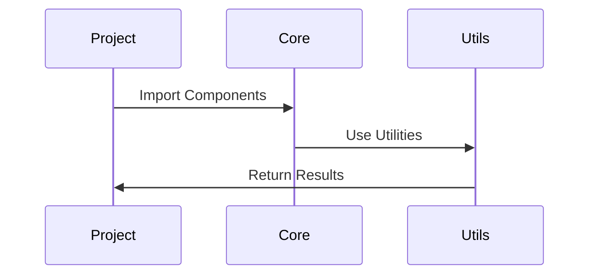
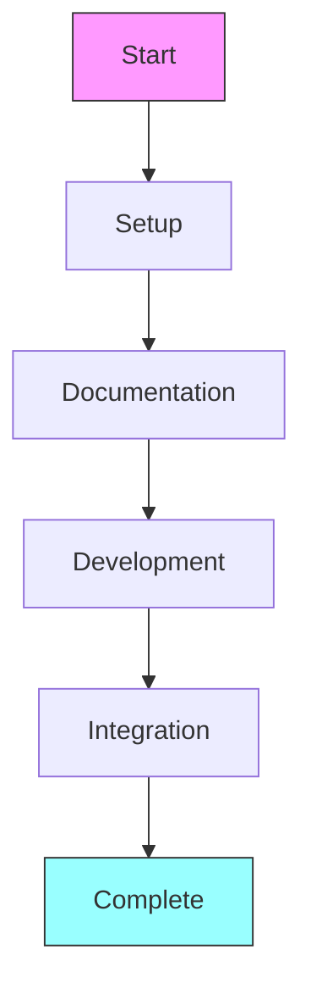

# Projects Directory 🚀

> Collection of modular computer vision implementations

## 📑 Table of Contents

- [Overview](#overview)
- [Directory Structure](#directory-structure)
- [Project Guidelines](#project-guidelines)
- [Project Types](#project-types)
- [Integration Guidelines](#integration-guidelines)
- [Project Creation Checklist](#project-creation-checklist)
- [Resources](#resources)
- [Additional Notes](#additional-notes)

## Overview

This directory contains individual computer vision projects, each focusing on specific vision tasks or applications.

## Directory Structure



```
projects/
├── project-name/           # Individual project directory
│   ├── app/               # Application interface
│   │   ├── api/          # API endpoints
│   │   └── ui/           # User interface
│   ├── engine/           # Core project logic
│   │   ├── models/       # Model implementations
│   │   ├── processing/   # Data processing
│   │   └── evaluation/   # Evaluation tools
│   ├── models/           # Trained model weights
│   ├── tests/            # Unit and integration tests
│   ├── README.md         # Project documentation
│   └── requirements.txt  # Project dependencies
└── README.md             # Projects directory documentation
```

## 📋 Project Guidelines

### Project Structure



### 📝 Project Requirements

Each project must include:



1. 📘 Clear README.md with:

   - Project overview
   - Installation steps
   - Usage examples
   - API documentation
   - Performance metrics

2. 📦 requirements.txt listing:

   - Core dependencies
   - Version constraints
   - Optional packages
   - Development tools

3. 📚 Proper documentation:

   - Code comments
   - API documentation
   - Usage guides
   - Architecture docs

4. 🧪 Comprehensive tests:
   - ≥80% code coverage
   - Performance benchmarks
   - Integration tests
   - Edge cases

## 🎯 Project Types

### Vision Tasks Matrix



### 🏭 Domain Applications

- 🏥 Medical Imaging
- 🏭 Industrial Inspection
- 🚗 Autonomous Systems
- 🎥 Security & Surveillance
- 🛒 Retail Analytics
- 🌾 Agriculture
- 🛰️ Satellite Imaging

## 🔄 Integration Guidelines

### Using Core Components



```python
# Import core utilities
from core.utils.visualization import draw_boxes
from core.models.base import BaseDetector
from core.pipelines.preprocessing import ImagePreprocessor

# Project implementation
class CustomDetector(BaseDetector):
    def __init__(self):
        self.preprocessor = ImagePreprocessor()

    def predict(self, image):
        # Implementation
        pass
```

### ✨ Best Practices

1. **🏗️ Code Organization**

   - Modular structure
   - Clear interfaces
   - Proper documentation
   - Efficient imports

2. **📦 Dependencies**

   - Minimal dependencies
   - Version pinning
   - Optional extras
   - Development requirements

3. **🧪 Testing**
   - Unit test coverage
   - Integration tests
   - Benchmark suites
   - CI/CD integration

## ✅ Project Creation Checklist



1. **🚀 Initial Setup**

   - [ ] Create project directory
   - [ ] Follow template structure
   - [ ] Setup virtual environment
   - [ ] Initialize git repository

2. **📝 Documentation**

   - [ ] Create README.md
   - [ ] Document installation
   - [ ] Add usage examples
   - [ ] Include API docs

3. **💻 Development**

   - [ ] Setup development tools
   - [ ] Configure linters
   - [ ] Add type hints
   - [ ] Write tests

4. **🔄 Integration**
   - [ ] Use core components
   - [ ] Follow coding standards
   - [ ] Add CI/CD config
   - [ ] Setup monitoring

## 🛠️ Resources

### Development Tools

- 🎨 Black for formatting
- 🔍 Mypy for type checking
- 🧪 Pytest for testing
- 🔄 Pre-commit hooks

### 📚 Documentation

- Google style guide
- Type hints guide
- Documentation templates
- Example projects

### ⚡ Performance

- Profiling tools
- Benchmark suites
- Optimization guides
- Hardware requirements

## 📝 Additional Notes

- Keep projects focused and modular
- Reuse core components
- Follow consistent style
- Maintain documentation
- Regular updates
- Performance optimization

Remember: Each project should be self-contained, well-documented, and maintainable! 💪
