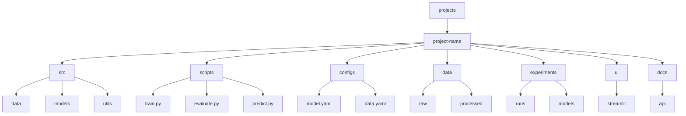
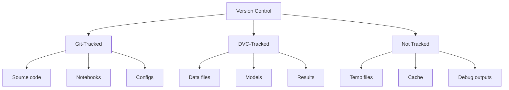

# Projects Directory 🚀

> Collection of modular computer vision implementations following ML/CV best practices

## 📑 Table of Contents

- [Overview](#overview)
- [Project Organization](#project-organization)
  - [Standard Project Structure](#standard-project-structure)
  - [Version Control Strategy](#version-control-strategy)
  - [DVC Configuration](#dvc-configuration)
- [ML Development Standards](#ml-development-standards)
- [Project Creation Checklist](#project-creation-checklist)
- [Additional Resources](#additional-resources)

## Overview

This directory contains individual computer vision projects, each following industry-standard ML project organization and best practices for reproducibility, maintainability, and production deployment.



## Project Organization

### Standard Project Structure

```
project-name/
├── README.md          # Project documentation
├── pyproject.toml    # Poetry/project metadata
├── requirements.txt  # Pip requirements (alternative to Poetry)
├── scripts/          # Execution scripts
│   ├── train.py      # Training entry point
│   ├── evaluate.py   # Evaluation script
│   ├── predict.py    # Inference script
│   └── utils/        # Script utilities
├── configs/          # Configuration files
│   ├── model.yaml    # Model architecture
│   ├── data.yaml     # Data processing
│   ├── train.yaml    # Training parameters
│   └── experiments/  # Experiment configs
├── data/             # Dataset files (DVC-tracked)
│   ├── raw/          # Original data
│   │   ├── train/    # Training data
│   │   ├── val/      # Validation data
│   │   └── test/     # Test data
│   └── processed/    # Processed data
├── src/              # Source code
│   ├── data/         # Data processing
│   │   ├── dataset.py
│   │   ├── transforms.py
│   │   └── utils.py
│   ├── models/       # Model implementations
│   │   ├── model.py
│   │   ├── layers.py
│   │   └── heads/    # Model heads
│   └── utils/        # Utilities
│       ├── metrics.py
│       ├── visualization.py
│       └── logging.py
├── notebooks/        # Jupyter notebooks
│   ├── exploration/  # Data exploration
│   ├── modeling/     # Model prototyping
│   └── evaluation/   # Model evaluation
├── ui/               # User interface code
│   ├── streamlit/    # Streamlit interface
│   │   ├── app.py    # Main Streamlit app
│   │   ├── pages/    # App pages
│   │   └── assets/   # UI resources
│   └── static/       # Shared static files
├── experiments/      # Experiment tracking
│   ├── runs/         # MLflow/experiment runs
│   │   ├── baseline/ # Experiment instance
│   │   └── improved/ # Another experiment
│   ├── models/       # Trained models (DVC-tracked)
│   └── results/      # Evaluation results (DVC-tracked)
├── tests/            # Testing suite
│   ├── conftest.py   # Test configuration
│   ├── test_data.py  # Data tests
│   ├── test_models.py # Model tests
│   └── test_utils.py # Utility tests
├── docs/             # Documentation
│   ├── index.md      # Documentation home
│   ├── api/          # API documentation
│   └── guides/       # User guides
├── artifacts/        # Temporary outputs (not tracked)
│   ├── predictions/  # Model predictions
│   ├── checkpoints/  # Training checkpoints
│   └── logs/        # Training logs
├── .dvc/            # DVC configuration
│   ├── cache/       # DVC cache (auto-managed)
│   ├── tmp/         # DVC temporary files
│   └── config       # DVC settings
├── .dvcignore       # DVC ignore patterns
├── .env.example     # Environment variables template
└── .gitignore       # Git ignore patterns
```

### Version Control Strategy



1. **Git-Tracked**

   - Source code (src/)
   - Notebooks (notebooks/)
   - Configuration (configs/)
   - Documentation (docs/)
   - UI code (ui/)
   - Tests (tests/)
   - Small static files

2. **DVC-Tracked**

   - Data files (data/)
   - Trained models (experiments/models/)
   - Important results (experiments/results/)
   - Large binary files
   - Dataset versions

3. **Not Tracked**
   - Temporary files (artifacts/temp/)
   - Cache files (artifacts/cache/)
   - Debug outputs (artifacts/debug/)
   - Local environment files (.env)
   - Build artifacts

### DVC Configuration

```bash
# Initialize DVC
dvc init

# Add remote storage
dvc remote add -d storage s3://bucket/path

# Track data and models
dvc add data/raw
dvc add experiments/models/

# Configure DVC
# .dvcignore
artifacts/          # Ignore temporary outputs
*.pyc              # Ignore Python cache
__pycache__/       # Ignore Python cache directories
.ipynb_checkpoints # Ignore Jupyter checkpoints

# .dvc/config
[core]
    remote = storage
    autostage = true    # Automatically stage DVC changes

[cache]
    type = "hardlink,symlink"  # Efficient storage
    dir = .dvc/cache    # Local cache location
```

Note: DVC manages its own cache in .dvc/cache/. The artifacts/ directory is for temporary outputs that don't need version control:

- predictions/: Model inference outputs
- checkpoints/: Intermediate training checkpoints
- logs/: Training and evaluation logs

### Dependencies Management

1. **Using Poetry (Recommended)**

```toml
# pyproject.toml
[tool.poetry]
name = "project-name"
version = "0.1.0"

[tool.poetry.dependencies]
python = "^3.11"
torch = "^2.3.0"

[tool.poetry.group.ui.dependencies]
streamlit = "^1.32.0"
gradio = "^4.19.0"
```

2. **Using Pip (Alternative)**

```txt
# requirements.txt
torch>=2.3.0
opencv-python-headless>=5.0.0

# UI dependencies
streamlit>=1.32.0
gradio>=4.19.0
```

## Project Creation Checklist

### 🚀 Initial Setup

1. **Project Structure**

```bash
# Create project
mkdir project-name
cd project-name

# Initialize version control
git init
dvc init

# Create directories
mkdir -p src/{data,models,utils}
mkdir -p scripts
mkdir -p notebooks/{exploration,modeling,evaluation}
mkdir -p experiments/{runs,models,results}
mkdir -p artifacts/{temp,cache,debug}
mkdir -p docs/{api,guides}
mkdir -p ui/streamlit/pages
mkdir -p tests
```

2. **Version Control Setup**

```bash
# Configure DVC storage
dvc remote add -d storage s3://bucket/path

# Initial data tracking
dvc add data/raw/
dvc push
```

3. **Environment Setup**

```bash
# Copy environment template
cp .env.example .env

# Configure environment
edit .env  # Add your configurations
```

### Best Practices

1. **Data and Model Management**

   - Track data with DVC
   - Version models properly
   - Document data sources
   - Keep artifacts temporary

2. **Development Workflow**

   - Use notebooks for exploration
   - Keep production code in src/
   - Track experiments with MLflow
   - Maintain clean artifacts

3. **Documentation**
   - Clear README.md
   - Detailed docs/
   - API documentation
   - Usage examples

## Additional Resources

### 📚 Documentation

- [DVC Documentation](https://dvc.org/doc)
- [MLflow Documentation](https://mlflow.org/docs/latest/index.html)
- [PyTorch Best Practices](https://pytorch.org/docs/stable/notes/best_practices.html)
- [Google ML Best Practices](https://developers.google.com/machine-learning/guides/best-practices)

### 🛠️ Tools

- [Weights & Biases](https://wandb.ai/) - Experiment tracking
- [PyTorch Lightning](https://lightning.ai/) - ML framework
- [Hydra](https://hydra.cc/) - Configuration management
- [Great Expectations](https://greatexpectations.io/) - Data validation

### 📖 Guides

- [ML Project Organization](https://neptune.ai/blog/how-to-organize-deep-learning-projects-best-practices)
- [Reproducible ML](https://reproducible.ai/)
- [Model Versioning](https://dvc.org/doc/use-cases/versioning-data-and-models)
- [CI/CD for ML](https://neptune.ai/blog/continuous-integration-continuous-deployment-continuous-training-in-machine-learning)

Remember: Keep tracked files clean and temporary outputs in artifacts/! 💪
