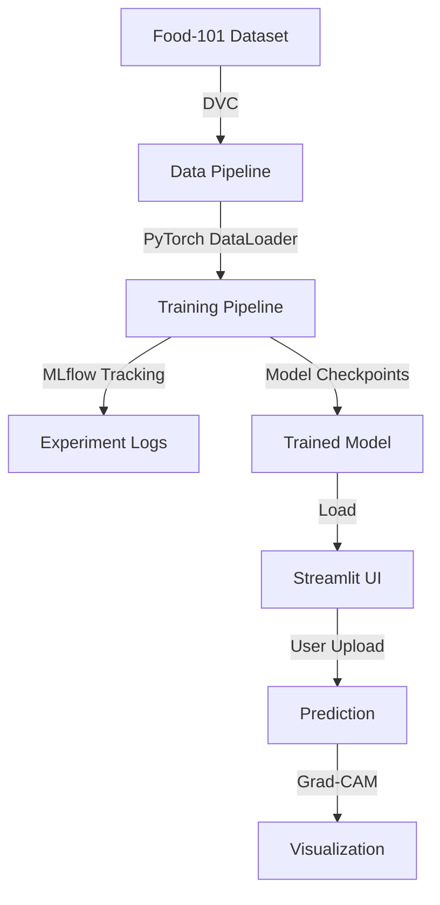

# Food-101 Classification Project

> An end-to-end deep learning solution for classifying food images using PyTorch, with MLflow experiment tracking and a Streamlit interface.

[](https://www.python.org/downloads/)
[](https://pytorch.org/)
[](https://dvc.org/)
[](https://mlflow.org/)
[](https://streamlit.io/)

## Table of Contents

1. [Overview](#overview)
2. [Features](#features)
3. [Architecture](#architecture)
4. [Installation](#installation)
   - [Prerequisites](#prerequisites)
   - [Setup Steps](#setup-steps)
   - [Dataset Setup](#dataset-setup)
5. [Usage Guide](#usage-guide)
   - [Training](#training)
   - [Inference](#inference)
   - [Web Interface](#web-interface)
6. [Project Structure](#project-structure)
7. [Technical Details](#technical-details)
   - [Model Architecture](#model-architecture)
   - [Data Pipeline](#data-pipeline)
   - [Training Pipeline](#training-pipeline)
   - [Web Interface](#web-interface-1)
8. [Development](#development)
   - [Contributing](#contributing)
   - [Testing](#testing)
9. [Resources](#resources)

## Overview

The Food-101 Classification Project demonstrates best practices in deep learning development through a complete, reproducible pipeline for food image classification. It combines modern tools and frameworks to create an efficient workflow for training, evaluating, and deploying models.

## Features

- 🚀 **EfficientNetV2** backbone with transfer learning
- 📊 Comprehensive experiment tracking with **MLflow**
- 🗄️ Data versioning using **DVC**
- ⚡ Interactive web interface with **Streamlit**
- 🔧 Modular configuration using **Hydra**
- 📈 Real-time training visualization

## Architecture



## Installation

### Prerequisites

- Python 3.11 or higher
- CUDA-capable GPU (recommended)
- [Git LFS](https://git-lfs.github.com/) for model storage
- [DVC](https://dvc.org/) for data versioning

### Setup Steps

```bash
# Clone repository
git clone https://github.com/username/food-classification.git
cd food-classification

# Create virtual environment
python -m venv .venv
source .venv/bin/activate  # Windows: .venv\Scripts\activate

# Install dependencies
pip install -r requirements/base.txt
pip install -r requirements/ui.txt
pip install -r requirements/dev.txt
```

### Dataset Setup

```bash
# Download Food-101 dataset
mkdir -p data/raw/food-101
# Download from https://data.vision.ee.ethz.ch/cvl/food-101.tar.gz

# Initialize DVC and track dataset
dvc init
dvc add data/raw/food-101
git add data/raw/food-101.dvc .gitignore
git commit -m "Add Food-101 dataset"
```

## Usage Guide

### Training

```bash
# Start training with default configuration
python scripts/train.py

# Override hyperparameters
python scripts/train.py model.architecture=tf_efficientnetv2_m model.optimizer.lr=0.0005
```

### Inference

```bash
# Single image prediction
python scripts/predict.py --input_path path/to/image.jpg --checkpoint path/to/model.pth

# Batch prediction
python scripts/predict.py --input_dir path/to/images --output_dir predictions
```

### Web Interface

```bash
# Launch Streamlit app
streamlit run ui/streamlit/app.py
```


## Project Structure

```
food-classification/
├── src/                # Source code
│   ├── data/          # Data processing
│   ├── models/        # Model implementations
│   └── utils/         # Utility functions
├── configs/           # Hydra configurations
├── scripts/           # Training/inference scripts
├── ui/                # Streamlit interface
├── tests/             # Test suite
└── requirements/      # Dependency specifications
```

## Technical Details

### Model Architecture

The project uses EfficientNetV2-S as the backbone, with the following modifications:

```python
class FoodClassifier(nn.Module):
    def __init__(self, cfg):
        super().__init__()
        self.model = timm.create_model(
            cfg['architecture'],
            pretrained=cfg['pretrained'],
            num_classes=cfg['num_classes']
        )
```

### Data Pipeline

- Custom PyTorch Dataset for Food-101
- Robust data augmentation pipeline
- Efficient data loading with pin memory
- DVC integration for versioning

### Training Pipeline

- Mixed precision training
- MLflow experiment tracking
- Hydra configuration management
- Gradient accumulation support
- Learning rate scheduling

### Web Interface

- Real-time prediction visualization
- Grad-CAM heatmap generation
- Training progress monitoring
- Experiment comparison

## Development

### Contributing

1. Create a new branch: `git checkout -b feature/name`
2. Update configuration in `configs/`
3. Implement feature in `src/`
4. Add tests in `tests/`
5. Submit PR with description

### Testing

```bash
# Run test suite
pytest tests/

# Check code style
black src/ tests/
mypy src/
```

## Resources

- [Food-101 Dataset Paper](https://data.vision.ee.ethz.ch/cvl/datasets_extra/food-101/)
- [EfficientNetV2 Paper](https://arxiv.org/abs/2104.00298)
- [MLflow Documentation](https://www.mlflow.org/docs/latest/index.html)
- [DVC Documentation](https://dvc.org/doc)

---

📝 **Note**: This documentation should be updated as the project evolves.
If you notice any inconsistencies or have suggestions for improvements,
please open an issue or submit a pull request.
